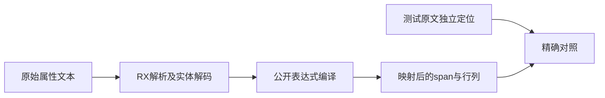
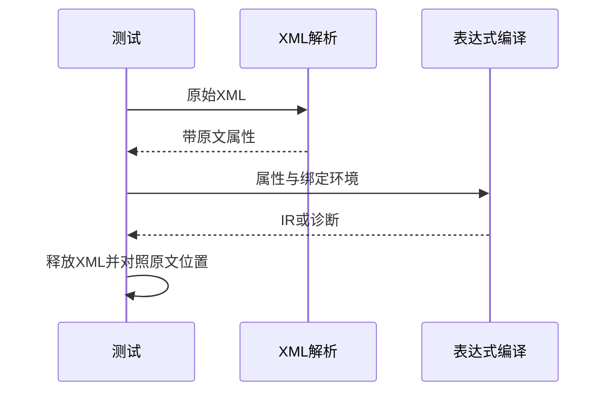

# XML表达式诊断映射验证

## Intent：最终目标

验证真实XML属性表达式从解码字节位置映射回原始RX文本的准确性和所有权。

## Data：可用证据

新公开application.expression.compile使用rx.parseXml属性及attributeLocation/attributeEndLocation。预期位置由测试直接在原文中定位标记并逐字节计算行列，不调用生产位置函数。

## Edges：边界与限制

本轮仅覆盖公开表达式适配层，不替代Call/Context联结、Schema或应用执行验证。测试不修改生产源码。

## Answer：交付与成功标准

验证普通文本、十进制/十六进制实体、实体在标记首尾、CR/LF/CRLF、UTF-8前缀及EOF的精确span和行列；验证IR表达式span映射以及释放XML后结果有效和分配失败清理。

## 实际结果

新增15个测试：12种真实XML表达式位置情形、2个成功/拒绝路径逐分配点故障注入、1个四字节实体内部起止边界测试。后者逐点核对解码偏移落在🙂内部时，起点回到实体开头、终点覆盖完整实体，并检查属性末尾及越界返回null。

公开application.expression入口取得的结果在XML解析arena释放后才读取。普通诊断精确检查name，EOF检查syntax；span与line/column直接由原始XML标记和独立字节计数取得。两个合法表达式验证IR并检查返回根表达式原文span。

`zig build test-xml-expression --summary all`：4/4步骤15/15通过，日志 `/tmp/zxc-xml-expression-final.log`。目录审计通过，日志 `/tmp/zxc-xml-expression-audit.log`。格式、本次diff与两份草稿/正式文件字节一致性通过。新增专项接入全包test。

## 缺陷反馈与自我复核

首次构建发现实现会话在建application/call.zig的expression导入与方法同名，导致公开模块无法编译，已发送原始诊断。其修正后复验15/15通过，并已回传复验结果。测试代码自身两处Zig类型问题（可选ExprId解包、运行时枚举字面量需明确类型）由本会话修正，未混为生产缺陷。没有修改生产源码。

UTF-8前缀用真实中文XML注释置于Call之前，避免把后置文本误当作前缀覆盖。位置检查没有复用生产attributeLocation作为预期来源；四字节实体测试独立指定边界。当前有限样例不证明所有XML字符组合、Call/Context联结或真实RX运行正确。JSONL目录仍63323，上游审阅仍661/53597；15个API测试单列。未重跑全仓库。
