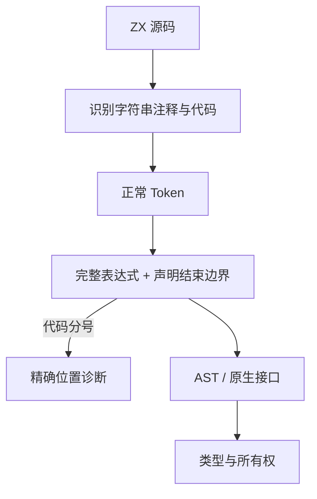
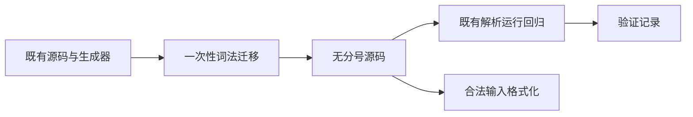

# ZX 无分号语法实施计划

## Intent：最终目标

按用户最新明确要求：ZX 无需行尾分号，显式代码分号也不允许。此项优先于尚未提交的名义身份修复与 RX 自动推导。

## Data：可用证据

当前 lexer 接受分号；import、type、const、return、Store setter 与原生函数声明强制以分号结束，对象类型字段也接受分号。lint.source.format 只调整 AST 间空行，不生成标点。仓库有正式 .zx/.d.zx、Zig 嵌入源码、TS 生成器、JSONL source/source_hex 与 Markdown 示例，必须共同迁移才能保留原有验证目标。

## Edges：语法与迁移边界

- 代码中的分号由词法识别为标点、在语法入口明确拒绝；字符串、注释和模板原文中的分号保留，模板插值代码仍遵守禁令。
- 完整简单语句、import、type 与 native 函数声明后要求换行、块结束或 EOF；表达式内部继续按原有优先级与括号跨行解析，不引入通用 ASI。
- return 的值允许跨行，保留已有语言契约，不引入 JavaScript ASI。块结束或 EOF 前的 return 表示无值返回。
- 对象类型字段使用逗号、换行或右括号分隔；参数、列表、元组和对象值的逗号契约不变。
- fmt 只处理合法 ZX；分号非法时保留原文件并报诊断，不内置兼容清洗路径。
- 仓库迁移使用词法状态扫描，保留字符串、注释与模板文本。保持单字节替换以维持已有错误 span；必要时将旧分隔符替换为换行。不得对宿主 Zig/TS 全局删分号，不得把其他负向案例改成分号错误。
- 不新增测试、不打开浏览器、不使用针对用例 ID 的生产特例；更新既有旧语法断言，保持其他回归的验证目标。

## Answer：交付与成功标准

正式解析器与原生声明入口一致禁止分号；标准声明、源码、生成器与生成数据一致输出新语法；现有回归及全部生成器 --check 通过，实际 CLI 可编译无分号示例且拒绝显式分号。提供 IDEA 记录、语法参考、执行结果和自我复核，按既有授权提交并 push。

## 执行记录

完成语法入口与语料范围盘点，准备实施。名义身份修复草稿在独立副本已通过 12/12 既有回归，暂不混入本特性。

阶段 219 的既有专项确认 return 换行后继续表达式是旧语言契约，因此撤回最初的换行截断建议；严格禁止分号不应顺带改变该语义。

为保留更早出现的真实语法错误，分号禁令最终放在语法入口，词法仍可识别其 token。所有正常声明与语句语法均不接受分号；不是兼容开关，fmt 同样拒绝非法输入。否则对完整文本提前扫描分号会掩盖旧负向用例中更早的 if/async 等不支持结构。

### 2026-10-04 验证进度

- 解析器与原生声明已改用声明结束边界；对象类型字段仅接受逗号或换行。
- 前端回归通过 5,031/5,031；编译器回归通过 352/352；CLI 回归通过 34/34。
- 运行时与 switch 求值顺序回归通过 46,693/46,693，构建步骤 1,175/1,175。
- 117 个现有生成器 `--check` 全部通过；最后一个条件表达式生成器修正后独立复查通过。类型检查与目录审计通过。
- 四种语言的公开 ZX 示例与语法参考已同步。完整测试包回归正在执行，尚不宣称全部通过。

### 自我复核

迁移扩大了源码字符串的影响范围，风险主要在宿主语言片段误识别、旧负向用例错误位置及生成器换行拼接。已保留原始上游 JS 证据与字符串内容，恢复误识别的 Zig/C 片段；对原有诊断的位置调整要求错误阶段与错误类别保持一致。运行时回归发现函数体末尾重复换行，已在所属生成器的模板边界修正，没有放宽格式规则。完整集成结果仍需核实后再提交。

### 独立提交快照

为避免夹带其他会话扩充的测试与尚未完成的 RX 推导，从当前 HEAD 创建独立检出，只迁入本次语法改动。对同时被其他会话编辑的生成器，迁移 HEAD 版本并保留本次必要的换行修复；重新生成其既有语料，按原有 case 更新诊断 span。工作目录中的其他新增用例保留，不纳入本次提交。

| 验证                                 | 结果                             |
| ------------------------------------ | -------------------------------- |
| 独立根构建                           | 14/14 步骤通过                   |
| 独立编译器回归                       | 352/352 通过                     |
| 独立 CLI 回归                        | 34/34 通过，46/46 步骤           |
| 独立前端、运行时、求值顺序、原生声明 | 41,615/41,615 通过，733/733 步骤 |
| 独立既有生成器复现                   | 37/37 通过                       |
| 独立测试包类型检查与审计             | 通过                             |
| 当前工作目录原生声明、完整求值顺序   | 1,079/1,079 通过                 |
| 当前工作目录模块记录                 | 10/10 通过                       |

模块记录用例原本按分号计算 import 范围，已改为查找换行并保持 span 不包含行尾；该文件属于其他会话未提交的扩展，因此保留其修复在工作目录，不加入当前 HEAD 的提交快照。

四项旧外部枚举名义身份失败仍按独立修复计划处理。本次独立回归通过不代表整个长期目标已经完成，也不代表已经通过这些旧身份契约。
