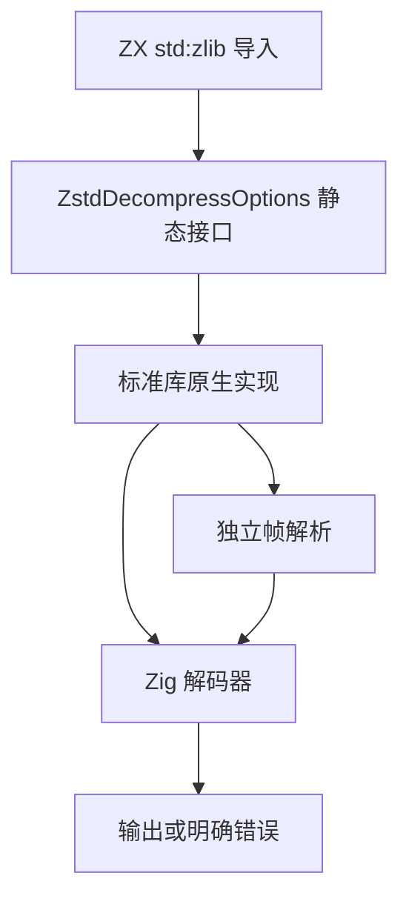

# Zstd 解压实施计划

## Intent：最终目标

推进标准库压缩功能组，接入真实 std:zlib.zstdDecompress 内存解压，遵循现有纯计算、只读输入及新分配输出语义。整个功能组仍需后续完成编码、字典、流式和其余协议，不以单个解压入口替代完整目标。

## Data：可用证据

Node.js zlib 文档提供 Zstd 压缩与解压及输出上限；RFC 8878 定义连续帧、可跳过帧、窗口与可选 XXH64 校验和。参考：[Node.js](https://nodejs.org/download/release/v26.8.2/docs/api/zlib.html)、[RFC 8878](https://www.rfc-editor.org/rfc/rfc8878.html)。本地 Zig 0.16 的 std.compress.zstd.Decompress 已有块解码，但 verify_checksum=true 会触发 panic；不支持字典。现有 zlib/decompress.zig 是同职责成熟实现。

## Edges：边界与限制

新增 ZstdDecompressOptions 包含 data、max_output_length、max_window_length。总输出与单帧窗口分别限制，帧头不能直接决定无上限分配。按完整帧切分后调用 Zig 解码，逐帧核对校验和；支持连续帧和可跳过帧，拒绝截断、坏帧、尾随垃圾与字典。保留现有 gzip/DEFLATE API。输入空字节不视为合法压缩帧；合法空帧可返回空列表。尚不提供编码器、字典或流接口，不引入系统动态库。

## Answer：交付与成功标准

正式类型声明、纯 Zig 实现、使用参考和验证记录。使用既有压缩输入资源及 zstd/Node 的独立工具生成压缩数据，实际 ZX 构建运行并比较字节；复用现有回归，不新增测试用例。检查已知长度、未知长度、连续帧、校验和、输出与窗口边界以及库消费。代码草稿及资源存放于本目录 Zstd解压。

## 执行与自我复核

不能仅依赖解码器返回成功：必须独立核对校验和，且不能在输出上限恰好耗尽时跳过帧尾验证。

正式实现位于 standard/src/zlib/zstd：frame.zig 复用 Zig 公开帧头及块头结构定位完整帧，并检查窗口；decompress.zig 每次仅把一个帧交给底层解码，分配有界历史窗口，再验证当前输出片段的校验和。每轮窗口缓冲及时释放，失败时释放累计输出。不对输入或类型做业务特例。

已完成真实应用构建及 19 项手工互操作/边界核验，记录在 [互操作结果](Zstd解压/互操作结果.json)：11 项合法输入字节一致，8 项非法或超限输入明确拒绝。输入包括 Node 压缩的现有源码及二进制字节，覆盖已知/未知长度、零输出和多块，最大实际输出 852400 字节。独立 Zig 消费通过生成库的 module("library")，3/3 构建步骤成功；ZX 再消费也通过，见 [库消费结果](Zstd解压/库消费结果.json)。

根构建 14/14 步骤通过（/tmp/zxc-zstd-build.log）；既有 test-zlib 回归 21/21 步骤、231/231 检查通过（/tmp/zxc-zstd-existing-regression.log）。未新增测试用例或使用浏览器。示例源码为使用演示，保存在功能目录。

自我批判：底层 verify_checksum 仍未实现，所以关闭该开关不代表忽略校验；本层逐帧独立验证。输出等于预算时仍读取帧结束状态，未知长度的超限也经过实际核验。当前字典 ID 字段值为零也被底层拒绝，这是一项明确的协议覆盖缺口，已在参考中披露。没有宣称 Zstd 编码、完整压缩功能组或其他平台运行完成。
