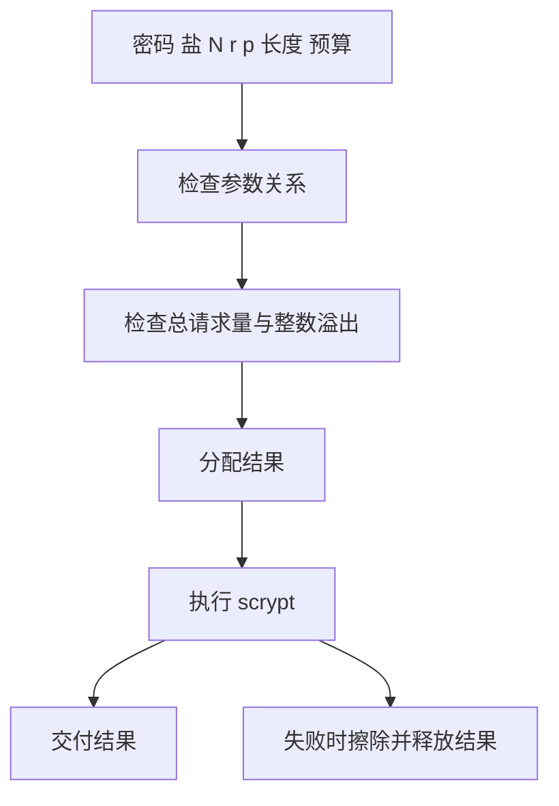

# scrypt 密钥派生实施计划

## Intent：最终目标

补齐 std:crypto 的 scrypt 密码密钥派生，直接使用 Zig 标准实现，保持纯计算、字节输入和新分配输出。与现有 HKDF/PBKDF2 并列，不以算法包装器替代随机数、密钥管理或完整密码学功能组。

## Data：可用证据

既有 crypto/kdf.zig 承担 HKDF、PBKDF2 的参数验证和输出所有权；Zig 0.16 std.crypto.pwhash.scrypt.kdf 实现实际算法，Params 采用 log2(N)、r、p。它没有调用方内存预算，内部申请 256*r、128*N*r、128*p*r 字节，因此需要在进入算法前检查完整请求量。

规范：[RFC 7914](https://www.rfc-editor.org/rfc/rfc7914.html)；功能参考：[Node.js scrypt](https://nodejs.org/download/release/v24.21.0/docs/api/crypto.html#cryptoscryptsyncpassword-salt-keylen-options)。不引入字符串编码隐式转换或系统动态库。

## Edges：边界与限制

ScryptOptions 明确 password、salt、cost、block_size、parallelism、length、max_memory。cost 为 u32 的 N，必须大于一且为二的幂；其余参数遵守 RFC 关系及 Zig 可表示范围。length 必须正数。max_memory 为 u64，限制工作缓冲和输出的请求字节总量，不包含输入、栈和分配器元数据。所有运算先以检查溢出的整数计算，超限前不分配结果或启动算法。

没有隐式默认参数。派生结果沿用 u8[] 所有权；失败时清理输出。Zig 内部缓冲由其实现释放，不承诺清除底层所有密码相关临时副本。

## Answer：交付与成功标准

公开 .d.zx 接口、Zig 实现、使用参考和实际 ZX 构建结果。使用 RFC 公开向量与 Node 独立派生逐字节比较，并核对预算及无效参数拒绝。复用既有密码学回归，不新增测试用例。代码草稿及示例位于同日期 scrypt密钥派生 目录。

## 执行与自我复核

不能仅检查 128*N*r 而漏掉 p、r 的工作缓冲与输出；也不能将合法但低成本的互操作向量当作使用建议。

正式实现为 standard/src/crypto/scrypt.zig，独立于已有 HMAC 泛型 KDF；公开 ScryptOptions 由真实 .d.zx 类型声明生成共享 ABI。只复用 Zig scrypt.kdf，不复制或改写密码学核心。

15 项手工互操作与边界核验已完成：前三组 RFC 向量加四种二进制输出长度均与独立 Node 结果一致；八项非法参数、内存预算和溢出输入被拒绝。RFC 第四组的大内存向量未运行。结果保存在 [互操作结果](scrypt密钥派生/互操作结果.json)，其中派生数据来自公开向量或人工演示输入，不含实际用户密码。

根构建 14/14 步骤（/tmp/zxc-scrypt-build.log）、既有 test-standard-resources 14/14 步骤与 37/37 检查（/tmp/zxc-scrypt-regression.log）均通过。后者是已有密码学、查询与压缩资源回归，不能替代新接口的独立向量核验。没有新增测试用例。

library 发布后 ZX 再构建成功，独立 Zig 项目通过 module("library") 构建 3/3 步骤成功；两者运行输出与 Node 一致，见 [库消费结果](scrypt密钥派生/库消费结果.json)。另已交叉编译 x86-linux，file 确认 ELF 32-bit、Intel 80386、statically linked；仅为编译证据，没有宣称跨平台运行完成。

自我批判：初始验证记录错误地将无期望字节的拒绝场景也标记 equal=true，已删除该字段，仅保留真实退出码与错误。预算是请求字节预算而不是严格的进程 RSS；p 为算法工作因子，不等于线程数。上述界限已写入公开参考。标准库其余密码学、受控 I/O 和整体目标仍未完成。
