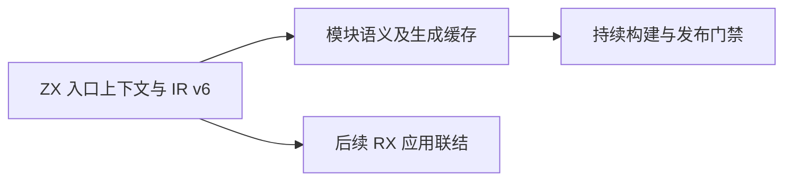
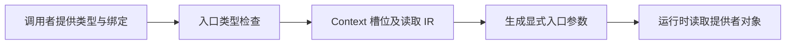

# 入口上下文与持续构建提交计划

## Intent：最终目标

将已经实现的增量语义缓存、模块 Zig 生成与持续构建形成可以独立检出和构建的提交，避免混合工作区掩盖依赖缺失。

## Data：可用证据

新缓存产物已经记录 Context 槽位，依赖 IR v6、入口上下文类型和读操作。当前工作区还包含 RX 标签、XML 属性表达式和其他会话的测试工作；这些不属于持续构建交付。上一轮完整工作区已有 347 项编译器测试和持续构建实际运行证据。

## Edges：边界与限制

前置提交只交付 ZX 编译 API 的入口 Context 注入能力及其 IR、所有权、生成、验证边界，不包含 RX 流程自动求值或调度，不报告完整 Context feature 已完成。普通 ZX 函数不继承入口上下文。缓存提交随后依赖此前置，不为拆提交而删除缓存对既有 Context 数据的支持。

## Answer：交付格式与成功标准

1. 按 hunk 生成前置提交版本：入口 Context、共享类型表、IR v6、useContext、借用规则与生成参数；保留 RX 表达式解析和缓存改动在工作区。
2. 从暂存区导出隔离目录，构建并运行既有编译器回归；用实际结果确认该提交不依赖工作区其他改动。
3. 提交并推送前置，再整理缓存/watch 的源码、使用文档与证据，重复隔离构建。
4. 保留完整 RX 执行和运行状态热重载的未完成状态。

自我复核：不能仅用混合工作区的绿色回归证明拆分提交完整；隔离检查必须使用暂存内容，而不是复制整个当前源码目录。

## 前置提交隔离检查

从暂存区导出独立目录，仅包含本次前置提交版本及此前已提交文件。根构建 13/13 步成功，编译器回归 48/48 步、347/347 测试成功。未复制工作区尚未提交的缓存、RX 表达式或其他会话测试文件。该检查证明前置提交可独立构建及兼容现有回归，不替代完整 RX 执行验收。
