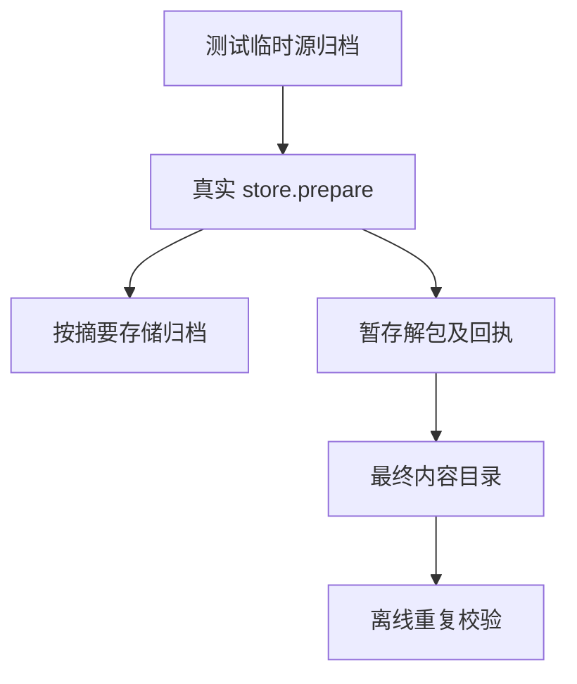
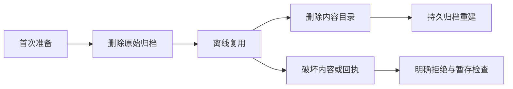

# 共享包存储完整性与恢复验证

## Intent：最终目标

验证归档进入共享包存储的真实路径：首次准备、离线复用、归档缓存重建、内容与回执损坏拒绝，以及失败暂存清理和资源释放。

## Data：可用证据

当前生产入口为 `packages/compiler/src/package/store.zig` 的 prepare。实现会话确认 CLI、锁文件和依赖图尚未接通，故此轮直接调用真实入口，不替代缺失安装功能。沿用上一阶段经独立tarfile校验的归档，临时目录隔离每个场景。

## Edges：边界与限制

不修改生产实现，不访问外网。缓存损坏目前约定拒绝，不能假定自动删除或修复。失败清理仅检查本轮创建的暂存目录，不要求已完成的缓存发布被回滚。并发、HTTP、安装锁文件与应用导入链路仍需单独验证。

## Answer：交付格式与成功标准

新增分层 Zig API 测试与专项构建，源码草稿同步保存在本目录。验证返回路径、实际文件、持久归档、回执和失败后的目录状态；逐分配失败验证资源释放。检查通过或真实缺陷需保留日志，并将缺陷发送实现会话。

## 执行结果

新增21个具名Zig API测试：8个生命周期场景、11个内容/回执完整性场景、2条逐分配失败路径。

生命周期检查首次发布的精确摘要目录、实际内容和持久归档字节；删除源文件后的离线复用；删除内容后的归档缓存重建；大写摘要与小写摘要共用身份；离线冷缓存明确拒绝；相对缓存根拒绝；源归档损坏拒绝；重复归档中途失败后清除暂存；缓存归档损坏拒绝。

完整性负例逐项破坏内容字节、删除文件、添加文件、文件符号链接、目录符号链接、执行位、回执版本、归档摘要、重复条目、非规范路径和回执符号链接。每次均直接调用真实prepare并检查明确错误，没有使用生产测试钩子。

- 首轮行为21/21通过，但构建因夹具释放错误退出1。夹具将realPathFileAlloc返回的 `[:0]u8` 保存成普通 `[]u8`，导致丢失哨兵长度；已保留原始类型修复，未改生产逻辑。日志 `/tmp/zxc-package-store.log`。
- 修复后专项21/21、8/8步骤通过；补充精确路径和归档字节断言后，与上一阶段归档专项共同复验，最终 **15/15步骤、59/59测试通过，退出0**，其中新增存储21项、归档38项。最终日志 `/tmp/zxc-package-store-verified.log`。
- 在 `packages/test` 执行 `zig build test-package-store test-package-archive --summary all`；存储专项已接入包根测试。
- Zig格式、夹具生成一致性、diff检查通过；本轮仅新增Zig代码，没有TypeScript改动。5份Zig草稿与正式文件逐字节相同，引用上一阶段归档夹具。

没有新增生产缺陷或生产源码修改。登记目录仍62,474，上游审阅516/53,597（唯一关联2,980）；21个新API测试不计入JSONL目录及上游审阅。最新完整根仍阶段160，4个已知legacy身份失败，此轮未运行完整根。

## 自我批判

直接API证据不能证明尚不存在的安装CLI、锁文件或完整依赖图已可用。缓存拒绝与缓存恢复需要分别论证，不能将所有失败一概视为预期。

本轮夹具缺陷说明行为断言通过不足以宣布构建通过，必须检查分配器错误和退出码。现有测试在macOS执行，不能证明Linux/Windows发布路径与权限相同；没有覆盖并发竞争、HTTP和共享目录被其他进程同时修改。
