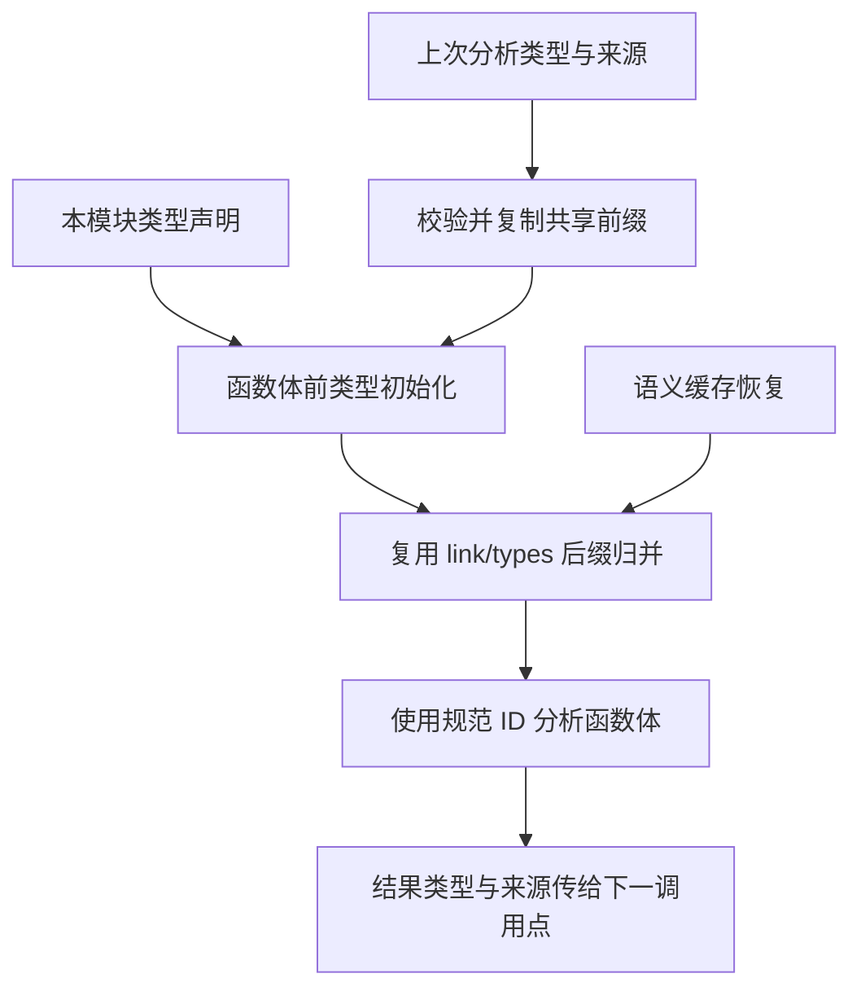
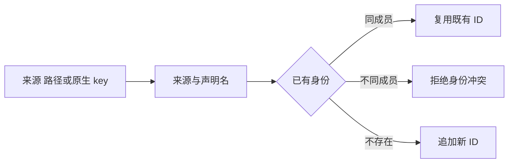

# 共享名义类型联结计划

## Intent：最终目标

使 RX 的多个 ZX 直接调用点共享完整类型身份，保证同一声明来源的枚举在冷分析、缓存恢复中一致，不同来源的同名同结构枚举保持不同。

## Data：可用证据

Analysis.Result 已有 nominal_types，Context 却仅接收 types，下一次 project 分析从空来源表开始。Types.enumeration 冷路径总是追加，函数体可能在最终链接前就因同源枚举 ID 不同报错。现有 modules/link/types 已按来源和名称归并，并拒绝同身份不同成员；缓存恢复复用该算法。独立只读分析确认不能把缓存命中作为语义正确的前提。

## Edges：边界与限制

Context 增加可选 nominal_types，与 types 一起校验、复制和持有。未提供来源的既有枚举仍是该表中的独立身份，不根据结构猜测来源。提供的来源记录不得越界、重复或与枚举名称不一致。

源代码类型初始化在函数体前复用现有归并器：保留共享前缀 ID，仅归并新声明后缀，重映射声明解析表。原生声明与 legacy 接口沿同一规则进入；legacy 来源仍采用 importer/binding/member，不改变待确定的既有枚举契约。同来源同名但成员冲突必须报错，不能静默选择一份。

来源和名称归结果 arena 持有，不借用已释放的上一轮结果。缓存摘要自动包含完整 Context。完整 RX Module 输入输出类型的公开来源仍待确定，本次不新增语法或替用户选择。

## Answer：交付与成功标准

共享类型输入与来源的最小扩展、统一冷/热归并、中文参考和执行证据。复用模块链接及缓存回归验证类型身份。不新增测试用例，不使用浏览器。

## 自我复核

已实施 Context.nominal_types、来源校验与深复制，并将来源归并放入 Types.initialize，在表达式类型检查之前完成。源码、native 冷路径和 legacy 接口复用同一归并逻辑；native 缓存仍使用已有恢复器。共享前缀 ID 不变，新声明后缀通过已有 link/types 算法重映射。

根构建 14/14 步成功；compiler 回归 49/49 步、347/347 用例通过。type-merge、semantic-cache、native-link、native-declarations 与 nominal-origins 组合回归为 100/104；失败项仍是已记录的三个 legacy 枚举绑定身份案例及其资源案例，本轮未解决该契约冲突，不能宣称全量通过。

自我批判：原注入示例及产物随功能移除，不再作为当前能力证据。独立分析使用 file_name，而项目分析使用规范路径，调用方必须统一来源路径。完整 RX Module 契约尚未完成，本次只交付编译器基础。
