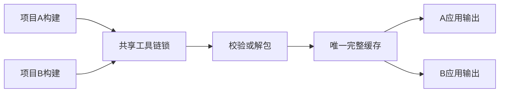
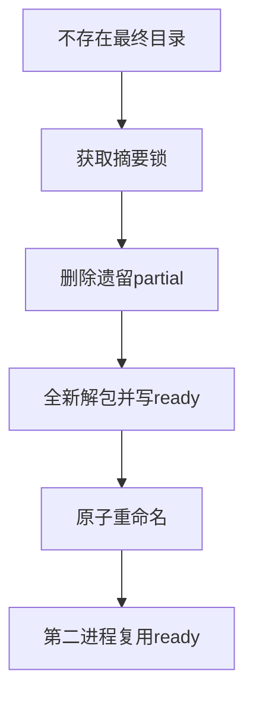

# 内嵌工具链并发解包验证

## Intent：最终目标

验证两个进程首次共享缓存时，工具链只形成一个完整最终目录，应用构建互不干扰；遗留 partial 暂存目录不会污染下一轮解包。

## Data：可用证据

cli/toolchain.resolve 先持有摘要锁，再检查 ready 并解包，unpack 清理同摘要 partial 后重新提取与重命名。阶段 88 已验证单进程独立运行，但没有覆盖共享冷缓存竞争。

## Edges：边界与限制

全部在临时目录进行，使用专用 ZXC_CACHE_DIR，清空 PATH 并指定不存在的外部 Zig 库。两个项目目录和输出相互独立，仅工具链与全局 Zig 缓存共享。本机实际并发不证明所有调度和跨平台锁行为。

## Answer：交付与成功标准

第一轮同时启动两个冷缓存构建，执行各自应用多个输入并检查仅一个完整摘要目录，无 partial。随后仅在临时缓存删除最终目录，放置同摘要的陈旧 partial，再次并发构建；旧哨兵不进入最终目录。所有子进程结束后才清理。

## 执行结果与自我批判

新增 1 个并发生命周期集成测试，内部执行空缓存与遗留 partial 两轮，每轮并发构建两个独立应用，共 4 次真实构建、12 次应用执行。两轮均仅留下一个摘要目录，ready 内容与摘要一致，无残留 partial，旧哨兵未进入最终目录；两个应用各自返回加11和乘7的正确结果。

`zig build test-toolchain-concurrency --summary all` **9/9 步骤、1/1 Node 测试通过**，日志 `/tmp/zxc-toolchain-concurrency.log`，执行约 56 秒。类型、Zig 格式、diff 和草稿一致性检查通过。已接入根 test，未修改生产源码，也未发现新缺陷。JSONL 57,631 与上游 316/53,597 不变。

自我批判：该集成测试检验两轮实际并发，无法枚举所有调度；两个进程同启不等于对每个锁切换点进行了确定性控制。陈旧 partial 模拟的是中断后的残留状态，没有实际杀死正在写入的进程，也没有模拟持锁进程崩溃。结果仅对应本机，不能扩展为跨平台锁验证。最近完整根仍为阶段 83。
