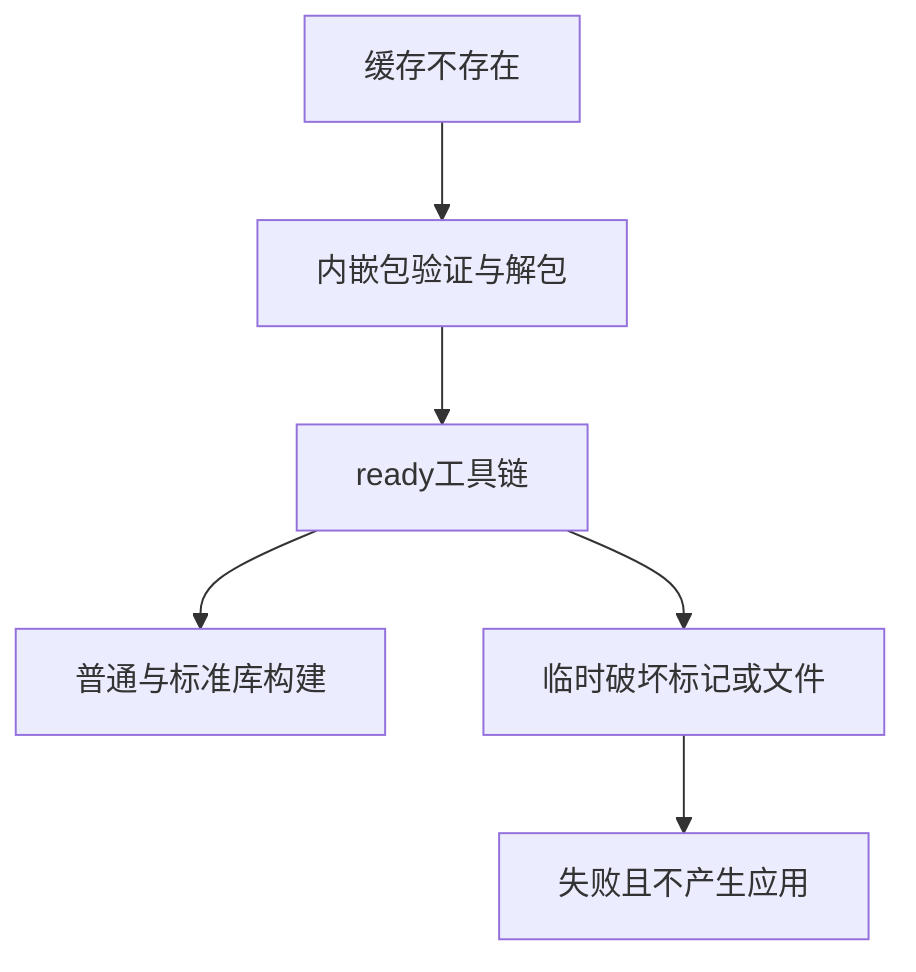

# 内嵌工具链独立运行验证

## Intent：最终目标

验证新 zxc 二进制包含独立构建所需工具链和标准库，不依赖安装目录旁的文件或 PATH 中的 Zig；同时验证工具链缓存损坏时明确失败。

## Data：可用证据

当前 build/toolchain.zig 将 Zig、库文件、标准库与索引嵌入 bundle。cli/toolchain.zig 按摘要缓存、加文件锁、临时解包并写 ready 标记。已有 build_modes 测试继承正常 PATH，不能单独证明内嵌能力。

## Edges：边界与限制

只操作测试临时目录，不修改真实用户缓存。设置专用 ZXC_CACHE_DIR 和 Zig 全局缓存，不改变 HOME。PATH 为空且 ZIG_LIB_DIR 无效，所有进程使用绝对路径。损坏缓存按当前设计拒绝而非自动修复，不将修复行为强加给实现。

## Answer：交付与成功标准

新增独立 Node 测试入口，通过编译器构建产物复制单个二进制。验证内嵌索引、冷缓存普通应用、暖缓存标准库应用、相对缓存路径拒绝、缺失/损坏标记与缺失 Zig 文件的失败且无目标产物。所有步骤使用真实编译和运行，接入根测试。

## 执行结果与自我批判

新增 7 个顺序生命周期场景，Node 统计包括父测试为 8/8，全部通过。`zig build test-toolchain --summary all` **9/9 步骤成功**，日志 `/tmp/zxc-toolchain-verified.log`。冷缓存普通应用分别输入 0、7、123 返回 3、10、126；暖缓存标准库应用把字节 [104,105] 编码为字符串 6869。内嵌索引无需安装旁文件且不创建工具链缓存。

相对 ZXC_CACHE_DIR 返回 InvalidZxcCacheDirectory；缺标记、错误摘要标记、缺 Zig 可执行文件均返回 IncompleteToolchainCache，并且不生成目标应用。测试结束恢复被临时移走的文件并清理全部临时目录。TypeScript、Zig 格式、diff 和草稿一致性通过，步骤已接入根 test。

首轮夹具未满足源码空行规则，第二轮标准库夹具误用字符串参数；分别按 AST 分组规则与 encoding.d.zx 的 u8[] 声明修正。最终完整重跑通过，两项均为测试夹具问题，不发送生产缺陷通知。无生产源码修改。

自我批判：此验证在当前主机执行，不能替代其他操作系统上的独立运行测试。没有覆盖同时首次解包的并发竞争、所有损坏文件、磁盘满或恶意缓存替换；只按当前拒绝损坏缓存的契约断言，不引入自动修复预期。父测试不算额外独立行为案例。最近完整根仍为阶段 83，本轮仅运行新专项；JSONL 57,631 与上游 316/53,597 不变。
