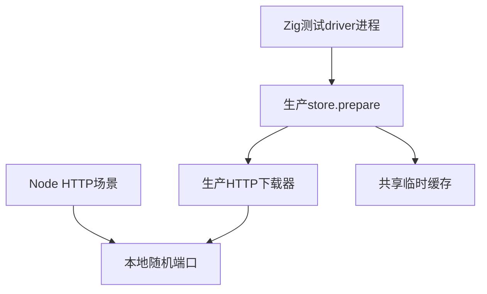
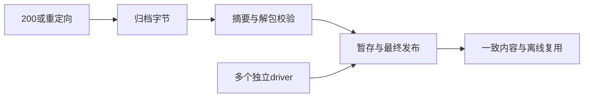

# 包HTTP下载与并发缓存验证

## Intent：最终目标

补齐共享包存储的真实HTTP输入路径和同摘要并发发布证据，不以本地文件读取代替网络协议行为。

## Data：可用证据

生产下载器显式请求identity编码，允许最多三次重定向，只接受200响应，检查声明大小；prepare随后校验归档SHA、解包、生成回执并发布整个目录。Node本地HTTP服务提供独立响应，Zig测试driver直接调用生产prepare。

## Edges：边界与限制

仅绑定127.0.0.1随机端口，无外网访问。测试driver不是正式安装CLI，不替代待实现锁文件和依赖图。此轮不验证TLS证书、代理或跨平台文件发布；并发只对当前平台实际行为负责。

## Answer：交付格式与成功标准

分开保存driver、进程调用和HTTP场景，专项接入根构建。检查请求次数与Accept-Encoding、响应处理、落盘内容、无残留暂存、离线不访问网络和并发进程结果。失败保留具体错误与日志，真实缺陷发送实现会话。

## 执行结果

新增17个Node测试，Zig driver直接调用生产共享存储：13个下载场景、2个缓存/并发场景、2个头部拒绝时序场景。

最初15项通过，5/5步骤成功，日志 `/tmp/zxc-package-http.log`。覆盖固定长度和chunked响应、相对重定向、三次允许/四次拒绝、循环重定向、404/500/204、内容编码、声明超限、SHA不匹配和gzip CRC错误；每次核对请求次数与identity编码。

并发采用HTTP响应屏障：四个独立driver全部到达下载点后才统一发送归档，确保四者都经过冷缓存路径。所有进程返回同一摘要目录，只有一个最终内容目录与归档、无暂存残留；后续四个离线进程复用成功且网络请求数仍为4。循环和多进程不额外计案例。

### 新缺陷：错误返回清理仍读取正文

最初15项虽通过，但204与超限响应各耗时约6秒。进一步检查生产下载器及Zig 0.16 HTTP Client源码，发现在读取响应头后直接return错误时，defer request.deinit()可能通过discardRemaining读取剩余正文。

新增两个受控场景：服务发送200和128MiB+1声明，或503和100字节声明，flush响应头后保持正文不结束。driver都未在3秒保护期限内返回；测试主动关闭响应后，driver返回正确错误，但“拒绝不依赖对端结束正文”的断言失败。

复现专项 `zig build test-package-http --summary all`，日志 `/tmp/zxc-package-http-rejection.log`，退出1，15项通过、2项失败。测试不把超时当作正确错误，也未放宽断言。已按授权将事实、路径、日志和修复方向发送实现会话，生产源码由其处理。

### 当前检查

TypeScript检查退出0，日志 `/tmp/zxc-package-http-typecheck.log`。源码草稿6份与正式文件逐字节一致。最终再次运行仍为15/17通过，4/6构建步骤成功，退出1，日志 `/tmp/zxc-package-http-final.log`。两条失败仍是同一头部拒绝清理问题；没有掩盖或删除失败。实现修复后的复验待后续记录。

## 自我批判

本地HTTP协议覆盖不能推导公网或TLS可靠性；并发成功不能证明所有时序，也不能忽略错误退出、残留暂存或请求次数异常。

归档夹具沿用上一阶段固定有效夹具；本目录草稿的导入路径对应正式目录，完整文件位置为 `packages/test/tests/package_store/http`。

新增17个Node测试不计入JSONL登记或Test262上游审阅。登记案例62,474、上游516/53,597、唯一关联2,980不变；最新完整根仍阶段160，原4个legacy身份失败之外，阶段169结束时另有本轮2个专项失败，随后阶段170已修复并复验通过。

## 阶段170修复复验

实现会话在HTTP错误路径的errdefer中将连接标记为closing，避免后续request.deinit继续读取待拒绝正文。两个受控失败断言保持不变，联合执行 `zig build test-package-http test-package-store test-package-archive --summary all` 最终20/20步骤、59/59 Zig测试、17/17 Node测试通过，退出0，日志 `/tmp/zxc-package-http-fixed.log`。204与声明超限响应本次均约4毫秒返回；这里只记录实测，不将耗时当作跨平台性能保证。

已把独立复验结果通知实现会话。完整根回归另见 `阶段一百七十完整根回归.md`。
