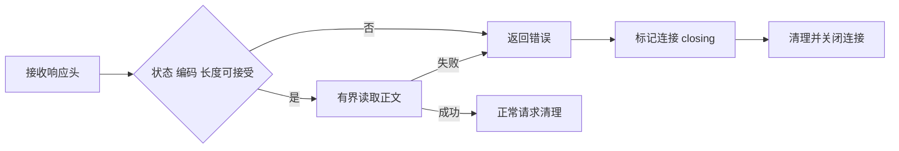

# 包下载响应头拒绝阻塞修复

## Intent：最终目标

响应头已足以拒绝包下载时立即结束请求，不等待服务器发送被拒绝的正文。

## Data：可用证据

测试会话反馈两个真实 HTTP 场景：200 响应声明超过 128 MiB；503 响应声明 100 字节。服务器只发送响应头，保持正文未结束。原实现均超过三秒不返回，关闭服务器响应后才返回预期错误。

本地 Zig 0.16 的 std.http.Client.Request.deinit 在 received_head 状态调用 discardRemaining，以便复用连接。业务层提前 return 并不意味着传输停止；defer 清理重新读取了应被拒绝的正文。

## Edges：边界与限制

修改仅涉及 package/store/download.zig 的请求错误退出路径。保留正常下载、成功请求清理及重定向流程。没有新增测试用例；运行测试会话已提供的 HTTP 专项。

本次消除了明确拒绝后的隐式读取，不宣称实现了下载总超时或所有网络取消策略。

## Answer：实施与验证

在 request.deinit 的 defer 之后注册 errdefer，将仍存在的连接标记为 closing。错误退出时 errdefer 先执行，deinit 的短路逻辑跳过正文清空，连接池销毁连接。该处理也覆盖正文读取失败，不改变成功路径。

执行 packages/test 下 zig build test-package-http --summary all：6/6 构建步骤成功；17 个 Node HTTP/并发检查全部通过。两个保持正文未结束的场景分别约 12 ms 和 5 ms 返回；普通响应、chunked、重定向、编码拒绝、摘要及 CRC 拒绝、离线与四进程并发准备均通过。

自我复核：根因在清理函数的传输行为，而非状态码判断失效。通过错误路径关闭连接修复资源生命周期，未放宽拒绝条件，也未把三秒等待阈值调大。
