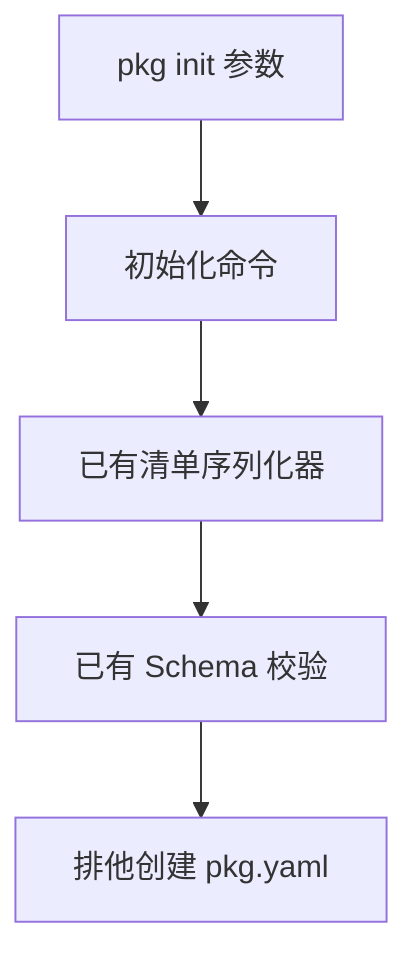

# 包初始化实施

## Intent：最终目标

提供内置 `zxc pkg init`，在当前目录创建可被现有清单读取器消费的 pkg.yaml。初始化不依赖注册表、安装器或发布文件范围。

## Data：可用证据

已有清单写入器与解析器提供统一 Schema；现有 package/command.zig 按子命令分发。标准库 createFile 的 exclusive 选项在创建时拒绝已有文件，避免先检查后覆盖的竞争窗口。

## Edges：边界与限制

- 命令为 `zxc pkg init <name> [--version <version>] [--entry <path>] [--private]`。包名显式提供，版本默认 0.1.0，入口可选。
- 不推断或改写目录名称，不生成业务源码。entry 指定后遵循既有包内 .zx 路径约束；初始化不要求未来源码已经存在。
- 使用既有写入器生成内容，再用解析器验证，避免复制一套包名、版本和路径规则。
- 拒绝未知、重复及缺值参数；已有 pkg.yaml，包括符号链接，不覆盖。
- 内容验证完成后才排他创建文件。普通写入失败清理本次未完成文件；不承诺进程强制终止或机器断电下的事务恢复。
- 不新增测试用例，不调用浏览器；使用临时目录手工验证并运行相关既有检查。

## Answer：交付与成功标准

交付子命令、帮助与使用文档。验证默认与显式字段、清单回读、非法输入、已有文件保护；初始化已有源码后应可实际编译。验证完成后记录真实结果。

## 自我复核

初始化是包管理命令的一环，不能据此声称安装、锁文件、共享存储或发布完成。默认版本只是新清单初值，不代表已有发布版本。文件保护使用操作系统排他创建，不依赖检查文件存在后再写入。命令默认创建最小清单，不擅自生成入口业务代码。

## 实施与验证记录

- 已接通 init 子命令与全局帮助。参数解析、清单序列化和 Schema 校验全部在创建文件前完成。
- 分发构建 10/10 步骤通过。
- 临时目录核对默认字段、显式作用域包名/版本/入口/private 及 inspect 回读通过。复制既有报价源码后，用初始化的配置生成 Zig 源码成功。
- 缺名、缺值、未知参数、重复参数、非法名称/版本/入口等 12 种输入均失败，目录中没有生成 pkg.yaml。
- 已有清单字节保持不变；符号链接目标不受影响。
- 8 个并发初始化进程中恰好一个成功，最终清单通过 inspect。
- 人工核对过程中曾误用未支持的 -o 编译参数，改为现有 --out 后成功；未为此修改 CLI 契约。
- 所有人工核对临时目录均已清理，没有增加仓库测试文件。
- 使用真实 Z3 的既有根回归通过：1065/1065 构建步骤、57109/57109 测试。Zig 格式、Markdown 格式和 diff 空白检查通过。
