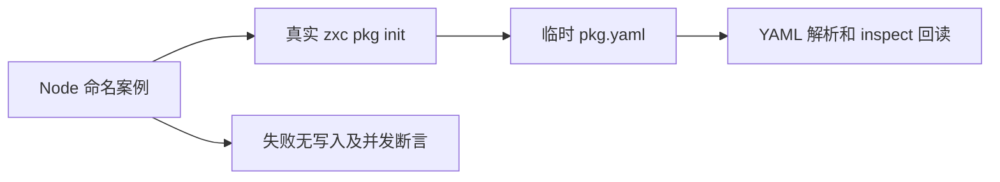
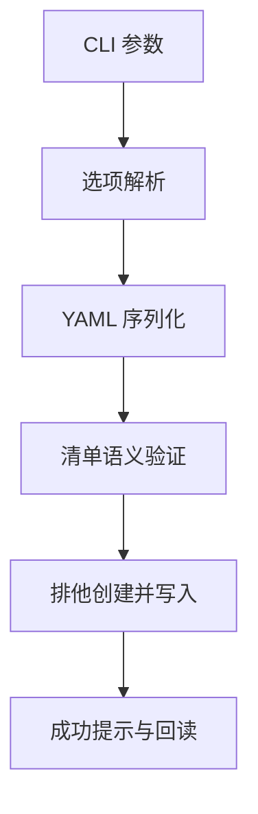

# 包初始化行为验证

## Intent：最终目标

验证新增 `zxc pkg init` 的参数、YAML 回读、失败无残留、已有文件保护和并发排他创建。初始化属于写入操作，成功提示必须与实际可解析文件一致。

## Data：可用证据

当前 `package/init.zig` 先序列化并复用清单解析器验证，再以 exclusive 模式创建 pkg.yaml；`manifest/write.zig` 使用 JSON 字符串转义形成合法 YAML。测试复用现有 Node CLI 测试风格。

## Edges：边界与限制

仅测试临时目录，不修改真实用户配置；不假设 entry 文件必须已存在。保留并行实现会话的生产源码。排他创建并非断电后的持久化保证，本轮不模拟磁盘硬件故障。

## Answer：交付与成功标准

在 packages/test/tests/package_manifest 下新增初始化测试。合法输入验证完整 YAML 数据并通过独立 inspect 回读；非法输入验证退出码、诊断和无文件；已有文件与符号链接目标保持原字节；并发只允许一个成功。

## 执行结果与自我批判

- 新增 27 个命名 Node 测试：5 个合法输入、8 个参数错误、9 个清单语义错误、4 个已有目标保护和1 个八进程并发场景。
- 直接专项 27/27 通过，日志 `/tmp/zxc-init-direct.log`。TypeScript、Zig 格式、diff 及草稿与正式文件一致性检查通过。
- 首轮错误地把含冒号入口路径作为合法输入。复核 `relativePath` 的明确限制后，改为独立拒绝案例；合法转义案例使用空格、井号和引号。此为测试假设修正，不是生产实现缺陷。
- 无生产源码修改，也未发现需要发给实现会话的新问题。

自我批判：八进程同时启动能检查实际排他行为，但不能穷尽所有内核调度；测试没有模拟断电、磁盘写满或输出管道中断，不据此声称初始化具备事务持久化保证。路径字符限制沿用现有契约，未为了通过测试放松规则。完整包管理专项 10/10 步骤、1,632 个 Node 测试全部通过，日志 `/tmp/zxc-init-final.log`。本轮未重复完整根回归，最近由本会话验证的完整根仍为阶段 75。
