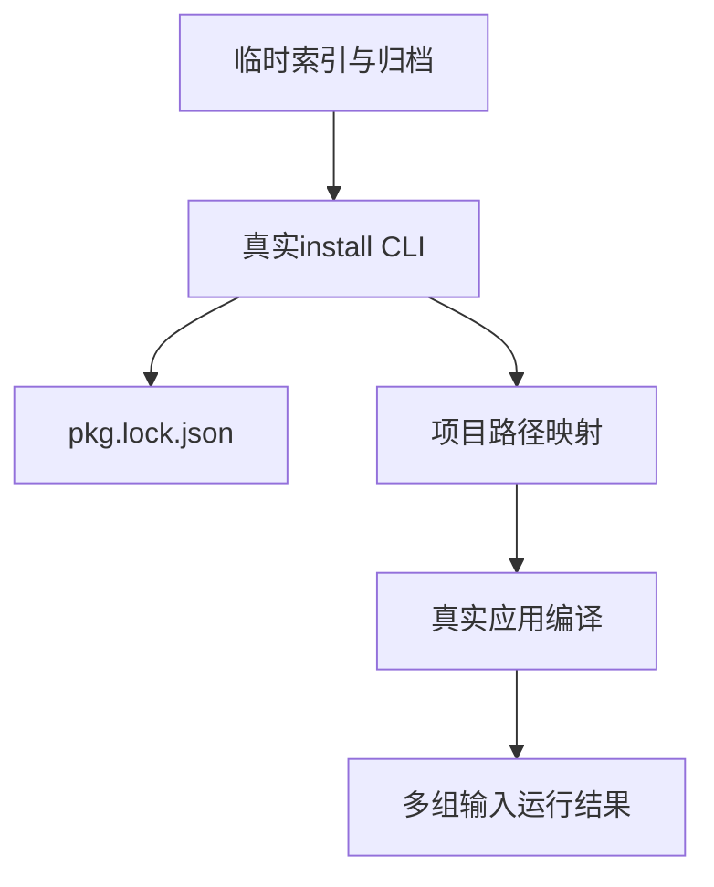
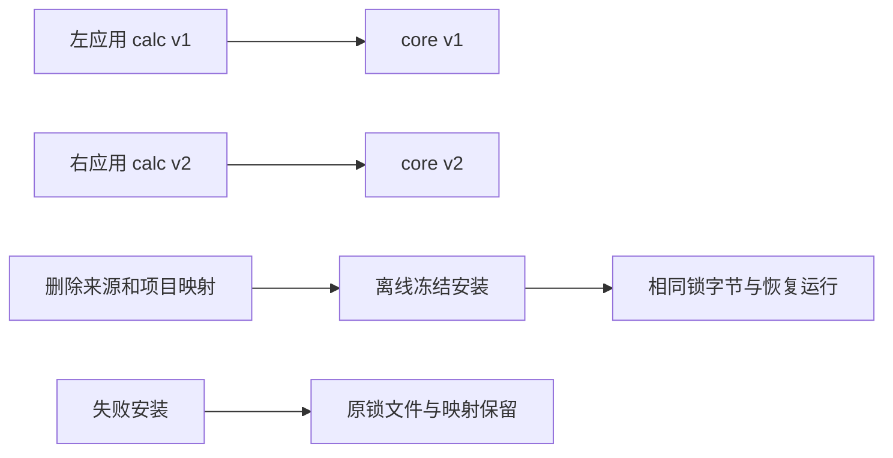

# 包安装CLI与版本隔离验证

## Intent：最终目标

验证真实zxc pkg install把多版本传递依赖接入应用编译执行，并验证离线冻结恢复与失败时保留既有锁文件、项目映射。

## Data：可用证据

当前CLI已提供--index、--offline、--frozen-lockfile；共享缓存按归档摘要组织，pkg.lock.json保存精确依赖图，.zxc/packages按锁文件摘要保存本机映射。沿用独立tar构造器生成临时包与索引，调用真实CLI而不是安装内部API。

## Edges：边界与限制

临时工作区和缓存隔离，不访问外网、不修改生产源码。此轮不模拟发布途中崩溃或HTTP远端故障；失败保留以锁文件与映射的原始字节为证据，不声称整个共享缓存回滚。依赖图仅覆盖明确构造的两条传递版本链，不声称所有解析器分支均覆盖。

## Answer：交付格式与成功标准

测试按临时包构造、CLI夹具、运行集成和失败边界分层。检查最高匹配版本、传递边目标、实际应用结果、冻结离线锁字节不变及映射重建；错误案例必须具体错误、退出1、已有发布元数据不变。保存草稿、构建入口及验证日志。

## 执行结果

新增6个Node测试：1个实际应用安装/恢复集成、5个失败保护场景，已接入根构建，专项入口为 `packages/test` 下 `zig build test-package-install --summary all`。

临时索引含core 1.1/2.2和calc 1.0/1.4/2.0。左应用选择最高匹配calc 1.4及core 1.1，运行结果为输入+9；右应用选择calc 2.0及core 2.2，结果为输入+24。逐条核对四条依赖边的精确目标；锁共7节点（3个工作区节点、4个归档节点），未选择较旧calc 1.0。

初次安装后两个应用各执行0、7、123；随后删除整个索引/源归档目录、项目映射及缓存解包目录，只保留锁文件与持久归档，执行离线冻结安装。锁文件和重建映射与原始字节完全一致，4个内容目录恢复，两个应用再次重新构建并运行同样输入。每次构建前删除旧可执行文件，避免旧产物掩盖构建失败。合计4次构建、12次真实应用调用；不额外计为独立案例。

失败场景为：冻结锁过期、版本无匹配、摘要错误、归档版本身份不匹配、冻结锁缺失。前四项验证退出1、精确诊断和原锁/映射字节保持，恢复原清单后离线冻结安装再次通过；最后一项验证不创建锁或映射。

- 首轮5个负例通过，但运行夹具在spacing检查被拒绝：生成ZX缺少语义块间空行。按既有import_cases.ts样例修正夹具，未修改生产规则或放宽断言。首轮日志 `/tmp/zxc-package-install.log`。
- 最终专项退出0，**11/11步骤、6/6 Node测试通过**。运行集成约40秒，日志 `/tmp/zxc-package-install-final.log`。
- TypeScript检查退出0，日志 `/tmp/zxc-package-install-typecheck.log`；Zig构建格式与diff检查通过。
- 四份TypeScript草稿与正式文件逐字节一致；复用已有 `packages/test/src/shared/tar.ts`，不新增tar实现。

无生产修改或新增实现缺陷。登记案例62,474、上游审阅516/53,597、唯一关联2,980不变；6个Node测试不计入JSONL或Test262审阅。最新完整根仍阶段170；此轮新增专项未再运行完整根。

## 自我批判

成功安装提示不足以证明安装可用；必须运行真实应用。精确锁边和运行结果共同证明版本隔离，不能仅统计包数量。错误后的元数据保留不代表任意写入时刻都有跨文件事务保证。

本轮未验证安装中的并发清单变化、锁文件篡改、归档内开发依赖、作用域越界及watch对安装图的恢复；这些不能由当前两个版本链自动推导。
