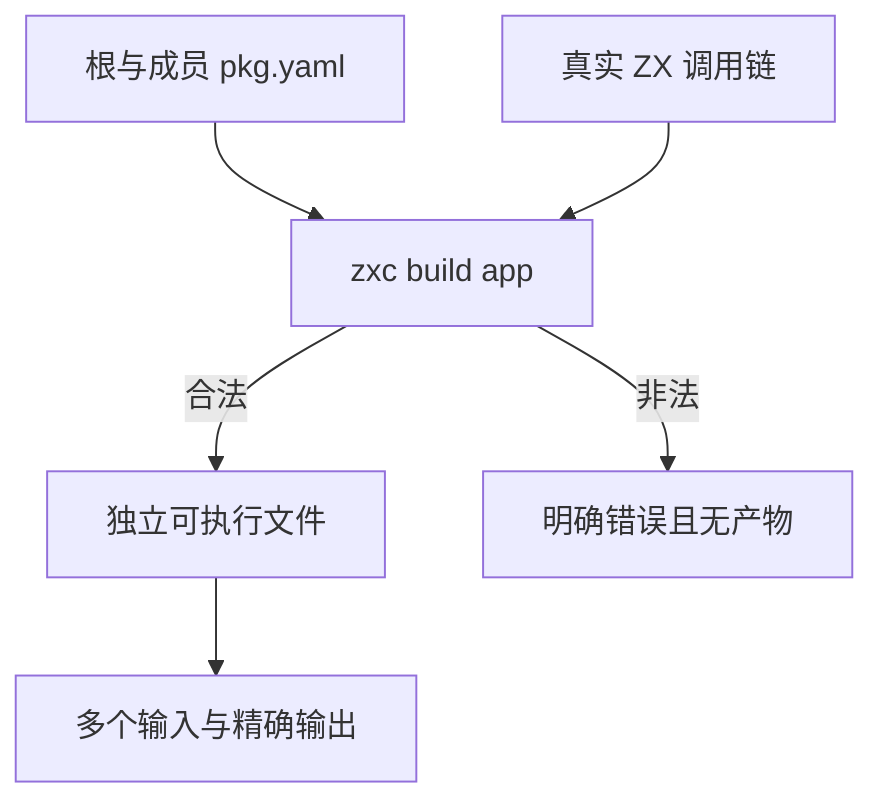
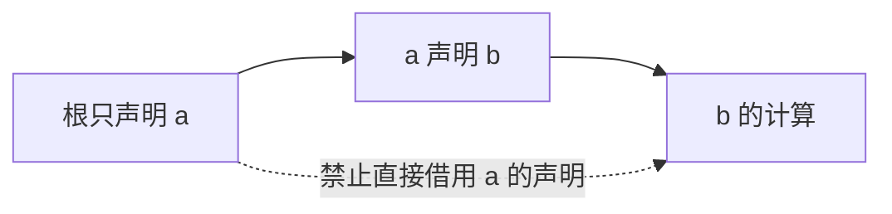

# 包导入隔离与运行验证

## Intent：最终目标

通过真实编译与独立可执行产物验证包依赖可见性，避免依赖图正确但文件导入仍可绕过边界。

## Data：可用证据

包管理契约要求按拥有者隔离直接依赖；@/ 相对当前包，文件导入不能跨包；真实源路径须与声明路径一致，未发现的嵌套包不能按普通目录绕过。已有 app 构建测试采用 JSON 参数执行产物，可复用该公开协议。

## Edges：边界与限制

只创建本测试临时工作区，测试正例真正编译为 app 并执行多个输入；负例保留明确拒绝而非只检查非零退出。成员发现和依赖图仍为独立证据，本轮不下载外部依赖、不测试安装或发布。

## Answer：交付与成功标准

验证合法传递调用链、直接编译成员、包内根别名/相对路径、开发依赖、声明别名和作用域名。验证根不可直接用传递依赖、成员不可用未声明依赖、别名不额外暴露原名、跨包文件路径、未声明嵌套包、缺入口和源文件符号链接。每例独立 Node test；拒绝后不应留下应用产物。

## 直接执行与自我批判

16 个独立场景全部通过：七个合法工作区分别构建应用，并用 0、7、123 三个输入执行（共 21 次真实应用调用）；九个非法场景确认退出 1、特定错误与无应用产物。直接日志 `/tmp/zxc-import-direct.log`。

传递正例实际执行 root→a→b 的不同增量，避免各模块返回同一常量掩盖错误目标。根与成员拥有同名 helper 时分别经 @/ 解析，实际输出证明包根归属；成员入口直接构建还验证了向上发现所属工作区。

拒绝场景包括“根可见 a、a 可见 b”不推出“根可见 b”，根声明 b 不推出成员 a 可见 b，以及虽已声明依赖仍不能用跨包文件路径绕过包入口。未发现的嵌套 pkg.yaml 和源文件符号链接有独立拒绝证据。

本轮不宣称跨平台链接权限、资源耗尽、任意包布局或所有文件编码已经验证。测试安装产物由真实编译器生成，但安装/下载机制本身不在本批范围。TypeScript、Zig 格式与 diff 检查通过，未发现新的生产缺陷。

## 构建系统专项

包清单专项 9/9 步骤通过，inspect 24、workspace 31、graph 32、import 16，共 103 个独立 Node 测试全部通过；日志 `/tmp/zxc-import-special.log`。未修改生产源码或既有语言目录，本轮执行相关专项，没有重复整套 Zig 回归；最近完整根仍为阶段 75。
