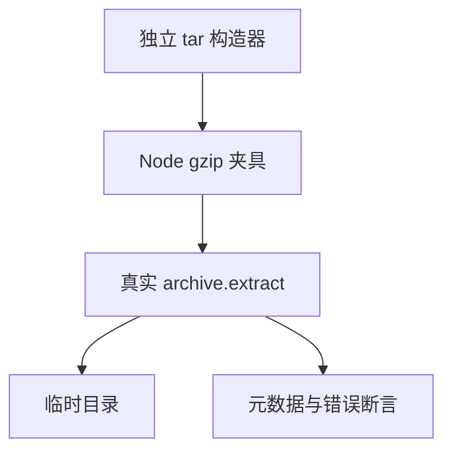

# 包归档完整性与解包边界验证

## Intent：最终目标

直接验证实际包归档解包器：合法归档的落盘字节、文件摘要与可执行标记正确；损坏归档、越界路径及不支持的条目被拒绝；逐分配失败不泄漏内存。

## Data：可用证据

生产入口为 `packages/compiler/src/package/archive.zig`，依次校验 SHA-256、gzip、tar 结构、路径并写入目标目录。测试使用独立的 tar 字节构造器与 Node gzip，不能调用生产编码逻辑生成预期。

同职责样例采用 `tests/package_index/resources_test.zig` 的逐分配失败断言和 `tests/incremental/backend_publish/paths_test.zig` 的临时目录生命周期。

## Edges：边界与限制

不修改生产源码。不声称 archive.extract 本身具备回滚事务；失败可能留下已解包条目，安装层负责暂存清理。此轮不覆盖网络下载、共享缓存并发、最终安装发布或完整 CLI。路径越界测试使用独立临时目录，禁止读写用户路径。资源上限的完整大文件压力另行验证。

## Answer：交付格式与成功标准

测试及独立夹具生成器放入 `packages/test`，中文方案与源码副本放入本目录。专项接入测试包根构建，要求具名断言、生成一致性、格式及 TypeScript 检查通过。任何真实实现缺陷按已授权范围发送实现会话。

## 执行步骤

1. 构造合法、压缩损坏、结构损坏、路径和条目冲突夹具。
2. 编写落盘行为及错误类别断言，补充逐分配失败测试。
3. 运行专项、独立夹具读取校验与静态检查；记录失败原因及结果边界。

## 执行结果

新增38个具名Zig测试：31个归档格式/路径/条目负例，7个内容、空包、SHA前置拒绝、既有文件保护及资源生命周期测试。成功解包测试本身也逐分配失败执行，并在成功提取后覆盖输入缓冲区，检查返回数据的所有权。

合法夹具包含规范化目录、ustar prefix、GNU长文件名、513字节跨块二进制、空文件、可执行文件。逐文件检查实际落盘字节、SHA-256、返回可执行标志和磁盘owner执行位。重复路径、坏gzip、非法路径分别进行逐分配失败注入。

- 首轮36/36通过；补充磁盘权限、输入所有权和两条资源路径后，最终38/38通过，8/8构建步骤成功，退出0。日志 `/tmp/zxc-package-archive-final.log`。
- 专项入口：在 `packages/test` 执行 `zig build test-package-archive --summary all`；已接入包根测试。
- `pnpm typecheck` 退出0，日志 `/tmp/zxc-package-archive-typecheck.log`；生成器 `--check`、Zig格式、diff检查通过。
- Python标准库tarfile独立读取合法gzip/tar，确认五个文件的名称、字节及执行位。夹具SHA-256为 `82b49fd42bd8e5a0fcde3f797a4b4a5cd3d17412ecdf523d1b823ee5b3bb1800`。
- 草稿按原目录结构保存2份TypeScript、4份Zig及33个压缩夹具，与正式测试文件逐字节核对。

没有生产代码变更，没有新增实现缺陷。JSONL目录仍62,474，上游审阅仍516/53,597，唯一关联2,980；这38个API测试不计入目录或上游审阅数。最新完整根仍为阶段160，4个已知legacy身份断言未通过，此轮未重新运行完整根。

## 自我批判

合法输入与无效输入必须分别验证；错误案例通过不能代替安装闭环。多个断言与故障注入循环不额外计为独立案例。

独立tarfile校验只核验合法夹具；负例以明确的包归档契约为准，不假设通用tar工具与该限制集一致。尚未覆盖完整压缩资源上限、既有目标目录中的恶意父级链接、安装事务、跨平台权限及并发；不得据本轮通过宣称外部包安装已闭环。
