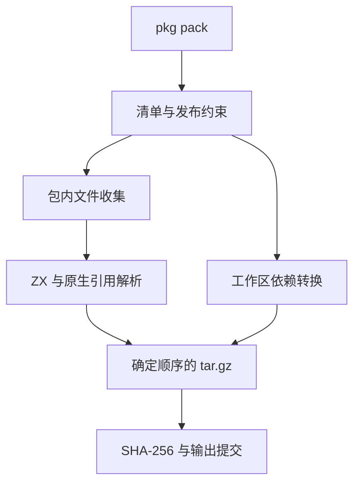

# 包归档实施计划

## Intent：最终目标

实现 `zxc pkg pack`，生成可供多版本索引引用、可搬迁且内容确定的包归档。归档保留包身份、源码与运行依赖，后续安装器验证原始归档 SHA-256，再校验清单与依赖闭包。

## Data：可用证据

- `packages/pkgs` 已提供多版本索引、版本范围选择与归档摘要字段；尚未获取或安装归档。
- `package/manifest` 已统一读取和写入 pkg.yaml；当前没有发布文件选择字段。
- `cli/library_sources.zig` 为 lib 输出重写整个源码闭包的导入，并清空包依赖。它是库导出，不能直接替代保留依赖身份的包发布。
- `cli/native_references.zig` 已解析 Zig 的静态 @import 与 @embedFile，并识别动态资源；应复用这个解析能力。现有 native_sources.write 会重排目录，不能原样用于保持包内路径的发布归档。
- 本机 Zig 0.16 的 std.tar.Writer 与 std.compress.flate.Compress 可直接生成归档，无需依赖系统 tar 命令。tar 文件时间、权限及 gzip 头均可确定；文件顺序也必须固定。
- 上一轮配置统一提交 6119ddf 的 GitHub Actions 37142720830 已完成，六个平台全部成功。

## Edges：边界与限制

发布文件范围会影响包的公开内容，尚待用户选择：

1. 显式 files 配合入口依赖和必要原生资源的默认闭包。
2. 默认整个包目录，排除版本控制、缓存和安装产物。

在选择确定之前不修改清单 Schema，不实现隐含的公开文件规则。选择确定后还需在对应方案中明确以下约束：

- 归档只包含当前包，不能递归带入相邻工作区成员；依赖由元数据表达。
- `private: true` 拒绝发布打包；打包不等于上传或发布索引。
- workspace 依赖必须校验实际目标并转换为安装器能理解的名称与版本要求；别名需要显式契约，不能丢失实际包名。
- 归档内路径统一使用相对路径和 `/`。拒绝越界、符号链接别名以及重复归档路径，不读取包外文件。
- 原生头文件、动态嵌入资源与链接目录的处理需要与编译契约一致，不能声称仅收集 .zig 文件就已覆盖所有原生依赖。
- 本机绝对 include_paths/library_paths 不构成可搬迁资源，须明确报错或由受支持的打包规则转换，不能静默写入产物。
- 输出文件本身不能进入输入集合。失败不能留下可被误认作成功的归档；最终输出采用准备完成后的提交步骤。
- 不新增测试用例，不调用浏览器。复用现有示例进行真实打包、独立解包和编译核对。

## Answer：交付格式与成功标准

交付内置命令、确定的 tar.gz 归档、SHA-256 信息、清单契约和对应使用文档。源码文件选择确定后再补充正式接口与代码草稿。

验收要求：相同文件内容产生相同归档；独立工具能够解包；解包后包身份和源码字节保持一致；工作区依赖没有泄漏成本机路径；必要原生资源完整；非法边界报错且没有成功产物；真实已有包能够搬迁并编译。

## 自我复核

当前仅完成依赖关系与标准库能力核对，未实现 pack，也未证明归档或安装闭环。默认全目录和默认依赖闭包各有不同的漏收或误收风险，不能将其当成纯粹的编码细节。先明确发布内容契约，再复用现有解析器实现；不要通过复制整个 lib 导出逻辑绕过包身份与依赖问题。
