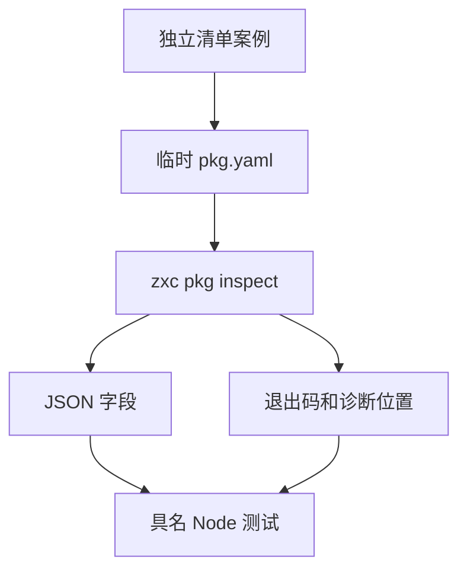
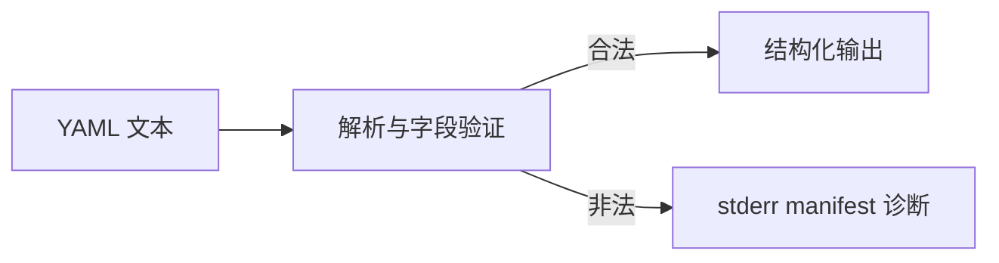

# 包清单检查入口验证

## Intent：最终目标

为新统一 pkg.yaml 清单的公开 inspect 入口建立独立具名 CLI 验证，保持阶段 73 根回归恢复工作，不将接口迁移只停留在旧夹具改名。

## Data：可用证据

实现会话已按用户决定取消 zxc.json，清单要求 name/version，并提供 entry/private/dependencies/dev_dependencies/workspace。解析器拒绝重复键、未知字段、错误类型和越界路径；inspect 输出结构化 JSON 或带位置的 manifest 诊断。当前 dist 编译检查为 9/9 步骤通过。

## Edges：边界与限制

本批只验证清单解析与 inspect 协议，不证明依赖下载、工作区扫描、图解析、链接或所有原生字段已覆盖。使用临时目录，不改用户清单。每项独立 Node test，保留错误退出码、空 stdout 与诊断位置检查；此类 CLI 测试不计入 JSONL 目录数量。

## Answer：交付与成功标准

合法清单核对解析后的字段，非法清单核对退出 1、无 JSON 输出及明确诊断。接入独立 test-package-manifest 与根 test，专项和根回归分别报告。先验证当前已编译 CLI，再验证构建系统提供的真实产物。

## 专项结果与自我批判

24 个独立 Node 测试通过：六个合法清单验证默认字段、带作用域名称/预发布版本、private、带空格入口、两类依赖和工作区包含/排除模式；十八个非法清单检查精确诊断消息、行列、退出码与空 stdout。

当前 dist CLI 直接运行通过，构建系统提供的 Debug CLI 也通过（6/6 构建步骤），日志 `/tmp/zxc-manifest-inspect-test.log` 与 `/tmp/zxc-manifest-inspect-build.log`。已接入 test-package-manifest 和默认 test；TypeScript 与 diff 检查通过。

这些是解析协议案例，不把 inspect 返回依赖要求字符串解释成已经解析/安装依赖，也不把工作区模式字符串的接受解释成文件扫描正确。标准项目测试正在并行迁移，完整根回归另行记录。24 个 Node 测试不计入 JSONL 目录总数与 Zig 测试汇总，避免重复计数。

最终根级实际 Z3 回归 1062/1062 步骤、57,109/57,109 Zig 测试通过，24 个清单 Node 测试也全部通过，日志 `/tmp/zxc-manifest-root.log`。同时恢复阶段 73 的根验证。JSONL 总数仍为 57,113，上游审阅保持 287/53,597。
