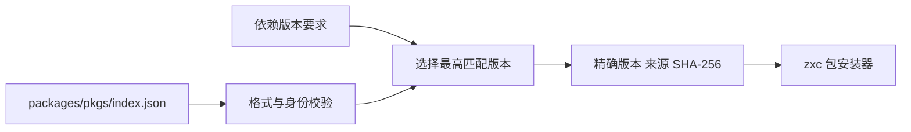
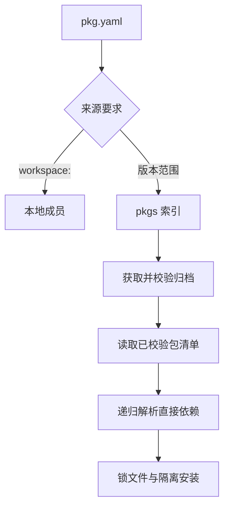

# 包索引实施计划

## Intent：最终目标

按用户要求建立 packages/pkgs，维护同一包的多个版本。索引负责可用版本、来源和内容完整性；zxc 包管理器负责解析、获取、锁定、共享存储和项目安装。

## Data：可用证据

- 用户明确指定 packages/pkgs 作为包索引所在包，并要求多版本。
- 当前 workspace 已支持按包拥有者解析与版本范围。已有范围实现应移动复用，避免工作区和外部包各维护一套语义。
- 尚无可用公共包服务和已发布包的证据；初始索引不编造版本或下载地址。

## Edges：边界与限制

- 采用版本化静态 JSON 索引。每个包包含版本列表，每个版本记录精确语义版本、归档来源和 SHA-256。清单仍为 pkg.yaml；索引不重复维护完整依赖表，安装时从经摘要校验的包清单读取。
- 按单个依赖拥有者的范围选择最高匹配版本，允许不同拥有者选择不同版本。预发布版本遵循显式范围规则。
- 重复包名、版本优先级冲突、未知字段、非法版本或摘要必须失败。顺序不影响选择；条目不可仅靠版本标签推断完整性。
- workspace: 只解析本地成员；普通范围查询索引，不能把未匹配的工作区引用自动替换成外部包。
- 本阶段不新增测试文件或浏览器 UI。使用已有回归、真实命令和临时索引副本验证。

## Answer：交付与成功标准

交付独立 pkgs Zig 包、仓库维护的 index.json、索引校验与版本选择接口、内置 CLI 查询、使用文档。随后将索引接入完整安装路径，验证归档完整性、不同版本并存、锁定重放和离线复用；在这些路径完成前不将索引查询描述为完整包管理。

## 自我复核

索引提供版本事实，不等于包内容已下载、依赖闭包已求解或产物可执行。空初始索引是未发布包的真实状态，不以示例地址伪造可用生态。后续验收必须覆盖实际安装与消费路径。

## 当前实施证据

- packages/pkgs 独立构建通过，编译器复用其名称与版本判断；没有复制工作区版本求解逻辑。
- 索引随分发安装到 share/zxc/pkgs/index.json，`zxc pkg index` 可直接校验和读取；`zxc pkg resolve` 接受包名、范围和可选索引路径。
- 用既有报价源码创建临时真实归档及对应索引，核对乱序列表中的最高匹配版本、预发布要求、无匹配与重复版本拒绝；临时资源已删除。
- 分发构建 10/10 步骤通过，现有根回归 1,062/1,062 步骤、57,109/57,109 测试通过；未增加索引测试文件。CI 打包脚本增加索引文件和真实读取检查。
