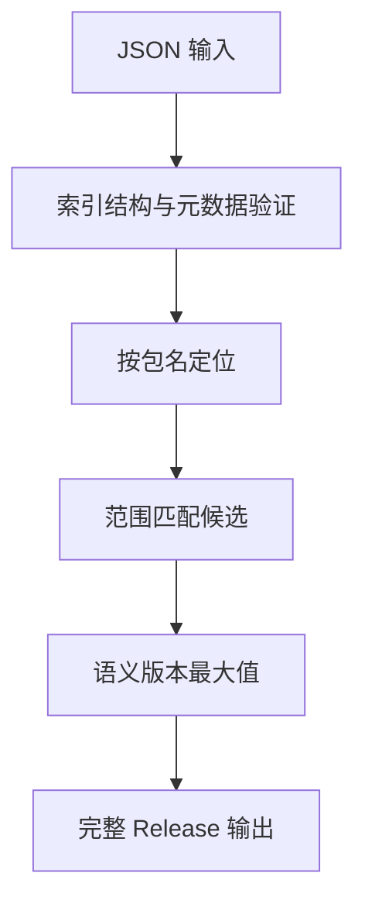

# 包索引解析与版本选择验证

## Intent：最终目标

通过真实 zxc pkg index/resolve 验证发布索引的完整性与最高满足版本选择。区别“范围能匹配单个版本”和“能从无序候选中正确挑选版本”。

## Data：可用证据

当前 packages/pkgs/src/index.zig 验证格式号、包名、非空版本列表、包名和语义版本唯一性、归档字段和摘要；select 遍历候选选择满足范围的最高版本。阶段 78 已独立验证范围匹配，尚未覆盖此 CLI 选择链路。

## Edges：边界与限制

索引提供归档位置与摘要元数据，本轮不下载归档或证明摘要与远端内容相符。工作区协议快捷形式不用于普通索引范围。所有索引写入临时目录。

## Answer：交付与成功标准

独立包索引测试目录，验证合法索引原样回读、非法索引错误、候选顺序无关、语义数字排序、预发布门控、构建元数据和不存在包/版本。真实 CLI 返回对象必须同时匹配版本、归档位置及摘要。

## 执行结果与自我批判

新增 64 个真实 CLI 测试：2 个索引回读、15 个范围各以原序/倒序/轮转三种顺序选择（45 个）、4 个包名与范围交互、6 个索引结构语义错误、7 个归档/摘要字段错误。

`zig build test-package-index --summary all` **6/6 步骤、64/64 Node 测试通过**，日志 `/tmp/zxc-index-special.log`。TypeScript、Zig 格式和 diff 检查通过。新步骤已接入 test 总入口。没有生产源码修改、没有新实现缺陷。JSONL 57,132 与上游 304/53,597 不变。包清单等现有专项 1,632 个 Node 测试之外，本轮另增 64 个包索引测试。

自我批判：候选顺序测试验证排序无关性，不代表三个不同功能。摘要测试只检查元数据格式，尚未证明真实归档内容与摘要匹配，也未覆盖下载、安装和发布链路。当前新增步骤没有复跑完整根，最近本会话完整根证据仍为阶段 75；不要将本专项结果扩展为全仓结果。
