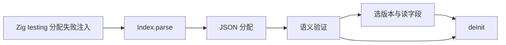
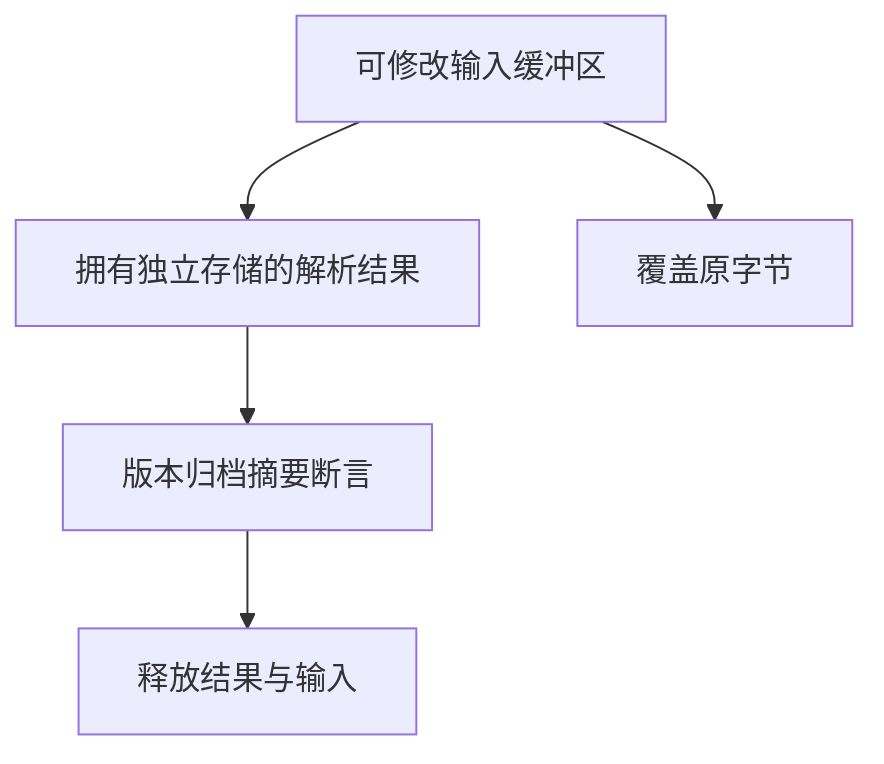

# 包索引资源失败验证

## Intent：最终目标

验证索引解析和语义校验在每个可触发的分配失败点释放资源，并确认解析结果拥有字符串存储，不依赖输入缓冲区保持不变。

## Data：可用证据

Index.parse 使用 std.json.parseFromSlice 的 alloc_always，语义验证失败通过 errdefer parsed.deinit 清理。沿用仓库 checkAllAllocationFailures 资源测试风格。

## Edges：边界与限制

测试目标是实际 Zig 内存分配路径，不以 CLI 进程退出替代释放证明。仅覆盖选定多包多版本索引及五种失败形状，不声称穷尽 JSON 输入或系统资源错误。

## Answer：交付与成功标准

新增 packages/test/tests/package_index/resources_test.zig，通过公开 pkgs 模块解析、选择和销毁。逐次注入分配失败，OutOfMemory 必须传播；正常语义错误必须保持原错误；解析后覆盖源字节，结果和选择仍正确。Debug 与 ReleaseSafe 专项通过，无泄漏。

## 执行结果与自我批判

新增 6 个 Zig 测试，每个使用 checkAllAllocationFailures 对其执行路径逐次注入分配失败。成功路径包含两个包与多个版本，解析后将输入所有字节覆盖为下划线，仍能读取包名、选出 1.2.3、核对归档位置与摘要。失败路径包括格式号、重复包、摘要错误、JSON 截断及未知字段；OutOfMemory 继续传播。

Debug 和 ReleaseSafe 均 **3/3 步骤、6/6 测试通过**，日志分别为 `/tmp/zxc-index-resources-debug.log` 和 `/tmp/zxc-index-resources-safe.log`。Zig 格式与 diff 检查通过，新步骤 test-package-index-resources 已接入测试总入口；测试包显式增加 pkgs 依赖。无生产源码修改，无新缺陷。

自我批判：逐分配点注入只覆盖本组输入触发的路径；没有覆盖所有索引规模、恶意嵌套或磁盘故障。覆盖原输入能检出字符串借用问题，但不等于所有公开 API 的生命周期均得到证明。六个测试按测试函数计数，不把内部注入轮数叠加成额外测试案例。

完整根回归使用真实 Z3：`ZXC_TEST_SOLVER=/tmp/zxc-z3-5.1.0/z3-5.1.0-x64-osx-13.3/bin/z3 zig build test --summary all`，退出码 0，**1,071/1,071 步骤、57,134/57,134 Zig 测试通过**，六组包管理/索引 Node 测试合计 **1,696/1,696** 通过，日志 `/tmp/zxc-stage83-root.log`。这是本阶段共享工作区的完整根回归证据。登记 JSONL 57,132 与上游审阅 304/53,597 不变，Zig/Node/JSONL 采用不同统计口径，不能相互相加冒充独立上游覆盖。
