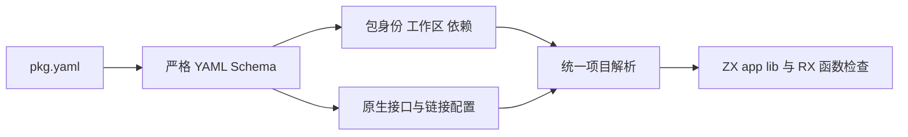
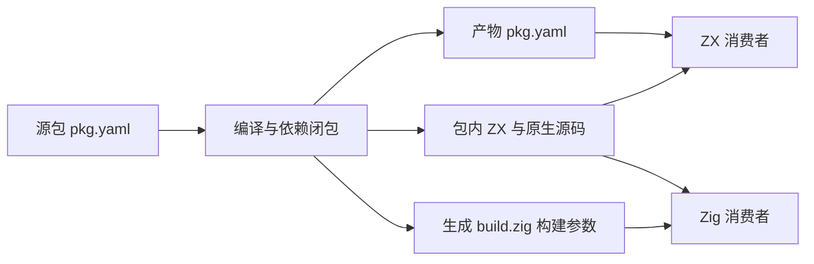

# 包配置统一实施

## Intent：最终目标

落实用户明确要求：用 pkg.yaml 代替 zxc.json，不保留第二套项目配置。工作区、包依赖、原生接口、链接与库产物使用同一清单契约。

## Data：可用证据

- 原 cli/project 从 zxc.json 读取全局包映射和原生配置；lib 产物也输出该文件。
- 当前 pkg.yaml 已有真实 YAML 解析、位置诊断、成员发现和版本依赖图，可作为统一入口。
- 现有 app/lib 回归覆盖原生声明、C/Zig 接口、库搬迁、共享 ABI、资源路径与压缩调用，适合验证迁移没有改变实际编译行为。

## Edges：边界与限制

- 不读取旧 zxc.json。没有清单的独立 ZX 文件仍可编译；存在清单时要求合法 name/version。
- dependencies/dev_dependencies 使用包依赖协议，不继续提供 CLI 全局 packages 映射。包可用自身 name 引用自身 entry；源码环仍由编译器拒绝。
- 原生字段保留既有名称与类型：native_interfaces、native_modules、externals、libraries、include_paths、library_paths。其路径相对声明所属清单目录。
- 标准算法源码仍随编译器分发。库打包复制真实依赖闭包，原生构建参数写入生成的 build.zig，Zig 消费者不需要安装 YAML 解析器。重新配置原始包后应重新导出库，不把派生产物当作第二份手工配置。
- 历史草稿、已取消的动态插件记录只保留历史证据；当前使用说明以 compiler README 与本文为准。

## Answer：实施结果与成功标准

- cli/project 统一读取清单；main、check-rx 的帮助及错误路径采用 pkg.yaml。
- lib 产物写出正常 YAML 清单，保留包名/版本，将 entry 指向打包源码。没有输入清单时默认 library@0.0.0。闭包内依赖已改写为相对源码，不复制原工作区依赖边。
- 迁移现有原生回归中的配置数据，沿用原来的输入与预期行为，不新增测试用例。使用 Grit 完成配置写入点迁移；规则保存于同日《包配置统一/迁移清单.grit》。
- 六组当前原生/标准库示例改为 pkg.yaml；旧全局示例映射转换为包自身身份与入口。
- 已有 app/lib 回归通过：搬迁后的 ZX/Zig 消费、原生资源和路径拒绝、72 次聚合引用调用、25 组原生调用及 264 次压缩应用调用均通过。完整根回归通过：1,062/1,062 个构建步骤、57,109/57,109 个测试成功。
- 六组迁移示例的七个 ZX 入口均经当前 CLI 生成成功。附带空行调整逐文件确认非空行字节未变。

## 自我复核

一次配置迁移不仅是文件改名。YAML 必须实际解析，旧全局依赖映射不能被原样带入新清单，lib 产物还必须能够独立消费。迁移过程中发现生成 Zig 切片字面量写法不合法，已改为明确生成类型正确的构建参数，并通过既有搬迁回归。外部包安装、锁定与共享存储仍属于未完成目标，不由这次回归推断完成。
