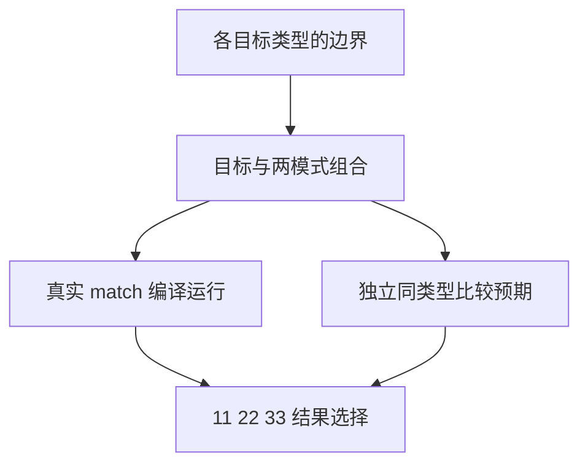
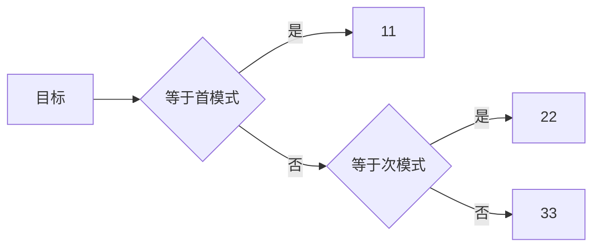

# 匹配标量与嵌套验证

## Intent：最终目标

补齐非浮点 match 目标的实际执行证据，验证字节字符串、布尔、全部整数宽度和枚举的匹配顺序，以及默认唯一分支和嵌套结果。

## Data：可用证据

match 明确允许非 void 标量与枚举，匹配项为同类型表达式，重叠时首项优先。浮点与调用顺序已覆盖；现有控制驱动支持精确 BigInt JSON 和字符串输入。

## Edges：边界与限制

字符串采用 UTF-8 字节语义，不引入 Unicode 归一化；内嵌 NUL 不得截断。枚举测试通过 u8 索引构造有限枚举值，避免把 JSON 数字直接假装成 Zig 枚举 ABI。此阶段不扩展借用聚合结果或隐式类型转换。

## Answer：交付与成功标准

九种字符串、两个 bool、六种整数各三个边界、三个枚举成员分别全组合目标与两个模式；三个不同结果标记区分首项/次项/默认。另验证默认唯一分支与四种嵌套 bool 组合，并增加枚举穷举仍缺默认、跨枚举和宽度不匹配等前端拒绝。

## 执行纠正

首轮错误地假定有八种整数，i8/i16 夹具在类型解析失败，并使有符号混用案例得到 name 而非预期 type_mismatch。重新核对设计文档 4.1 与 IR Scalar：只提供 u8/u16/u32/u64/i32/i64。删除本轮生成的两套无效运行夹具，用两条明确不支持类型的诊断保留边界；符号混用改为 i32/u32。未修改生产实现或将不支持类型伪称为已有能力。

## 最终专项与自我批判

新增 933 条运行（字符串 729、布尔 8、枚举 27、六整数 162、默认唯一分支 3、嵌套 4）及八条前端案例。字符串参考模型按 UTF-8 Buffer 内容比较，覆盖内嵌 NUL 与 Unicode 规范等价但字节不等的字符串；明确不依赖 JS 字符串隐式规范化。枚举由三个输入索引分别构造，命中结果为不同标记 11/22/33，全部 27 组合包含重复模式优先级。

缺默认、跨枚举、枚举/数字混用、整数宽度/符号和 bool/数字混用都独立验证；不使用其他早期类型错误冒充目标规则。默认唯一分支和嵌套结果已实际运行，补上上一阶段只有分析接受的证据缺口。

类型检查、生成一致性、审计、格式和 diff 检查通过。错误源于测试方案假设而非生产缺陷，没有向实现会话发送错误归因通知。借用聚合结果、跨模块枚举及资源失败仍需后续验证，本批不能代表所有 match 行为完成。

最终联合专项为 853/853 步骤、45,623/45,623 测试通过，日志 `/tmp/zxc-match-scalars-final-special.log`。根级实际 Z3 回归 1051/1051 步骤、57,085/57,085 Zig 测试通过，日志 `/tmp/zxc-match-scalars-root.log`。登记总数 57,089：runtime 42,503、frontend 3,120、evaluation_order 320、safety 464、RX 10,446、Store 236。ZX 自有测试不增加上游审阅数，仍为 287/53,597。
