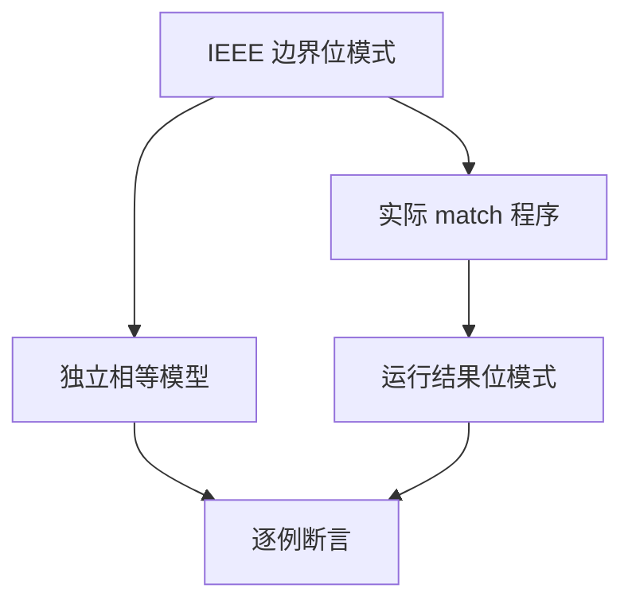
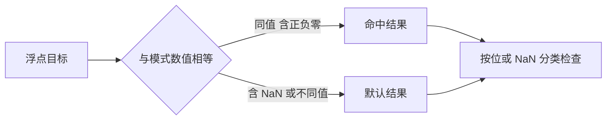

# 匹配浮点边界验证

## Intent：最终目标

验证 f32/f64 的 match 值模式采用数值相等语义，正确处理 NaN、正负零、无穷、正规与次正规边界，并保持所选结果位模式。

## Data：可用证据

match 设计允许浮点目标，匹配项按同类型表达式比较。已有独立 IEEE 位表示模型及 floating/floating_ternary 驱动，非 NaN 按位核对，NaN 仅要求分类。已有边界集合每种宽度 35 个值。

## Edges：边界与限制

不使用生产比较实现生成期望。IEEE 同宽有限非零值只有唯一位表示，两个零忽略符号相等，任何 NaN 比较均不相等。NaN payload 不属于现有输出契约，不增加 payload 保留断言。本批为 ZX 自有特性，不增加 Test262 上游审阅数。

## Answer：交付与成功标准

每种宽度 35×35 个目标/模式组合，输出 1/0 区分命中与默认；另验证首项命中、正负零匹配、NaN 模式不命中三种结果路径，各遍历 35 个结果或目标位模式。共 2,660 个独立具名案例，复用既有位驱动，执行后更新清单。

## 专项与自我批判

四套新程序全部通过：每种宽度 1,225 条匹配判定与 105 条结果选择，共 2,660 条新增案例。判定程序返回不同的 1/0，避免默认结果与命中结果相同掩盖分支错误；选择程序则独立核对命中值与默认目标的位模式。两类证据分开，不只检查最终浮点值相等。

独立模型只用 IEEE 分类、位相等与正负零规则，未读取生产 IR 或生成源码。35 个边界涵盖正负零、相邻正规/次正规、最小/最大有限数、正负无穷和 NaN；此集合不是所有可能位模式的穷举，也不证明硬件所有 NaN 变体及异常标志行为。

TypeScript、生成一致性、矩阵审计、格式和 diff 检查通过，无生产修改或新缺陷通知。测试来自 ZX 自有 match 契约，上游审阅数保持 287/53,597。

完整浮点专项 173/173 步骤、22,194/22,194 测试通过，日志 `/tmp/zxc-match-floating-special.log`。最终根级实际 Z3 回归 1006/1006 步骤、56,144/56,144 Zig 测试通过，日志 `/tmp/zxc-match-floating-root.log`。登记总数 56,148，其中 runtime 41,570；其他分项与上游审阅数不变。
