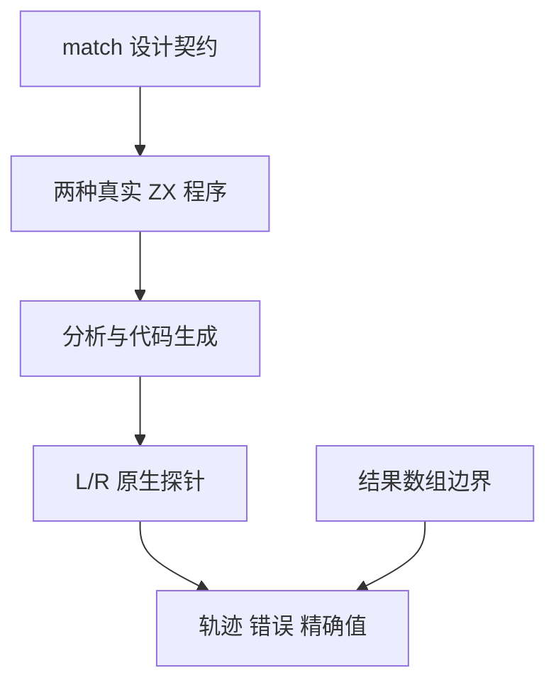
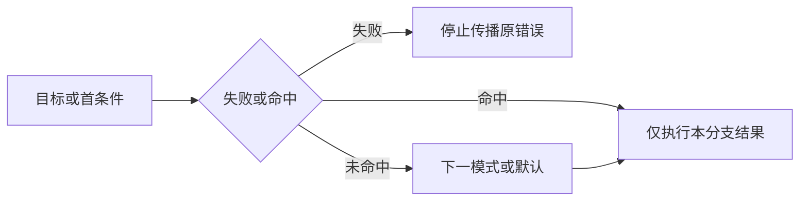

# 匹配表达式求值与边界验证

## Intent：最终目标

为 ZX 自有 match 特性补齐可独立失败的顺序、惰性和诊断证据，不增加 Test262 上游审阅数。

## Data：可用证据

《ZX match 设计》明确两种模式、首命中、目标一次求值、匹配项按序惰性求值、统一结果类型及唯一末尾默认分支。现有原生 L/R 探针可观测调用并分别失败，现有测试目录未发现专门 match 案例。

## Edges：边界与限制

本轮只覆盖两种模式的控制流及解析/分析边界，不能据此宣布枚举、字符串、浮点位模式、嵌套所有权等全部匹配语义完成。扩展既有轨迹驱动接受数值输出和 IndexOutOfBounds，不修改生产编译器或为测试特判。

## Answer：交付与成功标准

条件模式以左右命中与分别失败组合；值模式以首项/次项/默认命中及目标/首模式失败组合。两者加入长度零到三的结果数组，选中索引的可用性决定成功或越界。每例检查调用轨迹、错误身份或精确数值，共 112 条具名轨迹；另设独立语法与类型案例。

## 专项结果

新增 64 条条件模式、48 条值模式具名轨迹，另新增十六条独立前端案例。值模式第二匹配项改为真实 readLeft(false) 调用：首项命中仅 LR，否则 LRL；额外目标调用或漏掉第二匹配项都会改变轨迹。选择结果使用不同的 11/22/33，而不是各分支返回同一常量；数组长度零至三让每个分支分别出现成功和越界边界。

最终联合专项 26/26 步骤、3,433/3,433 测试通过，含完整 3,112 条前端案例、320 条目录轨迹及一个历史乘法轨迹。日志 `/tmp/zxc-match-final-special.log`。首次试跑第二项还是常量，后续改为可观察调用并完成联合复跑，最终生成器与源码一致。

前端覆盖缺默认、默认非末尾、重复默认、缺逗号/箭头、非 bool 条件、异型模式、optional/对象/列表/void 目标、异型结果、不可达分支未知名称，以及默认唯一分支与末尾逗号合法形式。

## 自我批判

这批证据重点是 match 控制流。两个原生标签足以发现目标或模式多余调用、首错误与未选结果错误，不等同任意宿主副作用证明。尚未独立展开枚举/字符串目标、NaN/有符号零、嵌套 match、借用结果身份及全资源失败，所以全特性覆盖仍未完成。前端合法默认唯一分支只证明分析接受，不误称已验证对应运行返回值。

轨迹检查器按实际 program.Output 比较结果，发射器仅新增有限数值与 IndexOutOfBounds 支持；原 bool/LeftFailure/RightFailure 用例仍联合执行。TypeScript、生成一致性、矩阵审计、格式与 diff 检查通过，无生产修改或新缺陷通知。

最终根级实际 Z3 回归为 989/989 步骤、53,484/53,484 条 Zig 测试通过，日志 `/tmp/zxc-match-root.log`。登记总数 53,488：runtime 38,910、frontend 3,112、evaluation_order 320、safety 464、RX 10,446、Store 236。此为 ZX 自有特性，上游审阅保持 287/53,597，未审阅 53,310。
