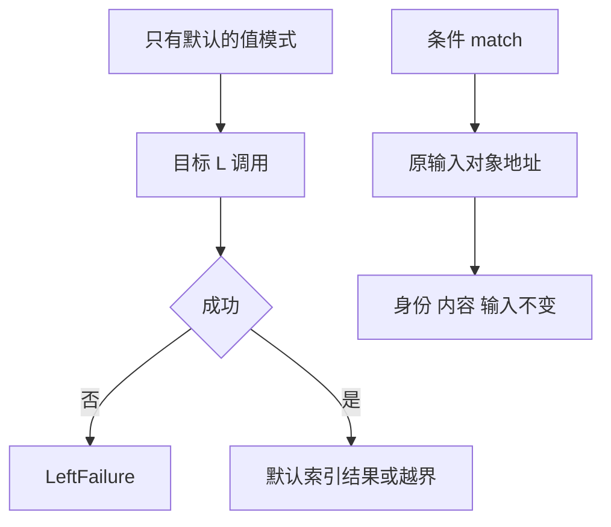
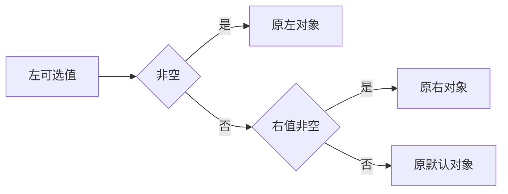

# 匹配默认目标与借用验证

## Intent：最终目标

验证值模式只有默认分支时仍执行目标，以及条件 match 返回借用对象时保持所选输入身份。

## Data：可用证据

match 设计要求先求值目标且只求值一次；后端零分支路径显式丢弃已绑定目标。现有可选对象身份驱动能创建三个不同地址并核对引用与输入不变，选择规则适用于空值合并与条件 match。

## Edges：边界与限制

不引入语言级引用相等；指针仅用于测试观测。结果表达式仍使用显式可选解包，身份检查不能证明所有聚合形状的借用。只将已复用的驱动和矩阵生成器改名为选择身份职责，不扩展生产抽象。

## Answer：交付与成功标准

十二条默认目标轨迹（目标成功/失败、结果数组长度与索引）核对目标调用 L、原始错误优先级及结果。十二条借用对象案例覆盖左右存在性和相同/不同内容，以独立地址检查 match 选择。旧空值合并身份案例保持 ID 与数据不变并共同运行。

## 执行过程与阶段性阻断

类型检查、两个生成一致性检查、全量矩阵审计、Zig 格式与 diff 检查通过。目录新增十二条默认目标轨迹与十二条 match 身份案例；原空值合并身份数据保持不变。驱动改名 optional_selection，矩阵生成器改名 generate_selection_identity，旧/新两种选择规则共用独立地址观测。

首次专项在 pkgs/build.zig.zon 缺 fingerprint 时未进入测试，已反馈实现会话并由其补齐。第二次构建中，全部轨迹 333/333 通过，但 CLI 因 manifest/decode.zig 导入尚未存在的 native.zig 失败，运行目录没有执行。该中间状态已再次反馈，未改动对方迁移源码。独立 test-evaluation-order 为 26/26 步骤、333/333 测试通过，日志 `/tmp/zxc-match-default-trace.log`；失败联合日志 `/tmp/zxc-match-borrow-special.log`。

当时尚未完成新 match 对象身份实际执行、改名后旧身份专项重跑及最终根回归；随后已恢复专项，见下述复跑结果。 不将元数据审计当作执行通过。当前登记 57,113：runtime 42,515、frontend 3,120、evaluation_order 332、safety 464、RX 10,446、Store 236；最后完整根回归仍来自阶段 72，不能覆盖进行中的 pkg.yaml 迁移。

## 自我批判

构建失败来自正在写入的新配置依赖，不能归因于 match 语义。等待迁移文件齐备再重试，保留测试期待；不通过回退依赖或绕开当前 CLI 宣称当前整库通过。目标只有默认时仍调用 L，且 LeftFailure 优先于回退索引错误的语义已有真实证据。借用身份部分必须在实际运行后才能结论化。

## 迁移文件齐备后的复跑

确认 native.zig 已落地后重跑，联合专项 878/878 步骤、42,848/42,848 测试通过，包含新旧对象身份与全部轨迹；日志 `/tmp/zxc-match-borrow-final-special.log`。根回归随后启动，单独记录最终状态。

## 根回归尚未恢复

最终根尝试退出 1：360/1060 步骤、14,564 条已执行 Zig 测试通过，但两个构建步骤失败。当前 library.zig:24 仍写 config.packages，而迁移后的 Manifest 已无 packages 字段。日志 `/tmp/zxc-match-borrow-root.log`。已向实现会话发送源码位置和结果；保留其迁移所有权，不回退清单接口。新旧身份与默认目标专项已通过，完整根回归仍待配置迁移修复后重跑。

## 根回归已恢复

实现会话完成 library 字段与清单解析迁移后，重新通过 dist 编译检查，并使用迁移后的 pkg.yaml 夹具完成根回归：1062/1062 步骤、57,109/57,109 Zig 测试通过，日志 `/tmp/zxc-manifest-root.log`。新增的 24 个包清单 Node 测试同时通过，单独计数。阶段 73 的身份与默认目标验证已闭环，前述失败保留为过程记录。
