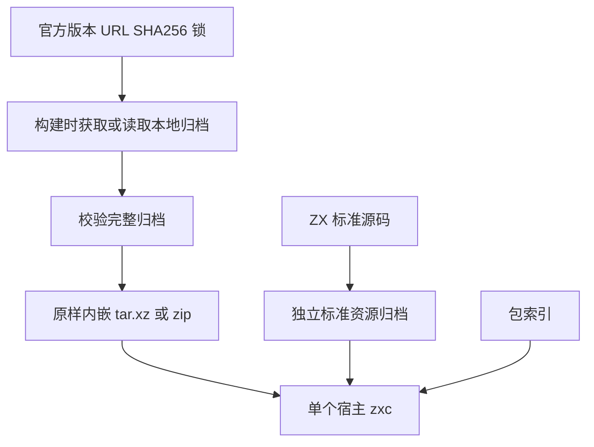
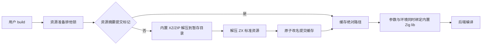

# 单文件编译器整合 Zig 实施

## Intent：最终目标

只分发单个 zxc 即可编译，无需用户另行安装 Zig。用户最新要求直接利用官方各平台发行版，取消资源裁剪。每个平台的 zxc 内嵌其宿主对应的一份完整官方压缩包，首次使用离线解压；不是把所有宿主发行包塞进同一个文件。新增脚本统一 TypeScript/Bun。

## Data：可用证据

- 原 CLI 依赖 PATH 中的 Zig 及 share 旁置标准实现/索引，不能独立分发。
- 已下载并按官方 SHA256 校验 Zig 0.16.0 归档：macOS x64 54.74 MiB、ARM64 49.82 MiB；Linux x64 52.91 MiB、ARM64 48.84 MiB；Windows x64 ZIP 92.71 MiB。
- 之前将全部文件重新 gzip 打包得到约 87.80 MiB 的 macOS x64 zxc；裁剪后约 67.49 MiB。官方 XZ 原始归档本身仅 54.74 MiB，说明重新打包降低了压缩效率，裁剪也增加了维护成本。
- Zig 0.16.0 标准库提供 XZ 流解压及 ZIP 文件解压，可以内置解压逻辑，不依赖系统 tar/unzip。
- 既有 C 模块隔离验证发现：仅 --zig-lib-dir 不能约束 Zig 的 C 导入子进程，需要同时覆盖后端进程的 ZIG_LIB_DIR。该修复保留。

## Edges：边界与限制

- 官方发行包原样内嵌并验证归档 SHA256，不裁剪、不重压缩、不执行运行时下载。
- 官方 Zig 二进制内部 LLVM/Clang 保留；Windows ARM64 沿用 x64 Zig 仿真方案，默认生成 ARM64 产物。
- 开发者构建 zxc 时可指定本地官方压缩包进行离线构建；未指定时由构建工具按锁定 URL 获取官方包并验证。终端用户使用 zxc 时不需要网络。
- 因完整资源保留，撤回裁剪方案新增的跨 CPU/操作系统限制；Zig 支持范围和外部 SDK/系统库边界仍适用。
- 工具链首次展开到用户缓存；按资源摘要隔离，排他锁、暂存目录与原子提交避免并发读到半成品。热缓存只检查提交标记和关键文件，不宣称自动修复任意篡改。
- 用户项目系统库、SDK、外部求解器和 FPGA 工具不属于内嵌范围。
- 不新增测试用例、不调用浏览器，复用既有示例及仓库回归。

## Answer：交付与成功标准

交付锁定官方归档、构建期获取与校验、原样内嵌、内置 XZ/ZIP 解压、标准资源独立归档、缓存准备、后端调用及分发验证。成功标准：单个 zxc 在仓库外、空 PATH、无效外部 ZIG_LIB_DIR 下能读取索引，编译并运行已有 quote、digest、Zig/C 示例；六平台 CI 验证实际产物。

## 自我批判

最初把“嵌入工具链”等同于“解包再统一 gzip”，忽略了官方 XZ 已提供更好的压缩结果。随后引入平台裁剪也扩大了维护边界。最新方案直接复用官方可验证制品，删除裁剪与完整文件重算机制，以归档 SHA256 为完整性依据。此前的裁剪版验证不冒充最终官方归档版验证；后续记录最终体积与结果。

## 最终方案本机验证

- 本地官方归档输入与构建时自动下载两条路径均通过，dist 为 12/12 构建步骤成功；自动下载后核对锁定 SHA256。
- macOS x64 ReleaseSafe zxc 为 59,252,003 字节（56.51 MiB），小于裁剪重打包版 67.49 MiB，并保留完整官方发行内容。该数字是本机产物，不推断其他平台大小。
- 仓库外临时目录中只复制 zxc 和已有示例；PATH 为空、外部 ZIG_LIB_DIR 指向不存在的目录。quote、digest、Zig/C native_math 均成功编译并执行，产物 CPU 正确。
- Windows x64 ZIP 分支交叉构建通过 12/12 步骤；不将交叉构建冒充 Windows 原生执行，后者交由六平台 CI。
- 四个官方 XZ 均检查为单流单块、LZMA2 64 MiB 字典，匹配当前解压器支持范围。解压器会缓冲完整块，首次解压需要数百 MiB 内存；不宣称低内存流式处理。完整归档 SHA256 在构建期和首次展开前分别校验。
- TypeScript 类型检查、工作流生成一致性检查及官方归档元数据重新生成比对通过。
- 最终根回归使用真实 Z3，通过 1,149/1,149 构建步骤、57,863/57,863 测试。中途回归捕获官方解包根目录与既有缓存 zig/ 布局不一致；修复为解包完成后统一目录名，并将布局版本纳入缓存摘要。修复后独立分发验证和完整回归均重新通过。

提交 a8b283a 的 [六平台 GitHub Actions](https://github.com/MatrixAges/zxc/actions/runs/37150522339) 最终全部成功。Linux、macOS、Windows 的 x64/ARM64 分发分别完成构建、空 PATH 下独立运行、标准库与 Zig/C 模块编译执行及上传；Windows ARM64 已实际验证默认产物的 ARM64 文件头和执行结果。
