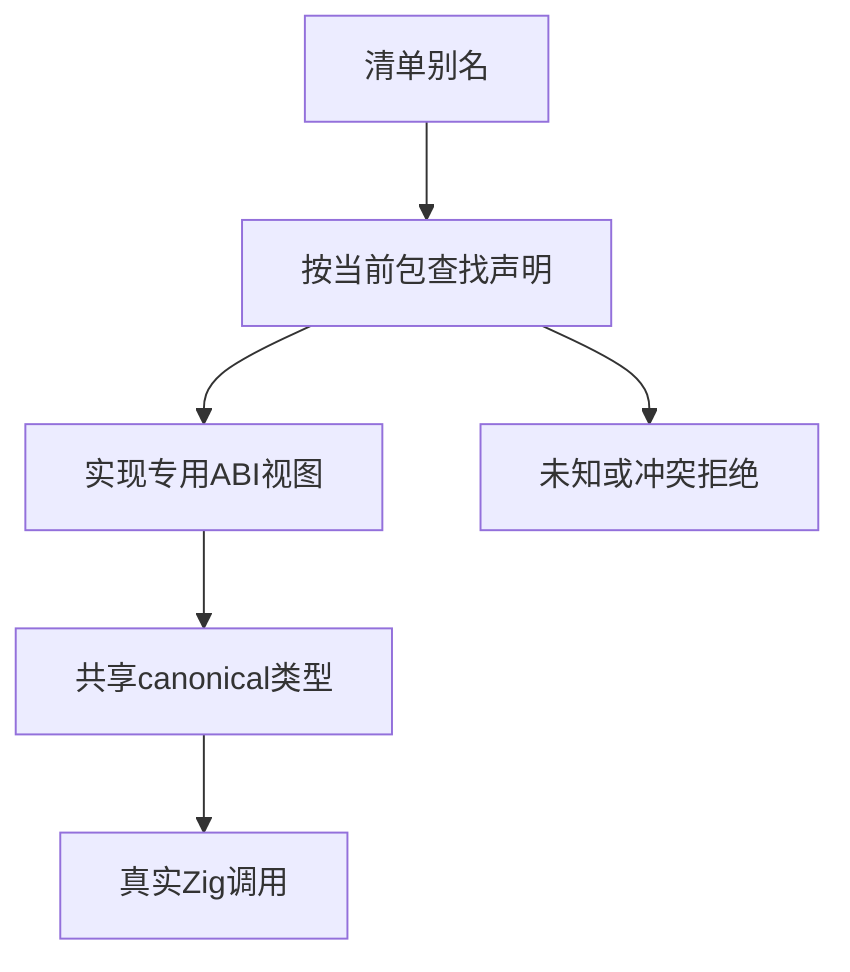

# 原生ABI别名解析与执行验证

## Intent：最终目标

验证原生ABI别名从清单配置进入真实Zig实现，明确默认映射、显式改名、别名共享身份和错误目标的行为。

## Data：可用证据

project/abi_aliases.zig默认收集当前包声明，显式配置按声明specifier定位拥有者身份；同名同目标合并，同名不同目标拒绝，不存在目标拒绝。cli/abi.zig按实现生成视图并引用canonical真实类型。

## Edges：边界与限制

测试独立临时项目、真实编译和程序输出。两个声明分别使用value及value/delta布局，避免错误合并仍碰巧成功。未知和冲突目标必须拒绝且无可执行文件；显式空映射不能退回默认映射。不修改生产源码，不冒充完整跨包或跨平台验证。

## Answer：交付格式与成功标准

7个具名场景：默认、改名、两个别名共享目标、重复相同映射、未知目标、冲突目标、显式空数组。4个成功场景各运行三组输入。使用既有Node运行风格，接入根构建与独立专项，保留草稿及实际日志。

## 执行计划

读取当前实现后添加具名场景，先执行专项，根据失败证据判断是测试错误或实现缺陷；不得为了通过更改所验证语义。

## 首轮发现与追加回归

7项首轮6通过、1失败，8/10构建步骤成功，退出1，日志 `/tmp/zxc-native-aliases.log`。显式空数组已按预期隐藏默认类型入口并触发Zig诊断，但失败后目标路径存在。独立重现日志 `/tmp/zxc-native-alias-empty.log` 确认是0字节普通文件；这属于发布输出的失败处理问题，不是别名解析错误。已发送实现会话，保留无产物断言。

因此增加第8项：先正常构建，再仅把映射改为[]触发后端失败，要求此前可执行文件SHA256保持不变并仍能运行三组输入。失败输出不应该破坏已发布程序；结果待验证填写。

## 追加回归结果

第8项单独执行也失败（退出1，0/1），日志 `/tmp/zxc-native-alias-preservation-final.log`：先成功构建（当时仅验证构建成功，未在故障前实际执行），再把映射改成[]；后端失败后输出SHA256变成空文件摘要e3b0c442…b855。已确认旧程序被截断，不仅是新路径留下占位文件。哈希断言失败，因此失败后的三次执行未到达，不能声称旧程序仍能运行。

已把初次新目标污染及旧产物截断的两份精确证据发送实现会话；对方确认正在处理非缓存构建的成功后发布。当前不修改生产源码，不删除产物断言，也不通过启用缓存绕过非缓存路径。

本轮最终新增8个Node测试：原7项运行6通过1失败，第8项独立运行失败。这不是一次8项联合运行的结果，日志分列。四种成功映射共12次程序调用通过，追加保留测试当时仅在故障前构建，执行断言未接入。未知与冲突目标均拒绝且无输出，默认/改名/共享类型/重复同目标正常；显式空映射的语义拒绝正确，但暴露输出发布缺陷。

TypeScript检查退出0（`/tmp/zxc-native-aliases-typecheck.log`）；格式、zig fmt、diff及两份草稿一致性通过。专项 `zig build test-native-aliases` 已接入根构建。目录62930、Test262审阅537/53597不变。

## 自我批判

只断言失败诊断会漏掉目标文件被截断，因此失败路径要检查可观察产物。前端拒绝用例无产物，不能替代后端Zig失败的产物保护。本轮两个失败是同一个发布路径问题影响全新和已有目标，不计作两个独立实现缺陷。修复尚待专项联合复验，不能标记完成；缓存、汇编文件和发布多产物的原子性也不在本轮已证明范围。

## 阶段184：修复复验与汇编产物保护

Intent：独立验证暂存发布修复，覆盖全新目标及已有二进制/汇编文件。

Data：当前build/staged.zig在独立目录编译，成功后发布二进制和可选汇编；上轮已确认非缓存后端失败会留下或截断目标。

Edges：不把成功后逐文件发布理解为多个文件整体事务；并发、磁盘失败和跨文件系统仍未证明。本轮不修改生产实现。

Answer：原8项全部联合复验，另加全新二进制+汇编不残留、旧二进制+汇编哈希不变且旧程序仍运行两项，共10项。

自我复核纠正：复查上轮fixture发现预定的故障前execute调用未接入，因此上轮“故障前3次运行通过”文字不准确，已改正文；旧产物被截断为零字节的哈希证据不受影响。本轮显式加入故障前调用并核对代码，故障后仍要求实际执行。

### 阶段184最终结果

`zig build test-native-aliases --summary all` 在当前修复源码上重新编译CLI并联合执行10项，退出0，10/10构建步骤、10/10 Node通过，无跳过或取消。日志 `/tmp/zxc-native-aliases-fixed.log`，约140秒测试执行。阶段183两个产物保护失败现在已经本地复验恢复，不再作为当前未解决专项失败。

四种正例各运行3次；只保留二进制与同时保留二进制/汇编的两项用例，在故障前后各运行3次，共24次程序执行全部正确。两项新目标测试确认无二进制残留，其中带--asm场景同时确认无汇编残留；已有产物场景确认故障前文件非空、故障后SHA256逐项相同。未启用缓存，也未改变错误触发条件。

TypeScript日志 `/tmp/zxc-native-aliases-fixed-typecheck.log` 退出0；格式、diff及两份草稿一致性通过。结果已发送实现会话。目录62930、上游537/53597、关联3436不变；本轮新增2个Node场景，共10个ABI别名测试。

本轮证明后端编译失败时的保护，不证明发布阶段磁盘错误、同时发布多个文件的整体事务、并发目标覆盖或跨平台全部成立。记录纠正已保留，不能用本轮24次执行倒推上轮也做过同样的检查。
