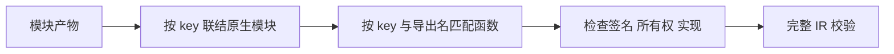
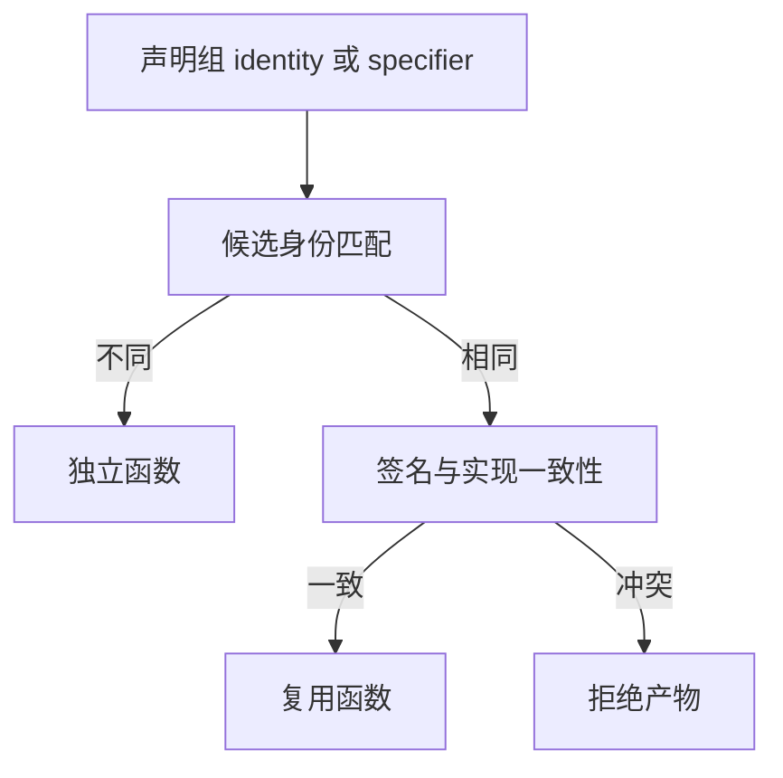

# 原生函数重联结身份修复

## Intent：最终目标

模块产物重新联结时按声明组身份区分原生函数。不同包实例可以导入同名 specifier 和成员；同一身份的重复声明仍须满足相同签名和实现。

## Data：可用证据

NativeModule.key() 已优先返回 identity，否则返回 specifier。IR 校验、原生模块联结与生成已遵循此规则；modules/link/build.zig 的 importExternal 却直接比较 specifier。不同包实例的同名导出因此进入同一签名冲突分支。

成熟实现参照相邻 link/native.zig 的 append：使用 key() 比较声明组。该问题与 legacy external 枚举按绑定建身份的语义冲突不同。

## Edges：边界与限制

只修改原生函数候选匹配的一行比较，不放宽参数、返回值、所有权、实现路径或 fallibility 校验。不改变 legacy 枚举规则，不新增测试，不运行浏览器。现有回归不包含多包身份的产物重联结成功案例，不能据此宣称该场景已经端到端覆盖。

## Answer：交付格式与成功标准

正式实现与本记录同步交付。原生函数合并与原生模块合并使用相同身份入口；执行现有 native-link、native-runtime、link-boundaries 回归。复核本次 diff 后提交推送。

## 执行与自我复核

已将 importExternal 的候选比较从 specifier 改为 key()，与相邻原生模块联结及 IR 导出检查一致。其余签名、所有权和实现检查保持原样。

在 packages/test 执行既有 test-native-link、test-native-runtime、test-link-boundaries：20/20 步、32/32 测试通过。包含原生枚举和函数合并、反序输入与生命周期、签名/实现冲突及生成后实际执行。首次从仓库根调用专项时因该层未注册目标而退出，随后从所属测试包执行成功。

自我复核：本次只有一行生产变更，不改变 legacy 枚举来源规则，也不宣称四个旧失败已解决。现有专项证明共享声明和拒绝边界未回归；不同包实例同名导出的重联结行为由源码身份规则直接支持，但未新增独立运行用例，不将这一点夸大为完整覆盖。
