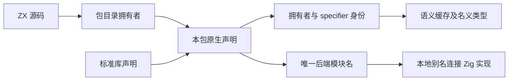
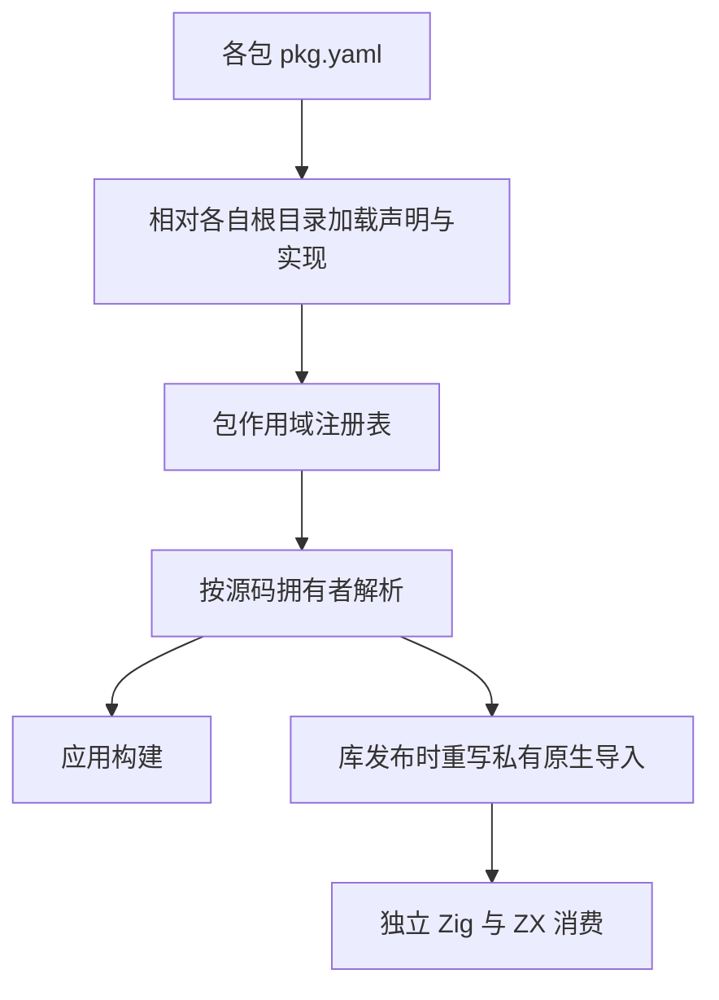
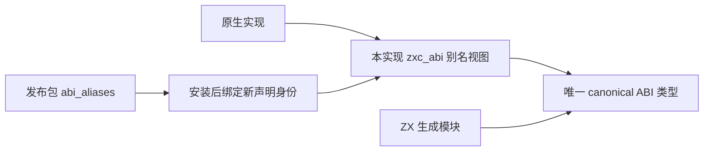

# 原生包作用域实施计划

## Intent：最终目标

已安装包的 ZX 源码可以使用该包声明的 zig:/c: 接口。包实例之间隔离声明、实现模块与名义类型；同一实例的多次导入保持同一声明身份。应用构建、缓存复用及库再次发布遵守同一规则。

## Data：可用证据

外部包安装闭环已经提交 cd91ff2。真实 library 归档可安装，但 native_math.zx 的 zig:calibration 导入报 no registered pure interfaces。package graph 已保留包实例与物理目录；cli/project 只加载入口包原生配置，modules/project 及持久缓存仍以全局 specifier 查找原生声明。

现有成熟实现 modules/package_scope.zig 负责最长目录匹配；modules/interface.zig 承载声明；cli/project.zig 负责清单加载，cli/build.zig 负责 Zig 模块命令行。沿这些职责扩展，不再建立平行模块解析器。

## Edges：边界与限制

每个源码文件只读取所属包的声明与统一标准库声明。内部身份使用包实例物理根目录派生的标识和原始 specifier；源码中的 specifier 不改变。后端模块名按拥有者限定，原生 Zig 中的依赖别名保持原文，通过 --dep 别名=唯一模块名连接。

缓存 key、摘要、artifact.path、native nominal origin 必须一致使用声明身份。公开分析 API 没有包作用域时继续使用已有注册表。legacy 签名的已有名义类型契约不在本次顺带改变。

C 符号与系统库的链接冲突不能仅靠 Zig 模块名隔离消除，不承诺任意不兼容 ABI 可并存。库发布必须重写已解析的原生导入并保留对应实现；不能只把多个包的同名声明拼接进一个清单。

## Answer：交付与成功标准

先完成声明身份与按包查找，再接入 CLI 的各包原生配置和后端实现；同步缓存与库发布。复用已有原生构建示例验证实际安装消费、同名模块的两个版本、禁止消费者直接使用依赖声明、缓存冷热一致与发布库的双向消费。使用已有检查及临时示例，不新增测试用例，不使用浏览器。

## 自我复核

直接合并全局声明只能让单个示例碰巧成功。验证必须覆盖同名声明来自不同包实例，以及同一实例多次导入和缓存恢复；否则会留下类型身份串用。每阶段记录实际覆盖与剩余边界，不以冷编译成功替代完整验收。

## 已实现的阶段与兼容处理

Scope 携带本包原生声明；Native 的独立 identity/key 用于 native unit、语义缓存、持久化 artifact 和名义类型来源。原始 specifier 保持导入查找及诊断用途。CLI 逐个加载包配置，依赖包实现模块采用拥有者派生名称；入口包仍保留已有模块名，以保持现有直接 Zig 模块消费及导出目录约定。最终名称碰撞明确拒绝。

原生模块依赖保持本地别名，通过 alias=后端名称传给 Zig。库发布同步重写已解析原生导入、保存私有声明和各实现；声明源文件从各包目录读取。native_modules 新增可选 include_paths，用于保存每个模块自己的头文件搜索路径；省略时继承包级路径。显式空列表表示不继承。库发布使用已解析绝对路径，避免把依赖包的头文件搜索路径误绑定到入口包。

这一新增字段是保留作用域所需的清单信息，不改变现有字段形状。依赖字符串也支持 alias=target，以便发布后再次加载时保留原生源码内的本地导入名。

## 已取得的运行证据

原生构建示例归档安装后，消费者实际得到 root=3、scaled=18。再次编译 native_analyzed=0、native_reused=2，两个 ZX 模块也完全复用；发布成 library 后由 ZX 再消费，结果相同。

同一应用通过直接和传递依赖同时使用 library 0.1.0、0.2.0，两份归档都声明 zig:calibration/c:math。实际运行分别得到 first=18、second=36；四份原生接口在热编译全部复用，当时一个 ZX 模块仍重新分析，后续定位与修复见下文。发布后再消费结果相同。消费者直接导入依赖包的 zig:calibration 被拒绝。

编译器构建通过 18/18 步骤。现有 native-link 和 native-declarations 共 16/16 检查通过。build-modes 首次失败于导出目录及直接 -M 参数依赖的旧入口模块名；已调整为保留入口模块名、仅限定依赖包模块名，重跑通过 2/2 步骤。该检查包含搬迁后 ZX/Zig 库消费、资源摘要与路径拒绝、72 次聚合引用调用、25 组原生调用和 264 次压缩应用调用。没有通过修改断言掩盖这个兼容问题。

## 第一阶段发现的 ABI 边界（已修复）

上述标量示例不使用 zxc_abi 的原生类型入口，不能证明对象或枚举 ABI 正确。当前 genz/type_bundle 按原始 specifier 聚合 native/types；两个拥有者使用同名声明时，这仍可能混用类型。库发布把 ZX 导入改成私有 specifier 后，原始 Zig 代码仍可能读取 zxc_abi.native 中原来的名称。

下一步需要按实现/拥有者提供 ABI 视图，同时在发布物中保留原实现的 ABI 名称映射。不能直接改写用户原生 Zig 源码，也不能把两个包的同名类型合并。当时将此边界作为本次功能提交的前置条件。

真实复制共享原生类型示例验证后，普通应用构建成功、library 发布成功，但发布物再次由 ZX 构建失败：原生源码读取 zxc_abi.native 的 zig:transport 时成员不存在。这确认问题不仅是静态推测，标量示例通过并不能覆盖该 ABI 契约。

### ABI 视图的后续实施约束

共享 canonical ABI 只定义一次真实类型。IR NativeModule 需携带独立声明组 identity，默认回退原始 specifier；genz 按声明组而非 implementation 聚合，保留同一声明组多实现的既有能力。不同拥有者的同名声明必须不同组；同组同名不兼容成员应拒绝。

每个原生实现通过自己的 zxc_abi view 访问原始名称。view 中 native/layouts 及顶层类型别名引用 canonical 类型，不重复定义 struct/enum。旧入口的 abi.zig 保持原始无冲突名称，兼容用户直接 -M 参数消费；其他实现使用专属视图。canonical ABI 不反向导入实现。

发布清单需在每个 native module 上保存 ABI 别名到本发布包声明 specifier 的映射，不能只在声明上保存一个原名：平铺后的包可能包含两个原拥有者的同名声明。重新安装时，映射值解析为新拥有者下的声明身份，左侧原生源码要求的名字不变；重复发布也按此规则处理。

identity 字符串的所有权、IR/artifact 深复制、语义缓存编码/恢复和生成指纹需同步。native→view→canonical 的依赖关系必须同时进入应用构建、library 文件输出、生成 build.zig 与直接 Zig 消费验证。这些约束已在第二阶段实施，结果如下。

## 第二阶段：声明身份与共享 ABI 已闭合

IR NativeModule 新增可选 identity，key 在未设置时回退 specifier；IR 版本提升到 7。ModuleRecord.Import 保存已解析声明身份，artifact 收集仅选择该身份下的模块。旧实现按原始 specifier 收集，误带入另一个包的同名模块，导致热缓存无法恢复；修复后冷热输出一致，热编译 4 个 ZX 模块、4 个原生接口均完全复用，分析数与新写入数均为零。

生成器以 identity 聚合 native_by_identity/layouts_by_identity，真实类型只在 canonical ABI 定义一次。每个原生实现拥有 zxc_abi 视图，其 native/layouts 和顶层类型别名均引用 canonical 类型。入口 abi.zig 同时保留无冲突的入口别名，以兼容现有直接 Zig 模块消费。多个入口实现对同一别名指向不同身份时，不在入口公共视图随意选择；实现各自的视图仍完整保留。

native_modules 新增 abi_aliases 数组，保存 name/specifier 映射。发布时目标使用发布包内私有声明，重新安装后绑定到新的声明身份；原生源码使用的 name 不变。应用构建和生成 library/build.zig 均连接 implementation → view → canonical，构建摘要包含视图内容。原生实现源码无需重写。

## 最终验证与证据范围

- 原生包安装专项：4/4 Node 检查通过，构建 10/10 步骤；覆盖标量、不同对象布局、冷/热编译、发布后重装。迁移场景删除原项目、原发布物、原索引和旧包缓存后仍通过。
- 原生链接、声明与构建模式：15/15 构建步骤、16/16 Zig 检查通过；包含直接 Zig 与搬迁后的 ZX/Zig 库消费及聚合引用调用。
- 持久缓存及原生生成缓存：31/31 构建步骤、29/29 Zig 检查，以及 6 项 Node 检查通过。
- 编译器最终构建：18/18 步骤；根构建：14/14 步骤。这里的根构建不代表全部根测试通过。
- 清单检查在自定义 External JSON 输出排除内部 identity 后通过；公开清单仍只输出其协议字段。
- 共享原生对象示例发布后 ZX 再消费得到 items=[17,29]、pair=[17,29]；独立 Zig 消费通过 generated module("library") 构建并运行，输出对象、数组与元组指针均保持输入身份。

最终对象 ABI 证据保存于 [共享原生类型发布修复结果](原生包作用域/共享原生类型发布修复结果.json)，专项日志摘录保存于 [验证记录](原生包作用域/验证记录.md)。早期失败 JSON 保留作为问题定位记录，不代表当前结果。正式实现快照位于同目录 packages 中。

## 最终自我批判

标量正确不足以证明 ABI 正确，因此补充检查了不同拥有者对象布局、发布重绑定与 Zig 指针身份。内部身份也不能泄漏到公开 External 清单，否则重新解析会拒绝未知字段；已通过独立序列化边界处理。

这些运行证据仅来自当前 macOS 环境，不能推导 Windows/Linux 运行保证；外部系统库与头文件仍由使用环境提供。既有 legacy 签名的名义类型策略保持原契约，尚未解决的相关旧检查不列为本次通过结果。全目标仍包含其他功能与自举，本次只交付原生包作用域、缓存身份及 ABI 发布闭环。
