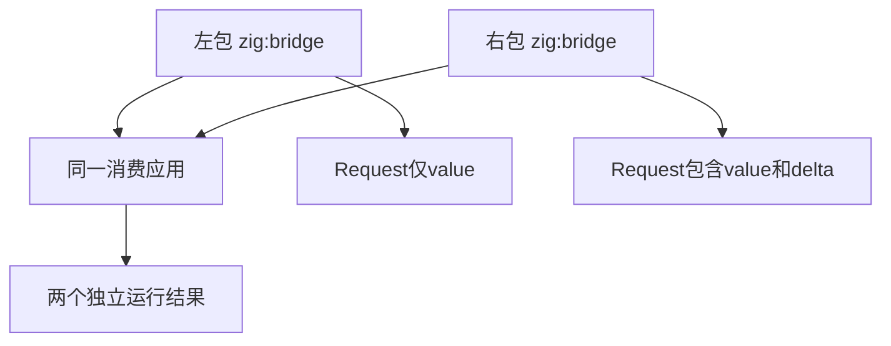

# 原生包同名模块与ABI验证

## Intent：最终目标

验证两个已安装包同时声明zig:bridge和bridge实现模块时，其行为和对象ABI互不串用；库再次打包安装后仍能运行。

## Data：可用证据

当前原生包作用域实施记录说明标量已运行，同名对象ABI及再次发布仍在完善。测试构造左右两个包：结果分别为输入+3、输入+22；对象模式使用同名Request但不同字段布局，迫使后端保留拥有者身份。

## Edges：边界与限制

不改生产源码，不改写原生Zig源码中的zxc_abi名称来绕过问题。不访问外网，所有归档、安装与产物在独立临时目录。跨平台、C链接符号冲突、全部聚合类型不在本轮证明范围。

## Answer：交付格式与成功标准

标量对照、对象ABI与库重新安装分别作为具名Node场景。实际安装并执行应用；成功路径检查三组输入，失败保留日志并发送实现会话。原始名称在两个包中完全一致，预期结果独立指定。

## 执行结果

新增3个真实安装Node测试，专项 `zig build test-native-packages --summary all` 已接入根构建。

标量对照通过：两个包都使用zig:bridge、bridge模块名和apply函数名，分别返回输入+3、输入+22。两轮构建前删除旧程序，每轮执行-4、0、23，共6次运行结果正确。这证明同名标量模块的基本拥有者隔离，不代表ABI类型已经正确。

对象模式左侧Request仅有value:i32，右侧Request有value:i32和delta:i32；两个原生实现都保留原始 `@import("zxc_abi").native.@"zig:bridge".Request` 引用。右侧传入delta=11并计算value+delta*2，不使用与左侧相同的布局掩盖冲突。

### 当前失败

对象应用和对象库发布均退出1，诊断为 `contract: module artifact extraction requires valid project IR and module metadata`。失败发生在IR/模块提取前置检查，尚未进入Zig原生编译。库发布场景因此尚未到达重新打包、安装及新消费者运行；不能声称已验证这些后续步骤。

首轮日志 `/tmp/zxc-native-packages.log`。补充库场景删除旧包缓存的独立性保证后复跑，最终仍为 **1/3 Node通过、2失败，8/10步骤成功，退出1**，日志 `/tmp/zxc-native-packages-final.log`。两个失败属于同一前置问题影响两个流程，不计作两个独立实现缺陷。

已将精确回归、日志及前置失败阶段发送实现会话。对方确认与正在修复的声明身份分组问题一致，并将使用本组回归验证。未修改生产源码、未改原生名称或放宽IR断言。

库回归在前置问题修复后，会删除原项目、原归档来源、临时发布目录和旧包缓存，再从发布库的新归档安装。这样不能依靠原安装目录残留来伪造可迁移性。

### 检查与计数

TypeScript检查退出0，日志 `/tmp/zxc-native-packages-typecheck.log`；格式、diff、3份草稿逐字节一致性通过。当前失败保留在正式测试中。

登记目录62,474、上游审阅533/53,597、唯一关联2,980不变；本轮3个Node测试不计入JSONL或上游审阅数。最新完整根仍阶段170，此外本轮存在2个新专项失败待实现修复。

## 自我批判

同名标量函数通过不能证明对象类型隔离。重新发布必须消费生成文件，不能只检查生成目录存在。

本轮没有检查native_reused计数，因此重复构建结果正确不等于所有模块均命中缓存。不能将实现会话的其他示例结果替代本组对象布局与迁移测试结果。

## 阶段180：重新发布链路的标量对照

Intent：为重新发布流程增加不依赖聚合 ABI 的对照，分辨归档迁移问题与对象类型身份问题。

Data：实现会话已推进到 Zig ABI 入口冲突；已有迁移测试仅使用对象，尚无标量迁移证据。

Edges：复用同一迁移流程，仅参数化原生声明和实现；不改变对象断言，不改生产源码。

Answer：标量与对象各自安装、发布、归档、删除原来源、重新安装并运行三组输入；据实际日志记录通过和失败阶段。

### 复验结果

实现侧ABI视图修改后，原3项先复验全部通过（`/tmp/zxc-native-packages-migration.log`）。新增标量发布对照后，最终4/4 Node、10/10步骤通过，退出0，日志 `/tmp/zxc-native-packages-migration-final.log`。上述阶段178“当前失败”为当时历史状态，现有两项对象失败均已复验恢复。

应用两种模式各两轮、每轮三组输入；重新安装后的标量与对象库各三组输入，共18次实际执行。迁移前确实删除原项目、临时发布目录、原registry及旧包缓存。没有通过改名、改布局或放宽断言使对象测试通过。

TypeScript检查日志 `/tmp/zxc-native-migration-typecheck.log` 退出0；格式检查、diff及草稿逐字节一致性通过。测试文件格式工具补齐语义空行，未更改执行语义。上游审阅数和JSONL目录数不变。

### 本轮自我复核

标量迁移对照现在覆盖完整发布链路，对象恢复则由本地实际执行确认。仍未断言缓存命中数量，尚未证明枚举、嵌套聚合、跨平台或直接Zig消费者的全部边界；专项通过不能替代全仓回归。
