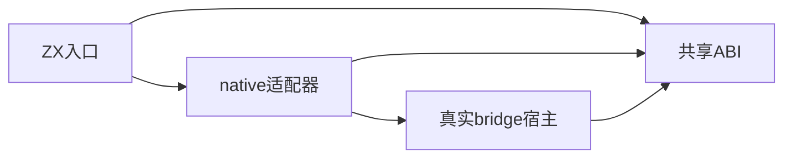
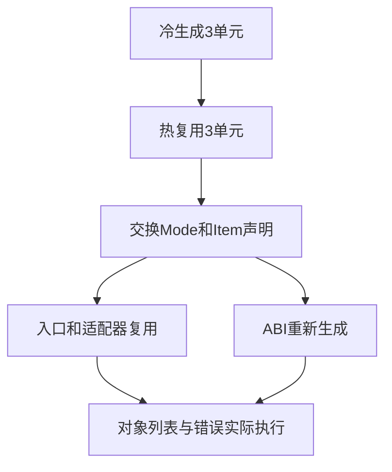

# 原生对象生成缓存运行验证

## IDEA

- Intent：验证分模块生成缓存遇到native类型声明顺序变化时，稳定类型身份与真实对象ABI不失效。
- Data：既有native_declarations成熟夹具、枚举/对象/列表/可空枚举、分配器与throws函数签名。
- Edges：复用宿主实现而不改变业务；只交换独立声明顺序，不假定ABI文本保持原序；不修改生产。
- Answer：冷/热/声明重排/禁用四次真实app构建，每轮执行对象结果矩阵和宿主错误断言，核对生成计数。

## 结果

新增1个Node集成测试，包含4次真实app构建，每轮6个成功输入加1个宿主错误，共28次调用。专项 `zig build test-native-generation --summary all`：10/10步骤、1/1 Node测试通过，日志 `/tmp/zxc-native-generation.log`。

- 冷构建生成3单元；热构建从磁盘加载复用3单元。
- 交换独立Mode与Item声明顺序后，generated=1/reused=2/loaded=2/written=1；共享ABI重生成，入口和适配器复用。
- 禁用缓存后继续真实构建并执行同一矩阵。
- 每轮输入空/双元素对象列表、mode=null/Add/Keep，检查offset加法、baseline对象列表与枚举返回值；offset=-1必须返回NegativeOffset且无标准输出。

正式测试 `packages/test/tests/incremental/generation_runtime/native_test.ts` 复用已存在项目/构建夹具与成熟native_declarations源码，未复制业务实现；草稿保存在 `docs/2026-10-04/原生生成运行测试草稿/native_test.ts`。已接入根test。包级TS、Zig格式、diff及草稿一致性通过，无生产修改或新缺陷通知。

## 自我批判

1个集成测试内部28次调用不记为28个独立目录案例。生成计数和实际执行共同证明本组重排稳定性；不证明所有类型形状重排或泛型参数变化都正确。对象内容检查不证明borrow指针身份，分配失败轨迹由既有资源测试覆盖，本轮不宣称新增覆盖。原生接口共享枚举与legacy外部接口的身份争议不同，不能由本轮通过推断legacy问题已修复。

目录62,036、上游461/53,597不变，最新完整根阶段122；阶段142实际复测的四个legacy失败保留。

