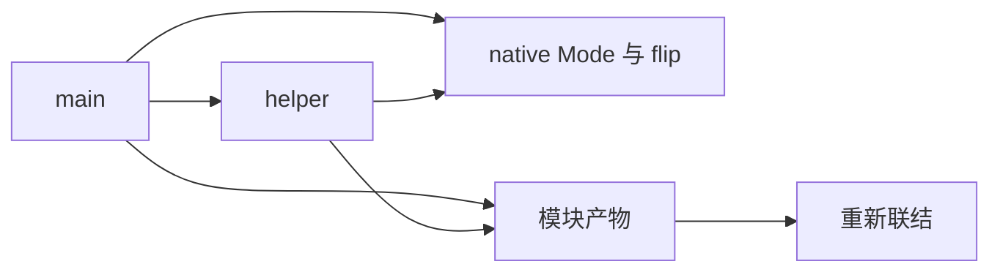
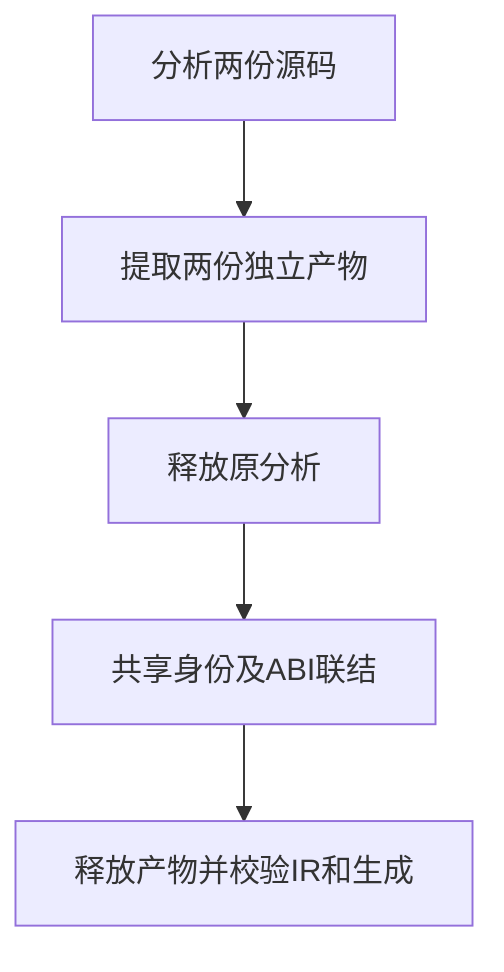

# 原生模块产物联结验证

## IDEA

- Intent：验证两个源码模块共享native声明时，重新联结能统一枚举、外部函数和native模块，并拒绝ABI元数据冲突。
- Data：公开分析、提取、联结入口及现有native声明语法。
- Edges：不修改生产实现，不处理legacy身份决策；本轮检查完整IR及生成，不代替native宿主执行。
- Answer：真实双模块夹具、正反序与生命周期测试、冲突拒绝及分配失败，保留草稿和日志。





## 结果

新增6个Zig测试：4个联结/生命周期/冲突场景、2条分配失败轨迹。最终命令：

```sh
cd packages/test
zig build test-native-link --summary all
```

6/6步骤、6/6测试通过，日志 `/tmp/zxc-native-link-bundle.log`。已接入根test依赖。

- helper与main都导入native枚举Mode并调用native.flip，main还调用helper。联结后只有一个native模块、一个枚举来源、一个外部flip及一个源码helper；输入输出都指向统一枚举。
- 反序产物输入、原分析及产物释放后，完整IR检查和bundle生成通过，native导入名仍保留。
- 两份产物对同一native的类型命名空间、外部函数fallible属性不一致时，分别返回ConflictingInterface。
- 成功与命名空间冲突两条联结分配失败轨迹通过，夹具分配不混入注入范围。

初次夹具错误使用混合命名导入函数，被分析器正确拒绝；根据现有成熟用例改为native命名空间调用。随后standalone emit返回NativeRequiresBundle，改为正式emitBundle入口。两个问题均属于测试接入错误，没有向实现会话误报。诊断辅助代码保留以定位将来的分析失败。

测试位于 `packages/test/tests/incremental/native_link/`，同内容草稿位于 `docs/2026-10-04/原生联结测试草稿/`。未修改生产源码，无新缺陷通知。

## 自我批判与后续

bundle生成成功及包含flip文本不证明Zig宿主ABI可编译或执行，后续须补实际宿主、原始/联结两版执行及调用次数断言。本轮只检查枚举参数，不涵盖分配器参数、tuple展开、对象布局和fallible运行传播。未推断legacy接口身份；阶段125失败未回归。

实现会话当前在接入持久缓存并构建CLI（快照revision49），尚无本轮获得的legacy决策证据。格式、diff、草稿一致性通过。登记目录61,614、上游已审阅400/53,597不变，最新完整根仍阶段122。

