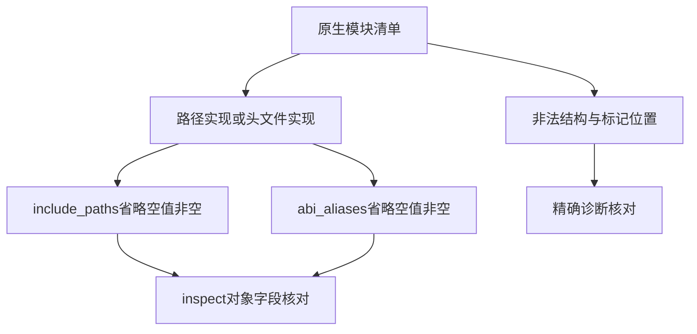

# 原生清单作用域字段边界验证

## Intent：最终目标

覆盖新增native_modules.include_paths及abi_aliases的结构契约，防止公开字段只在安装示例中可用、边界诊断和序列化缺乏验证。

## Data：可用证据

阶段181发现并修复内部identity对外JSON泄露。当前native.zig解析器接受两个新增可选序列；省略为null，显式空数组保留[]。include_paths是字符串数组；abi_aliases是含name和specifier的映射数组。

## Edges：边界与限制

测试解析及inspect完整字段值和错误位置，不把解析成功当成别名目标存在、文件路径存在或Zig模块能联结。路径/头文件两种实现均覆盖；不修改生产源码，不接受未声明内部字段。不重复计算Test262覆盖数量。

## Answer：交付格式与成功标准

新增独立module_scope_cases.ts，由既有inspect_test运行器执行，接入构建输入追踪。正例逐项比对完整模块对象，反例精确比对退出码、空stdout及带行列的诊断。草稿、专项结果、类型和格式检查可续接。

## 执行计划

先构造省略、空数组、非空数组的组合以及结构错误，复用成熟inspect运行器；执行后按实际结果记录，不先宣称通过。

## 执行结果

新增50项：18个正例（path/header两种来源×include_paths省略/空数组/非空数组×abi_aliases省略/空数组/非空数组），32个反例。正例包括空格和中文路径、两个不同名称/目标的ABI别名，完整比对数组顺序和模块所有输出字段。省略保留null，显式[]不会变成null。

反例覆盖两个外层字段的非序列和重复键、路径项的映射/数组/显式整数/空串/NUL、别名项非映射、缺少name/specifier、字段值类型/空串/NUL、重复name/specifier和未知字段。每个测试通过现有运行器验证退出码1、空stdout和完整行列诊断，未只做字符串包含判断。

`zig build test-package-manifest --summary all` 退出0：14/14步骤、1727/1727 Node通过，无跳过取消；日志 `/tmp/zxc-native-scope-manifest.log`。日志可逐项识别50个native scope新增用例。TypeScript检查退出0，日志 `/tmp/zxc-native-scope-typecheck.log`；TS语义空行检查、zig fmt、diff和两份草稿一致性通过。

没有生产源码修改或新缺陷。已接入inspect_test以及build.zig文件输入追踪，后续根命令会包含这些用例。目录62930、上游537/53597及唯一关联3436不变；本轮增加的是Node接口测试，不混入JSONL或Test262审阅数。

## 自我批判

这些测试证明解析和输出结构，不证明include路径存在、跨包根目录定位或别名目标可以联结。当前CLI的project/abi_aliases.zig另行解析目标并拒绝UnknownNativeAbiAlias或ConflictingNativeAbiAlias；这两个语义分支没有被本轮inspect测试覆盖，不能因为解析层通过就宣称它们正确。不同别名项共享同名的语义冲突也不同于同一个YAML映射内重复键。

本轮未重跑完整测试包或仓库根。最近完整测试包仍为阶段181原始失败快照（4项legacy及10项后来专项已恢复的清单失败），不能以本轮专项全部通过覆盖该历史事实。
