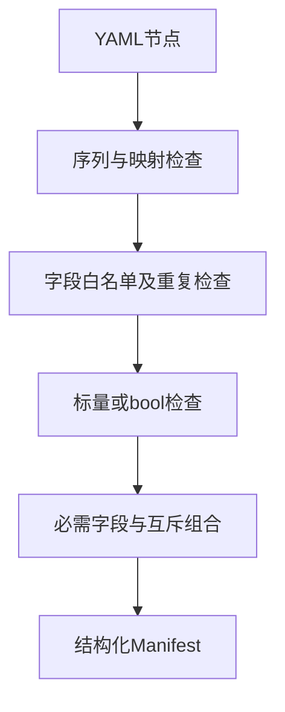

# 原生清单字段边界验证

## Intent：最终目标

验证 pkg.yaml 原生接口、模块、外部调用声明及链接列表的结构约束、默认值与错误定位，避免配置迁移漏掉字段或静默接受无效组合。

## Data：可用证据

当前 manifest/native.zig 逐字段解码并复用 mapping/sequence/scalar/boolean 校验；NativeModule 要求 path/header 二选一，bundle_files 仅适用于 path 模块。现有 inspect 专项未覆盖这些字段。

## Edges：边界与限制

inspect 校验清单结构，不证明声明源码可编译或链接资源存在；对应后端行为由现有原生接口与构建模式测试覆盖。本轮不新增配置语义，不修改生产代码。

## Answer：交付与成功标准

新增 native_cases.ts 复用 inspect_test 的真实 CLI 与 JSON 断言。合法配置检查默认字段和布尔选项组合；错误配置检查精确行列、诊断、退出码和空 stdout。与现有包清单专项及根入口集成。

## 执行结果与自我批判

新增 45 个命名 Node 场景：32 个错误定位、5 个结构回读与 8 个外部调用布尔组合。inspect 专项由 24 增至 69 个；native_cases.ts 作为显式构建输入登记，避免缓存遗漏。

包清单/工作区/图/导入/初始化专项 **13/13 步骤、1,677/1,677 Node 测试通过**（69+31+1534+16+27），日志 `/tmp/zxc-native-manifest.log`。TypeScript、Zig 格式、diff 和草稿一致性检查通过。另有阶段 82 的 64 个索引 Node 测试独立统计，本轮未重复运行该专项。

无生产源码修改、无新缺陷。JSONL 57,631 和上游审阅 316/53,597 均不变。最近完整根仍为阶段 83。

自我批判：本轮证明的是清单字段解码和结构约束，不能证明声明文件存在、头文件可用、模块依赖无环或链接选项在所有平台生效；因此没有将 inspect 通过描述为原生构建成功。默认空数组与布尔省略的全部组合尚未穷尽，现有测试只对本组明确输入的输出字段作完整核对。
