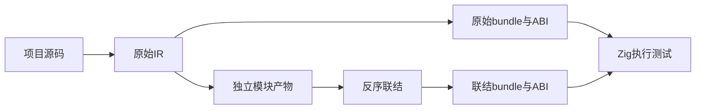
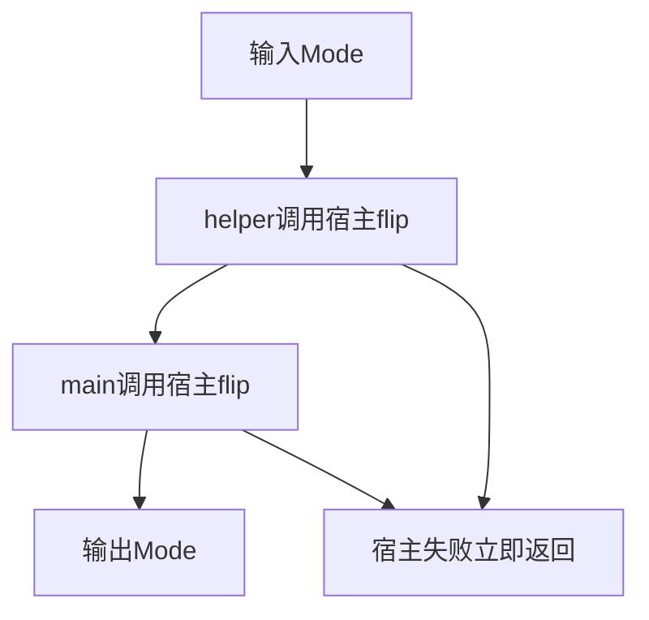

# 原生联结宿主执行验证

## IDEA

- Intent：把阶段131的native联结证据推进到真实Zig编译和宿主执行。
- Data：真实两模块项目、native枚举与可失败函数声明；原始IR和反序产物重新联结IR。
- Edges：本轮只测枚举ABI、调用顺序和错误传播；不修改生产源码，不处理legacy决策。
- Answer：原始与联结程序各自生成ABI、独立宿主模块，四个测试分别检查两个枚举输入及第一/第二次宿主调用失败。必须真实编译执行，返回值和轨迹使用独立预期。





## 结果

专项8/8构建步骤、8/8配置测试通过：同一组4个独立语义场景，分别在原始版和联结版执行，各4个通过；不把它描述为8种不同语义。命令：

```sh
cd packages/test
zig build test-native-runtime --summary all
```

日志 `/tmp/zxc-native-runtime-final.log`，已接入根test。

- First两次翻转返回First，宿主轨迹精确为First、Second。
- Second两次翻转返回Second，宿主轨迹精确为Second、First。
- 第一次调用失败时仅调用一次，main不继续调用native，错误NativeFailure原样传播。
- 第二次调用失败时保留helper成功调用轨迹，调用次数为2，错误原样传播。

两个版本分别生成bundle和ABI模块、分别接入同一宿主实现源码，再真实编译为两个Zig测试可执行文件。原分析在联结前释放，反序输入产物在联结后释放，然后生成联结版bundle。宿主直接使用每版生成的native.Mode，编译器检查实际名义类型兼容性。

初始构建尝试把两个宿主模块放进一个测试可执行文件，Zig报告同一文件不能属于两个模块；改为两个独立测试可执行文件。属于测试构建接入问题，没有误报为生产缺陷。

正式测试 `packages/test/tests/incremental/native_runtime/`，构建文件 `packages/test/build/native_runtime.zig`，对应7份草稿/资源 `docs/2026-10-04/原生运行测试草稿/`。格式、diff和草稿一致性通过，无生产修改。

## 自我批判与边界

这是实际枚举ABI执行及可失败调用链证据；未覆盖分配器参数、tuple展开、对象/列表布局、异步调用或跨平台目标。固定两步调用属于本测试源码的语义，用于观察联结后是否丢失、重排或额外调用，不是生产硬编码。测试宿主按枚举值翻转，不识别测试输入来绕过实现。

目录61,614、上游已审阅400/53,597不变；4个场景在2个构建配置计8个Zig测试，单独登记。最新完整根仍阶段122，阶段125失败本轮未回归。

