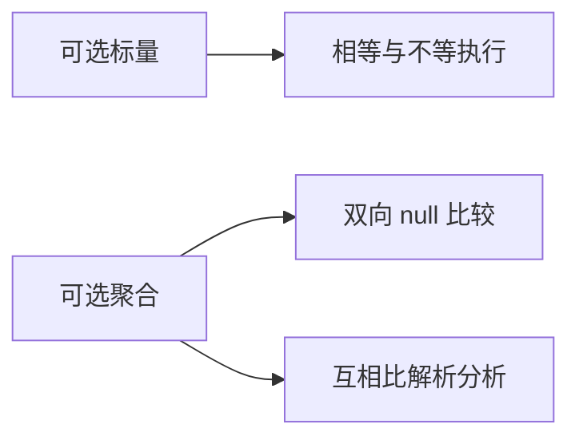
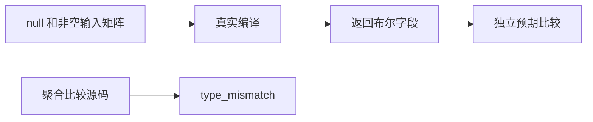

# 可选值相等执行验证

## IDEA

- Intent：验证可选标量的相等/不等及可选聚合的 null 检查，不把 null 混同零、false、空字符串或空列表。
- Data：IR 契约允许可选标量相等，可选聚合只能与 null 比较；现有 coalesce 和对象身份测试不能替代此执行证据。
- Edges：标量有限输入矩阵不包含所有浮点位模式；对象/列表/元组仍无深相等。Test262 null===null 以有类型的 optional 空值比较适配，不声明 JS null 类型系统。
- Answer：真实编译执行、可选聚合互相比的拒绝、两个上游 null 断言关联及专项结果；发现实现问题通知实现会话。

## 执行计划

1. 草稿生成十种可选标量的两两输入及六项结果。
2. 对对象、列表、元组生成双向 null 比较，添加聚合自比/双值比拒绝。
3. 运行前端和执行专项，核查独立预期并审计上游关联。

## 架构

## 数据流

## 执行结果

新增 184 个案例：十种可选标量两两组合 162 个，对象/列表/元组 null 检查 10 个，聚合自比/双值比较拒绝 12 个。标量同时断言相等、不等和四个 null 方向检查；聚合检查同时断言双向相等与不等。覆盖最大/最小整数、零、false、空字符串、空列表和非 ASCII 字符串。

`zig build test-runtime test-frontend --summary all` 退出 0，972/972 步骤、46,285/46,285 测试通过，日志 `/tmp/zxc-optional-equality.log`。类型、生成一致性、审计、格式、diff、草稿一致性通过。无生产源码修改，没有发现需通知实现会话的新缺陷。

登记 58,195：runtime 42,912、frontend 3,373，其余不变。上游 364/53,597（229 adapted、102 equivalent、33 excluded），未审阅 53,233，唯一关联 1,831。仅两份严格 null A6.2 建立完整适配；含 undefined 的文件虽已阅读，但仍保持未审阅。最近完整根阶段 99。

## 自我批判

- 有类型 optional 空值不等于实现 ECMAScript 的无类型 null；上游记录标为 adapted，并说明输入类型。
- 字符串运行值覆盖相同/不同内容，但未强制相同内容位于不同地址，不能单凭本轮排除错误的指针相等实现；独立存储来源仍需专门测试。
- 浮点有限集合未覆盖 NaN、无穷和所有位模式；这些不能从本轮结果外推。
- 不对可选聚合互相比定义深相等；拒绝测试保持现有语言契约。
- 计数按命名输入案例，一行的六个输出断言没有重复记为六个案例。
