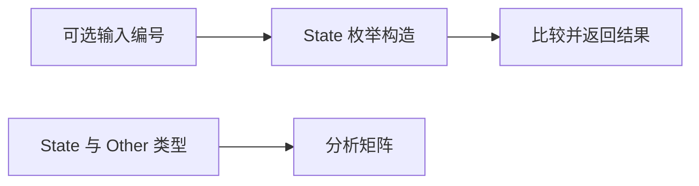
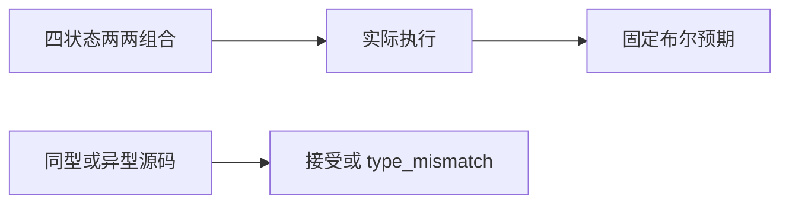

# 可选枚举比较验证

## IDEA

- Intent：补齐 optional 标量中的枚举比较，并验证不同枚举身份不会因成员名相同而混用。
- Data：现有枚举 match 构造风格、optional equality 契约与类型分析入口。
- Edges：数值输入仅用于构造三个枚举项，不声明整数与枚举隐式转换。不同枚举的成员列表刻意相同，用于隔离名义身份；本轮为同文件枚举，跨模块身份仍由独立模块测试留证。
- Answer：四状态两两运行矩阵与六操作符的同型/异型分析矩阵，实际专项结果。

## 执行计划

1. 草稿构造 State? 的 null/First/Second/Third 四状态。
2. 实际执行相等、不等及 null 检查。
3. 验证相同成员名的 Other? 不得与 State? 混比，排序操作仍拒绝。

## 架构

## 数据流

## 执行结果

新增 28 个案例：null/First/Second/Third 两两组合的 16 个实际执行，六个比较操作符 × 同型/异型的 12 个前端检查。同型 optional 枚举相等/不等通过，其余排序与异型比较为 type_mismatch。

`zig build test-runtime test-frontend --summary all` 退出 0，988/988 步骤、49,472/49,472 测试通过，日志 `/tmp/zxc-optional-enum.log`。类型、生成一致性、审计、格式、diff 与草稿一致性检查通过。无生产源码修改或新缺陷。

登记累计 61,382（runtime 46,034、frontend 3,438），上游仍 370/53,597；本轮为 ZX 自有特性，不增加上游审阅。最近完整根阶段 99。

## 自我批判

- u8? 输入是测试宿主到枚举值的显式构造桥接，不验证 JSON 直接枚举编解码。
- 相同成员列表的不同枚举仍被拒绝，说明本组类型身份隔离，但未扩展到跨模块 optional 枚举与别名重导出。
- 三个成员的完整四状态矩阵不证明任意枚举规模的行为。
- 运行检查与前端拒绝各自提供证据，不能由排序拒绝推断任何枚举排序定义。
