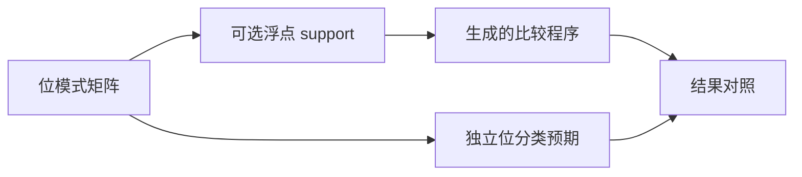

# 可选浮点特殊值比较验证

## IDEA

- Intent：补齐可选浮点相等在 null、NaN、正负零、无穷和正规/次正规边界上的执行证据。
- Data：已有 IEEE 位模式边界生成器和 runtime support 接口；可选标量比较契约；阶段 101 仅有有限浮点输入。
- Edges：输入整数表示原始位模式，通过 bitCast 构造 f32?/f64?；null 单独表示无值，不用 NaN 充当空值。有限边界矩阵不等于全部位模式穷举。
- Answer：独立位分类预期、实际生成程序的相等/不等与双向 null 比较、相关执行专项和自我批判。

## 执行计划

1. 草稿编写可选原始位输入 support，复用现有控制测试生成器。
2. 为 f32/f64 构造全部已选边界，加 null 与不同符号/信号 NaN。
3. 运行专项并核查预期、生成一致性和目录审计。

## 架构

## 数据流

## 执行结果

新增 3,042 个执行案例：f32/f64 各 39 种状态两两组合，每组 1,521。包含正负零、正负无穷、正规/次正规边界、四种 NaN 位模式和 null。六项输出分别验证相等、不等及四种 null 检查。

`zig build test-runtime --summary all` 退出 0，980/980 步骤、46,018/46,018 测试通过，日志 `/tmp/zxc-optional-floating.log`。将新 kind 同时登记到 test-floating 后，专项 184/184 步骤、25,236/25,236 测试通过，日志 `/tmp/zxc-optional-floating-registration.log`，其中明确包括两组各 1,521 新案例。

一次性独立 DataView 解码复核全部 3,042 条相等/不等预期，与位分类模型一致。类型、生成一致性、审计、格式、diff 和草稿一致性通过。没有生产源码修改或新缺陷。

登记累计 61,301：runtime 46,018、frontend 3,373，其余不变。上游仍 364/53,597；本轮未增加上游审阅数，最近完整根阶段 99。

## 自我批判

- 39 个边界状态不是全部 f32/f64 位模式穷举，也不证明全部 IEEE 运算行为。
- signaling NaN 作为输入参与比较，但本轮只断言比较结果，不断言异常标志、载荷保留或 NaN 静默化过程。
- 64 位模式经 BigInt 与 JSON 整数无损保存，位输入 support 使用整数后 bitCast；不经过十进制浮点字符串转换。
- 测试验证 null 和 NaN 是不同状态，未把 NaN 当成 optional 的空值表示。
- 独立 DataView 复核增强预期证据，仍不能替代实际生成代码运行；两条证据分别记录。
