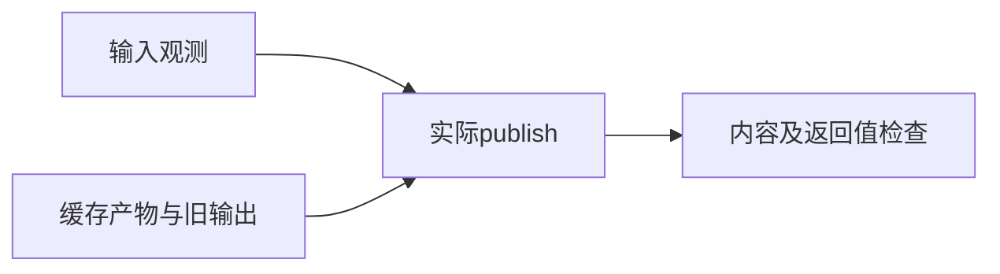
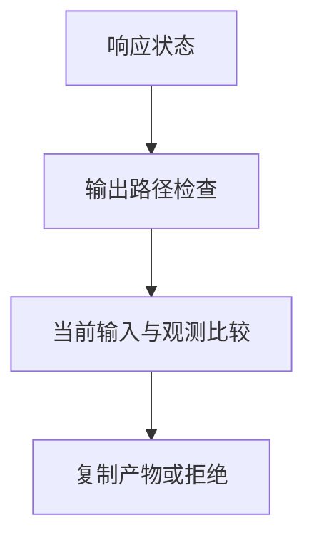

# 后端产物发布门禁验证

## IDEA

- Intent：独立验证发布入口在输入变化和协议状态不满足条件时保留旧产物。
- Data：build/observed.zig的实际publish接口、Inputs观测及真实临时文件。
- Edges：直接测试真实文件复制和输入复核；响应状态由fixture提供，不宣称已覆盖真实后端编译进程。
- Answer：新发布测试入口、根接入、旧文件与新文件内容断言、可复现日志和草稿。

## 结果

新增8个独立发布API测试：稳定输入同时复制二进制/汇编、修改输入、删除输入、新依赖、依赖报告不完整、失败响应、任一输出覆盖输入、二进制和汇编输出冲突。所有拒绝场景逐文件核对旧输出内容；输入重叠还核对源文件未改变。

包内 `zig build test-backend-publish --summary all`退出0，4/4步骤、8/8测试通过，日志 `/tmp/zxc-backend-publish.log`。入口已接入根test。没有生产修改或新缺陷通知。

初次直接把observed.zig作为模块根触发Zig目录边界错误，改为cli/build.zig仍遇到其父目录引用边界。最终由addWriteFiles逐字节复制8个实际依赖源码并生成仅导出的root.zig，复制步骤随源码更新失效；不维护测试版实现、不改生产导出。实现会话同时为Observed新增input_paths字段，fixture按当前接口补齐。另一次编辑命令工作目录错误已纠正，未更改预期。

格式、diff及两份测试草稿一致性通过。目录62,251、上游485/53,597不变；本轮8个发布API测试另计，43个协议API测试保持原记录。最新完整根执行仍阶段145。

## 自我批判

真实文件操作不等于真实后端构建：fixture明确构造响应状态和缓存文件内容，因此只证明publish入口的状态门禁、输入复核与复制结果。尚未覆盖resolve的四种路径前缀、真实缓存产物定位、编译进程、复制中途失败、符号链接或并发修改。此次没有将狭窄门禁结果扩张为发布事务的全面保证；后续继续补这些链路。
