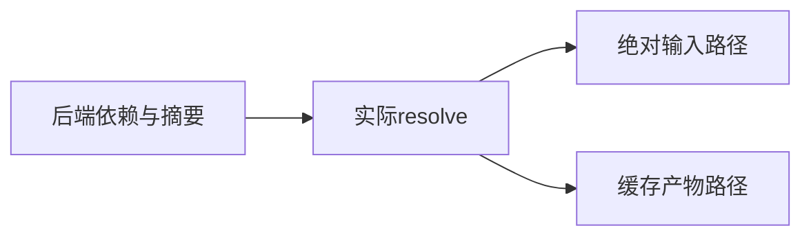
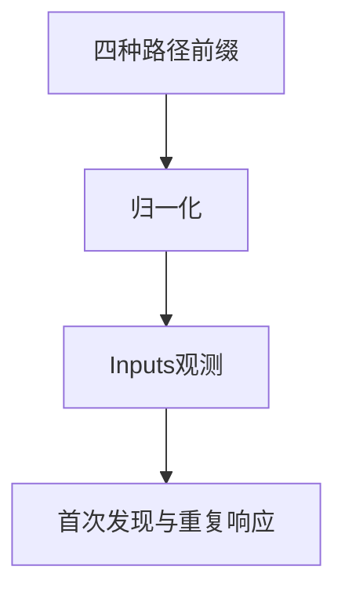

# 后端依赖与产物定位验证

## IDEA

- Intent：验证后端依赖前缀映射、重复依赖收敛和按摘要定位目标产物。
- Data：实际Observed.resolve接口、四种协议PathPrefix、真实临时输入文件及显式目标三元组。
- Edges：定位不等于编译或文件存在验证；本轮不运行跨目标二进制。
- Answer：独立定位测试与发布专项共同运行，保留计数和适配边界。

## 结果

新增4个独立API测试：cwd/zig_lib/local_cache/global_cache四前缀映射及重复响应收敛；folder/../input与input归一化后不新增观测；16字节摘要对应的小写十六进制路径与Linux/Windows产物名、汇编开关；失败响应保留依赖但不返回产物路径且不发布。

首次四前缀响应new_inputs=true，重复相同响应=false，观测总数为原输入1加新增4；input_paths逐项对照真实目录。Linux期望application，Windows期望application.exe，只检查路径不执行跨目标程序。

初次测试11/12通过，失败来自测试手写预期摘要多了一组a5。核对std.Build.Cache.bin_digest_len=16后改为明确的字符串重复16次，并非改变生产摘要算法。最终 `zig build test-backend-publish --summary all`退出0，6/6步骤、12/12测试通过，日志 `/tmp/zxc-backend-resolve-final.log`；初次日志 `/tmp/zxc-backend-resolve.log`保留。

没有生产修改或新增缺陷；格式、diff、一份草稿检查通过。目录62,251、上游485/53,597不变；12个发布/定位API测试和43个协议API测试另计。最新完整根仍阶段145。

## 自我批判

定位测试使用真实依赖文件与实际resolve，但后端响应由fixture提供。构造摘要只能验证路径拼接与目标命名，不能证明产物在该路径存在、可执行，或后端真实缓存命中。因此仍需后续runObserved到发布的完整链路，不把当前12个API通过作为其替代证据。
