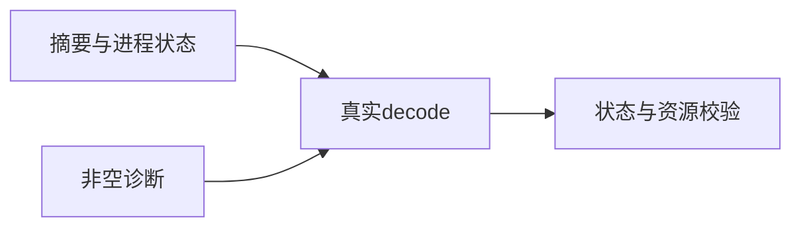
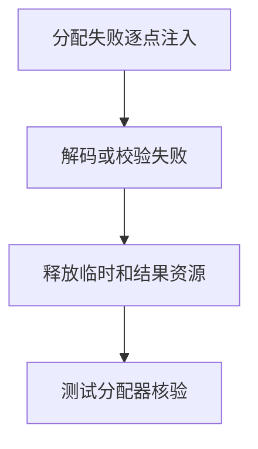

# 后端协议摘要与分配失败验证

## IDEA

- Intent：验证摘要标志、异常退出与非空诊断资源释放，复验阶段149缺陷修复。
- Data：实际后端协议与std ErrorBundle布局；实现会话正在添加内部引用校验。
- Edges：不更改实现；非空诊断分配失败和拒绝路径需独立验证。
- Answer：新增边界案例、包专项执行、修复前后结果、草稿与自我批判。

## 结果

新增8个API测试，总数25：两种缓存标志及摘要逐字节所有权、signal退出、4种保留标志、全部错误摘要长度、未知tag、非法输入前缀，以及有效非空诊断和损坏诊断的逐分配失败清理。参数遍历不额外计为独立测试。

实现会话在本轮加入error_bundle.zig内部引用校验，protocol.decode调用该校验。本轮未修改生产代码或放宽阶段149断言。`zig build test-backend-protocol --summary all`退出0：9/9步骤、25/25测试通过，日志 `/tmp/zxc-backend-protocol-resources.log`。上一轮四个失败现在全部通过。已向实现会话报告复验结果和范围。

非空诊断分配失败注入同时覆盖错误包分配、内部校验临时结构和结果所有权；损坏文本路径覆盖分配失败及InvalidBackendProtocol返回时释放。测试主体仍直接调用实际decode，未复制校验实现。格式、diff、五份代码草稿一致性检查通过。

目录62,251、上游485/53,597不变；25个协议API测试另计。最新完整根回归仍阶段145（四个legacy失败），没有以协议专项结果替代完整根结论。

## 自我批判

本轮证明既有四种损坏诊断被拒绝，以及新增边界/资源案例通过；未穷尽错误包引用图，也未验证真实进程输出限额或发布前复核。信号场景是传入真实Term类型值，未启动并终止子进程。内部校验新引入了深度与展开量限制，后续还需要阈值和有环/共享引用图测试，避免把防御性限制误当作完整协议正确性证明。
