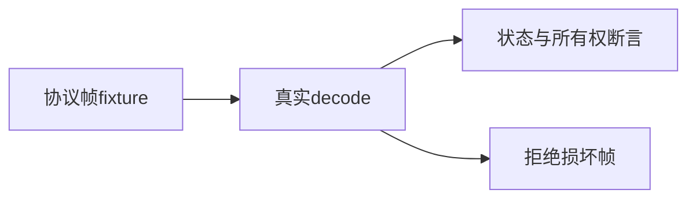
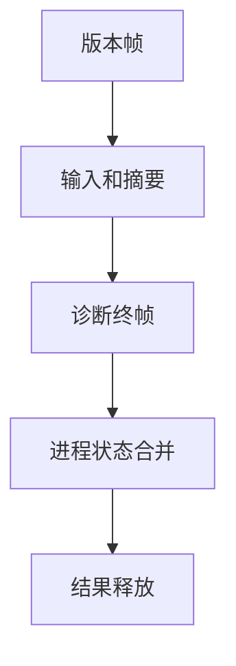

# 后端协议边界与资源验证

## IDEA

- Intent：验证新后端协议解码的帧边界、完成状态、所有权和损坏诊断拒绝。
- Data：cli/backend/protocol.zig、Zig 0.16 Server与ErrorBundle实际布局、现有增量API测试组织。
- Edges：直接导入现有协议模块，不改生产实现；不会把畸形包被接受设为正确预期。发现缺陷通知实现会话。
- Answer：独立协议测试入口、根接入、可复现结果、草稿及资源失败检查。

## 执行计划

构造符合实际布局的帧，检查正常与失败终止、重复/截断帧、输入所有权、分配失败清理及错误包内部索引。保留真实失败，不以跳过替代修复。

## 实际结果

新增17个独立Zig API测试，不增加JSONL目录或Test262审阅数。包内执行 `zig build test-backend-protocol --summary all`，最终3/5步骤成功、13/17测试通过、4个失败，退出1；日志 `/tmp/zxc-backend-protocol-final.log`。初次13测试中12通过、1失败，日志 `/tmp/zxc-backend-protocol.log`。最初从仓库根调用该专项，根没有此名称；随后切换packages/test执行，没有将入口错误算作实现缺陷。

13个通过覆盖输入/stderr/非空诊断所有权、缺输入帧、非零退出、缺摘要、输入快照替换、逐分配失败清理、截断帧、版本顺序、重复帧、终帧约束、版本不符和诊断头截断。有效非空诊断能读取文本bad，且阻止succeeded。

4个失败均为损坏ErrorBundle被接受：根列表起点越界、消息索引越界、字符串索引越界、文本无NUL终止符。具体字节构造留在invalid_test.zig，测试释放意外返回的Result后报告ExpectedProtocolRejection，不靠触发内存访问崩溃验证。std ErrorBundle消费者通过索引直接访问，接受这些对象会把损坏推迟到后续读取。

已按用户授权向实现会话01a1017f-f09f-7001-95ef-8e966ebd6aee发送初始复现及扩展证据，等待实现修复。本轮没有修改生产实现，没有跳过测试或放宽预期。测试已接入packages/test根test依赖，因此缺陷会让后续完整根回归继续失败。

格式、diff和三份代码草稿一致性检查通过。目录62,251，上游485/53,597保持不变。最近完整根执行仍阶段145的4个legacy失败；本轮新增4个后端协议失败，不能将旧根结果当作当前仅有四个失败的证明。

## 自我批判

协议帧来自测试构造，尚未覆盖真实子进程并发输出、输出大小上限、所有诊断来源与引用链、损坏循环结构。分配失败测试当前覆盖正常空诊断响应，不代表非空诊断的所有分配点都已覆盖。发现内部索引校验缺失后保留失败回归并通知实现方；本轮不能宣称后端协议已达生产可用标准。
