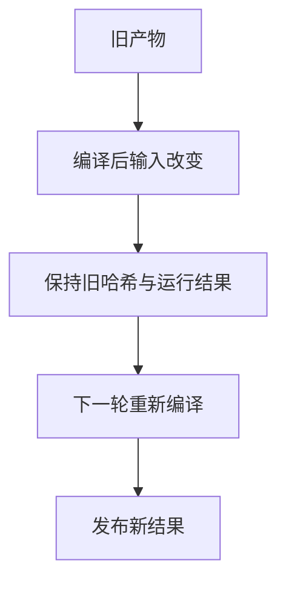

# 后端发布前输入变化与恢复验证

## IDEA

- Intent：验证成功编译与发布之间的输入变化阻止过期产物发布，并能在下一轮恢复。
- Data：已有真实后端驱动、输入内容快照、真实二进制与汇编哈希。
- Edges：用测试驱动确定性写入模拟临界时刻变化，不声称覆盖任意并发竞态。
- Answer：根源文件和传递依赖两条成功编译后变化路径、旧产物保留与后续恢复。

## 结果

扩展已有1个真实进程集成测试，不增加独立测试计数。现在包含8轮driver、16次真实后端编译请求与8次发布产物运行。驱动仅在指定测试参数存在时，于第二轮后端响应解析完成后、调用实际publish前写入指定文件；生产实现没有测试钩子。

根源文件和传递依赖两条路径均验证：编译成功、errors=0、cached=true、new_inputs=false，但输入已变化使published=false；二进制和汇编SHA256均保持旧值，旧二进制仍按此前值运行。随后正常构建首轮缓存失效、第二轮发布，程序分别恢复为13和15。原冷/热、依赖变化以及编译失败保留旧产物检查继续通过。

`zig build test-backend-runtime --summary all`退出0，4/4步骤、1/1 Node测试通过，约51秒，无跳过；日志 `/tmp/zxc-backend-input-race.log`。TS、格式、diff与两份草稿一致性检查通过，TS日志 `/tmp/zxc-backend-input-race-typecheck.log`。没有生产修改或新缺陷。

目录62,438、上游508/53,597不变，后端Node集成仍计1个。最新完整根执行仍阶段160，保留4个legacy失败；本轮专项不取代完整根。

## 自我批判

确定性写入严格发生在编译成功后、发布复核前，证明这一时间窗口中的输入变化会阻止发布；它不模拟复核后到原子替换前的并发变化。测试仍直接输入Zig应用，尚未覆盖ZX前端参数准备、watch长运行服务或双产物复制中途失败。测试计数保持1，未用内部请求次数扩大案例数。
