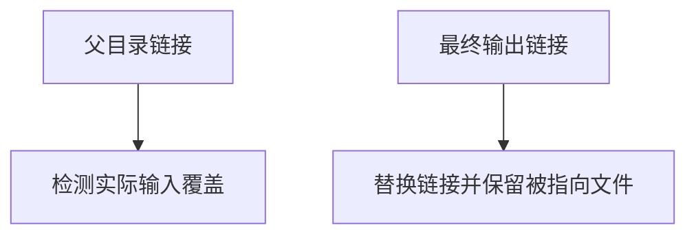

# 后端发布路径别名与资源验证

## IDEA

- Intent：验证真实发布路径别名、递归父目录及分配失败清理，防止重复出现路径释放缺陷。
- Data：watch/output.zig和std.Io.Dir.copyFile原子替换目录项契约。
- Edges：父目录符号链接与最终目录项符号链接语义不同；测试限当前主机，不声明跨平台权限表现一致。
- Answer：合法/冲突路径测试、真实文件内容核对、逐分配失败检查与专项结果。

## 结果

新增6个发布路径API测试：父目录符号链接不能绕过输入重叠检查；最终输出符号链接被替换且输入目标内容保持；输出/汇编经父目录别名指向同一位置时拒绝；缺失多层父目录能创建并正确发布；已有父目录与缺失父目录两条路径逐分配失败清理。

std.Io.Dir.copyFile明确采用createFileAtomic及replace，因此最终符号链接应被替换为文件，而不是一律拒绝。测试实际核对链接替换后的类型为file、新内容为new-bin、目标input仍为source。父目录链接则决定真实输出位置，必须用于重叠和冲突检查。没有用错误的统一符号链接规则制造缺陷。

`zig build test-backend-publish --summary all`退出0，8/8步骤、18/18测试通过，日志 `/tmp/zxc-backend-paths.log`。格式、diff与一份草稿一致性通过。只在构建缓存测试门面导出Output接口，没有修改生产实现，没有新增缺陷通知。

目录62,438、上游508/53,597不变，18个发布/定位API测试另计。最新完整根执行仍阶段160，已知4个legacy失败仍保留；本轮专项不改变完整根结论。

## 自我批判

符号链接行为在当前macOS主机实测，未验证Windows权限与路径大小写差异；硬链接、检查后目录替换、两个产物中途复制失败仍未覆盖。逐分配失败检查针对路径解析和释放，不代表整个发布流程的所有失败点已验证。单文件原子替换不等于双产物事务原子性。
