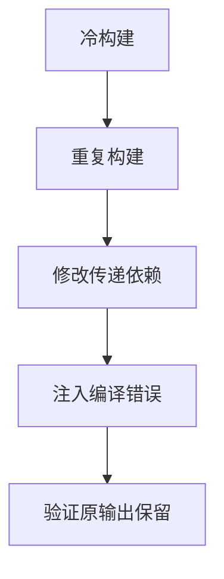

# 后端真实进程与发布验证

## IDEA

- Intent：通过真实Zig后端协议验证冷构建、缓存复用、依赖变化及编译失败保留旧产物。
- Data：现有process.run、Observed.resolve/publish、真实独立缓存和两文件Zig应用。
- Edges：直接输入Zig应用验证后端适配，不替代ZX前端到runObserved完整入口测试。
- Answer：真实进程集成测试、实际执行发布二进制、旧产物哈希比较、根测试接入与日志。

## 结果

新增1个Node集成测试，内部4轮driver、每轮2个真实Zig后端进程，共8次真实编译请求。驱动调用实际process.run→Observed.resolve→publish，独立本地/全局缓存，无模拟响应。

冷构建首次cached=false、new_inputs=true且不发布，第二次cached=true、new_inputs=false并发布；新进程热构建均命中缓存，二进制和汇编哈希保持一致。修改被import的value.zig后首次缓存失效，第二次发布新产物，实际程序退出值从7变为11。再把依赖改为未声明名称，两个真实后端响应均失败且带诊断、不发布；二进制与汇编SHA256不变，旧程序仍能以11退出。总共4次实际运行产物。

在packages/test执行 `zig build test-backend-runtime --summary all`，退出0，4/4步骤、1/1 Node测试通过，耗时约26秒，无跳过；日志 `/tmp/zxc-backend-runtime.log`。类型检查、格式、diff和两份草稿一致性通过，TS日志 `/tmp/zxc-backend-runtime-typecheck.log`。入口接入根test。

当前构建缓存镜像新增实际backend/process.zig，共9个生产源码按原字节参与编译；只生成导出门面，不修改生产实现。已向实现会话发送真实链路通过证据与边界，没有新缺陷通知。

目录62,251、上游485/53,597不变。新增1个后端进程Node测试、12个发布定位API与43个协议API均另计。最新完整根执行仍阶段145。

## 自我批判

此次填补实际后端响应与真实发布二进制的缺口，但直接使用Zig两文件应用，未走ZX前端及build.runObserved参数准备。没有验证发布前临界时刻输入改变、输出复制失败、别名路径重叠或watch连续服务。不能将1个集成测试内部8次请求当成8个独立案例或完整构建链路覆盖。
