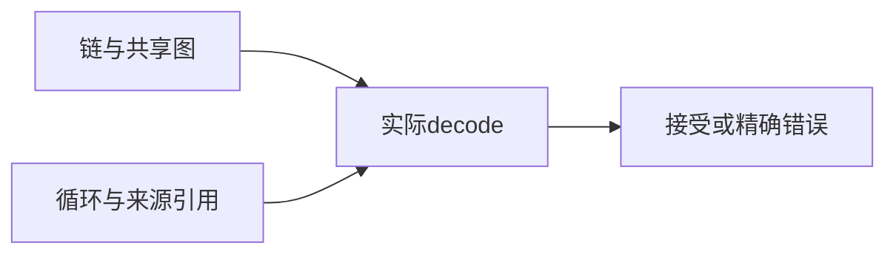
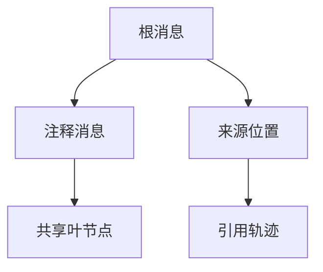

# 后端诊断引用图验证

## IDEA

- Intent：验证诊断引用图的循环拒绝、合法共享、深度与展开量阈值。
- Data：当前内部校验的256层、1048576展开量限制；std ErrorBundle真实记录布局。
- Edges：测试通过真实decode，不复制生产遍历；阈值是当前后端实现约束，不是Test262标准。
- Answer：合法与非法成对案例、资源失败测试、协议专项结果和草稿。

## 结果

新增9个独立Zig API测试：深度边界、共享DAG展开量、多个根的精确总量边界、自循环、间接循环、重复根、合法来源位置、来源引用循环、共享图逐分配失败清理。

每层两次引用同一下层节点，20层展开量为2^20-1=1,048,575，21层为2^21-1，后者被拒绝。将20层图与一个叶节点共同列为根时，累计恰为1,048,576，允许；再增加一个叶根得到1,048,577，拒绝。该预期来自独立的树展开计数，没有复制生产DFS。单链深度256允许、257拒绝。三个循环场景均返回InvalidBackendProtocol，合法共享不被误判为循环。

`zig build test-backend-protocol --summary all`退出0，11/11步骤、34/34测试通过，日志 `/tmp/zxc-backend-graph.log`。没有新实现缺陷；本轮只新增两个测试文件和入口注册。格式、diff与两份草稿一致性检查通过。

目录62,251、上游485/53,597不变；34个协议API测试另计。最新完整根执行仍阶段145，未以本轮专项替代完整回归。

## 自我批判

本轮构造合法共享与损坏循环后直接调用实际decode，覆盖了校验器的图状态和资源释放，但没有渲染百万规模诊断输出；复杂度限制本身是否适合真实工作负载仍需要真实编译场景验证。来源位置只覆盖基础合法记录与循环，尚未穷尽行号、列号、跨度和引用哨兵。阈值案例是协议实现的回归契约，不计为Test262语义对齐。
