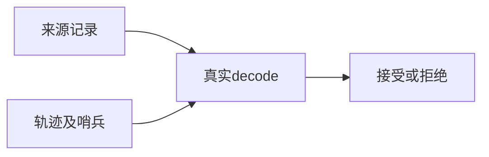
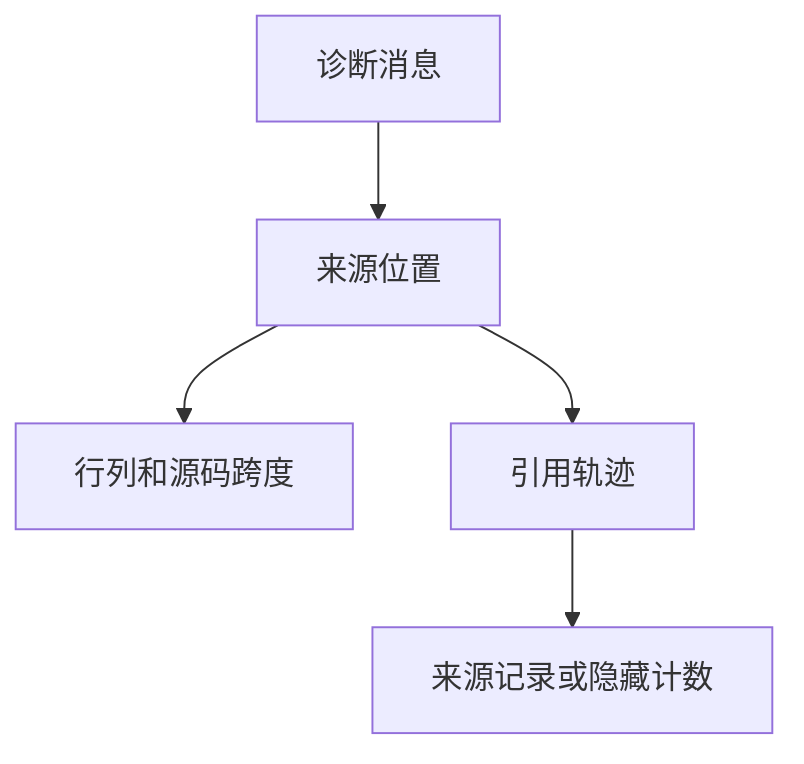

# 后端诊断来源边界验证

## IDEA

- Intent：补齐来源位置、引用轨迹和隐藏计数的合法/非法边界。
- Data：实际ErrorBundle来源记录及消费者使用的行列加法、跨度差值、轨迹哨兵定义。
- Edges：当前测试验证decode边界，不宣称完整诊断渲染和真实构建链路覆盖。
- Answer：独立来源测试、协议专项结果、草稿与剩余范围。

## 结果

新增9个来源测试，总协议专项43个：零位置/缺源码行、行列加法溢出、最大可递增行列、span_main早于span_start、列号不足以容纳前缀、路径/源码行索引越界、轨迹存储不足、隐藏引用计数哨兵、合法非循环来源引用及其索引反例。表内变体不额外计数。

标准库消费者ErrorBundle.zig确实使用span_main-span_start、column-before_caret、count+reference_trace_len-1等运算；span_end则使用饱和减法，本轮不人为添加要求其严格大于span_main的测试。隐藏计数是哨兵数值，不能误当字符串索引，0、3及u32最大值减1合法，u32最大值会在当前加法中溢出而被拒绝。

在packages/test执行 `zig build test-backend-protocol --summary all`，退出0，13/13步骤、43/43测试通过，日志 `/tmp/zxc-backend-source.log`。格式、diff和一份源码草稿一致性检查通过。无生产修改，无新增缺陷通知。

目录62,251、上游485/53,597不变；43个API测试另计。实现会话最新报告已验证发布前输入复核及输出输入路径重叠拒绝，后续需要独立接入真实构建/发布链路测试。最新完整根执行仍阶段145。

## 自我批判

这些测试覆盖解码与结构校验，未实际渲染最大合法列号；允许大整数并不证明渲染资源成本可接受。合法源码文本由测试固定字串提供，未验证文件编码、终端颜色或真实编译器来源定位。没有将纯协议通过等同于整个后端生产可用。
