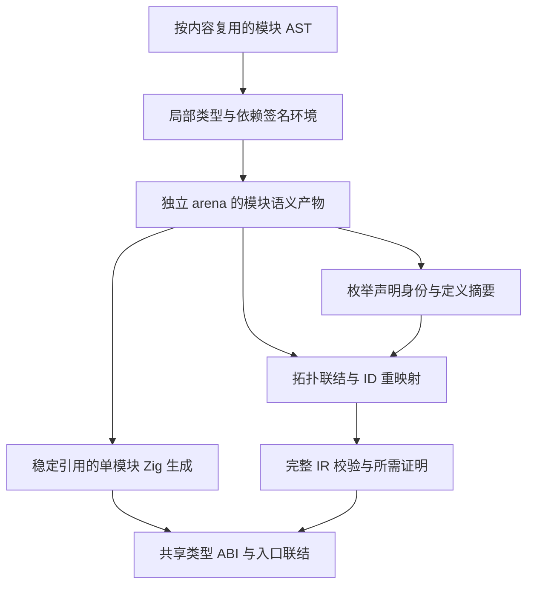
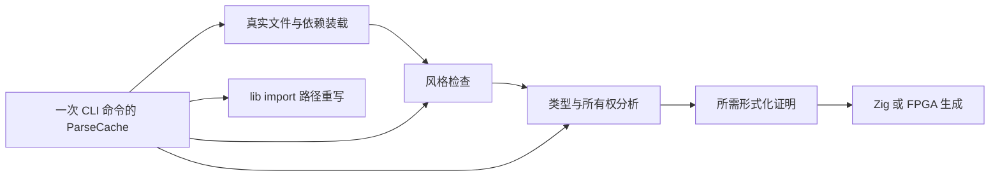
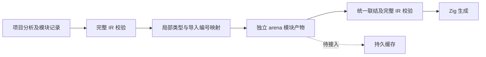
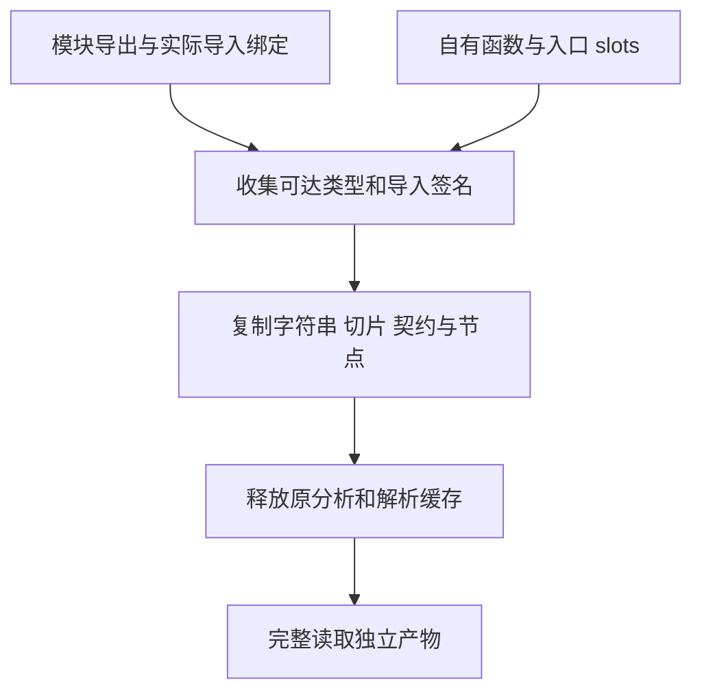
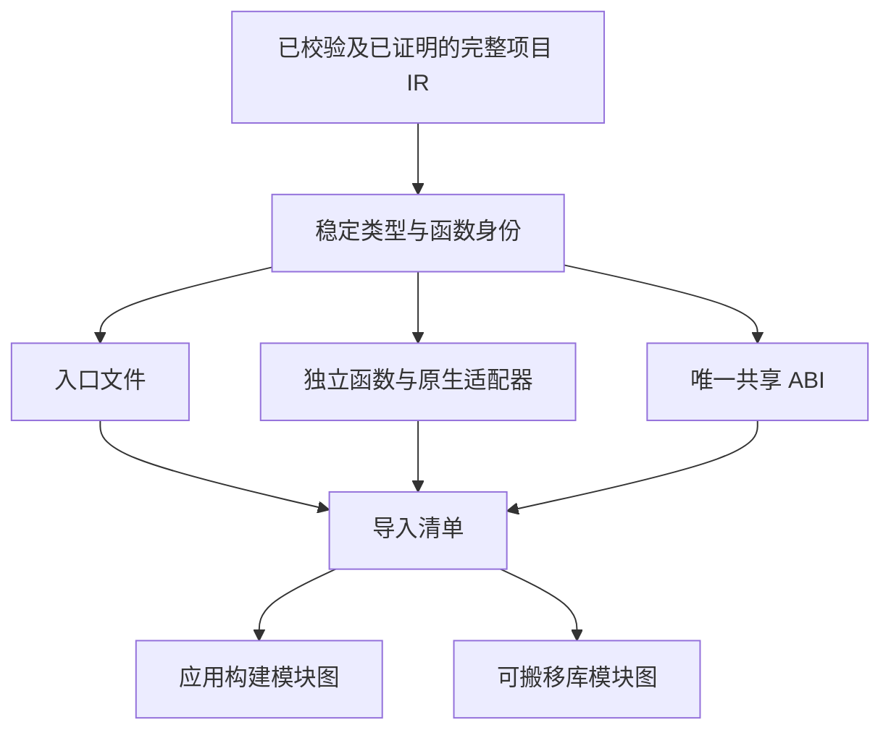
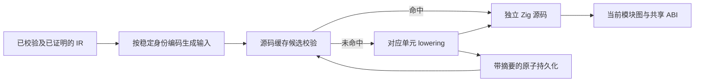

# 增量编译与热重载实施计划

## Intent：最终目标

实现 zxc 的细粒度模块增量编译：基于内容及编译环境缓存，仅重新分析、生成受变化影响的模块；从输出 Zig 源码的组织与缓存层面落实复用，而不是每次重发整份单体 Zig 后只依赖后端缓存。提供真实可用的热重载入口。该目标在包职责拆分、包管理与完整语言目标之外继续保留。

## Data：当前证据

用户明确要求“编译时利用缓存，仅编译变动的模块”和热重载。现有工具链调用 Zig 构建，Zig 自身缓存不能证明 zxc 前端、类型分析及模块生成已经具备增量机制。当前尚无本项实现与验收证据。

## Edges：边界与限制

- 模块缓存键必须覆盖源码、编译器/IR 版本、编译选项、目标平台、声明与依赖接口；不能只用文件时间戳。
- 源码变化需结合依赖图失效；接口变化传播到消费者，未变化模块复用。需要保留无环检查、形式化验证与所有权校验，不能用缓存绕过门禁。
- 生成的 Zig 模块需有稳定身份、稳定导入与类型 ABI 边界；细粒度缓存应保存独立生成产物，避免无关模块变化导致全局编号、类型排序和文件内容级联抖动。需核对生成单元和联结图，不仅记录一个整个项目的哈希。
- 缓存需要完整性校验、原子发布、损坏恢复与跨进程一致性；包路径、配置及标准库变化也属于依赖证据。
- 热重载需区分文件监听、增量构建、运行中代码切换和状态生命周期；进程重启不自动等于保留状态的热替换。具体运行时模型需结合 RX 宿主实现确定并明确交付边界。
- 构建失败应保留最后一个可运行版本并显示诊断，不能加载半成品或默默执行过期逻辑。
- 不擅自新增测试用例，不执行浏览器 UI；复用已有回归与真实编译示例，记录每次实际命中、失效与重载事件。

## Answer：交付与成功标准

首先定位现有源码加载、模块图、分析、生成和构建边界，形成缓存数据模型，再实现命令与运行宿主接入。验收至少覆盖未修改、叶模块修改、公共接口变化、配置与目标变化、依赖删除、缓存损坏、连续修改、构建失败及恢复。需要可核对的编译事件证明未变化模块没有重新编译，而不只比较耗时。

## 自我复核

本文仅记录新增目标和验收边界，尚未完成源码定位和方案定型。不将已有 Zig 缓存或文件监听包装器冒充本项完整实现。

## 当前源码定位

`compiler/src/modules/project.zig` 的 Project.load 按依赖顺序分析模块，并逐步合并全局 types/functions；函数引用使用在合并过程中分配的 FunctionId，模块程序随后携带累计的类型和函数集合。`genz/src/zx` 消费这一整体 Program。这意味着只给源码文件加一个哈希缓存仍不足够：依赖顺序或前置类型集合变化，会改变后续模块中的编号和生成文本。

后续设计必须明确模块局部 IR、依赖接口身份和生成 Zig 引用的稳定映射，在联结阶段处理跨模块引用；先测清哪些变化确实影响接口，再决定失效传播。不能缓存引用旧全局编号的 IR 后直接复用，也不能用每次重新生成整份 Program 来宣称“仅编译变化模块”。

已复核 `cli/artifacts.zig`：现有 SHA256 覆盖整份 source、types、runner 与 configuration，随后仍重写 program.zig、abi.zig、main.zig。该机制只是整程序输出目录寻址。genz 的 types/lower/imports 分别按全局序号命名 zx_type_N、function_N、zx_native_N，因此必须先稳定生成引用，再建立模块缓存。新缓存键还需明确字段边界和版本域，不能继续用未分帧的多个字节串拼接表达独立输入。

## 构建产物复用基础

先修正 cli/artifacts.zig 的整程序产物寻址：SHA256 输入加固定版本域，四个字段按固定顺序分别写入 u64 小端长度及字节，避免字段边界歧义。prepare 对已有 program.zig、abi.zig、main.zig 比较完整内容，相同则保留文件，不同或缺失时使用原有原子写入。超出预期长度的文件视为不同；权限及 I/O 错误继续返回，不伪装成缓存未命中。

这一步仅稳定整程序生成文件，仍会执行前端分析，不构成模块级增量编译。验证复用现有 CLI 构建输入，比较连续两次构建的目录与文件元数据，再破坏缓存产物确认恢复；不新增测试用例。

### 执行结果与自我复核

正式实现位于 packages/compiler/src/cli/artifacts.zig；代码草稿及结果位于本目录的增量编译子目录。根级构建通过 13/13 步骤，源码格式和 diff 空白检查通过。

复用 packages/compiler/examples/quote.zx，使用实际 zxc build 连续生成应用。修正后重复构建的 program.zig、abi.zig、main.zig 内容、inode 和纳秒修改时间全部相同；向 program.zig 追加损坏内容后再次构建，原文恢复，另外两个文件保持原 inode 与修改时间。结果保存为增量编译/产物复用结果.json。

首次验证暴露 readFileAlloc 的长度上限在文件恰好达到限制时也报 StreamTooLong，导致相同文件被替换。已将限制改为预期字节数加一，再完整执行重复构建与损坏恢复并通过。不存在“只比较执行成功就声称复用”的验收。

这里仍没有模块局部 IR 或依赖接口缓存；configuration 仍来自现有完整构建配置，不声称跨绝对路径复用或规范化等价配置。现有原子单文件替换保护完整文件发布，不能扩大解释成整个模块缓存目录的事务或运行中热替换。后续继续建立模块身份与联结边界。

## 模块解析复用

Intent：建立可跨构建会话持有的模块语法缓存，同时消除 analyzeProject 风格检查与 Project.load 对同一模块的重复解析。

Data：frontend/parse.zig 的 Result 拥有源码、文件名、token 和 AST 的 arena；modules/project.zig 的类型和函数仍采用全局累计编号。语法结果不依赖导入解析、Context 类型或目标平台，可以先独立复用；语义 IR 尚不能如此处理。

Edges：以规范化绝对路径定位条目，以源码 SHA256 判断内容是否变化。缓存拥有解析结果；同路径内容变化时替换，旧借用失效；单个分析调用期间输入固定。诊断也可缓存，但 source_index 仍在当前调用中赋值。风格检查、导入无环检查、类型及所有权检查每次继续执行；不缓存这些结论，不将 AST 命中解释为模块编译完成。缓存按实例隔离编译器版本，不序列化跨版本数据。缓存属于执行会话，不放进可序列化的项目 Options。

Answer：提供 project.ParseCache，analyzeProjectWithCache 可显式传入长生命周期缓存；未传入的官方 analyzeProject 也使用本次调用共享缓存，使风格和语义入口只解析一次。计数反映实际解析与命中次数，调用者负责缓存生命周期。后续模块局部 IR 及稳定类型/函数引用继续推进。

### 解析缓存执行记录

新增 modules/parse_cache.zig；原 analyzeProject 在本次调用内共享缓存，显式 analyzeProjectWithCache 支持跨调用持有。缓存条目独立分配，哈希表扩容不会移动已借用的解析结果。更新先完成新解析，再释放旧 arena，OOM 保留旧条目；不把无效源码继续当旧版本执行。

复用现有 runtime/cases/modules.zx、shared.zx、add.zx 三个文件，文档示例 parse_reuse.zig 连续调用完整项目分析及 emitBundle。第一轮 parsed=3、reused=3；第二轮 parsed 仍为 3、reused=9，两轮均成功生成 764 字节程序源码。计数证明第二轮没有重新解析；不据此声称没有重新类型检查或生成。

现有编译器前端及运行回归通过 43/43 步骤、338/338 测试。独立只读复核未发现生命周期、OOM、诊断失效或检查绕过方面的可确证缺陷。首次回归发现将缓存指针放进 Options 会污染项目配置序列化；现已改为独立会话参数并重新通过回归。根级构建已通过 13/13 步骤；本轮解析缓存整仓回归通过 1285/1285 步骤、61662/61662 测试。

本轮没有新增测试用例；运行示例复用已有源码，未改写其逻辑。未将语法缓存当作模块语义缓存完成，后续仍需稳定类型、函数与原生模块身份，再接入独立生成与失效联结。

### 后续 CLI 会话接入位置

cli/sources.zig 为读取依赖闭包仍会单独解析文件；本轮只消除了风格与语义入口间的重复解析，没有声称整个 CLI 只解析一次。后续应由 main.zig 持有一次调用的缓存，传给 sources.read 的会话入口及 verified_compile、verify、fpga 的分析入口；不把缓存放回 Options 或构建配置。application/function.zig 的真实 RX 函数检查也有相同加载路径，应随应用会话一起接入。待当前回归终结后再更改这些调用点。

## 模块语义产物与联结边界复核

只读复核确认 Project.load 当前先累计依赖 types/functions，再运行 Analyzer.run；unit.program 绑定本次全局编号，不能原样作为跨调用缓存产物。analysis/types.zig 的 enumeration 每个声明直接追加；其名义身份由本轮独立 TypeId 隐含表达，不等于名称和成员结构。

模块产物需要拥有独立 arena，包括局部类型表、枚举来源、自身导出、本地函数 IR、直接依赖引用及语义摘要。继续复用现有 Analyzer 与 IR 节点，不把未联结产物伪装为可执行 Program。联结后仍运行现有完整 IR 校验。

枚举声明身份采用 ZX 规范模块身份加声明名；原生枚举使用声明接口身份加声明名，不能只使用实现模块 import_name。身份与定义摘要分别保存：前者确定同一声明，后者检测成员及顺序变化。转导出保留来源，菱形依赖复用同一来源，不同模块的同名同结构枚举保持不同身份。包装与结构类型在子类型重映射后再驻留。

| 引用           | 联结需要处理的位置                                                                                                |
| -------------- | ----------------------------------------------------------------------------------------------------------------- |
| TypeId         | 类型字段、optional/list/tuple 子类型；Symbol/Expression/Export；输入输出；契约节点；Store/Context slots；原生导出 |
| FunctionId     | 所有表达式 call，包括各函数的表达式数组                                                                           |
| NativeModuleId | Function.external.module                                                                                          |
| 局部编号       | ExprId、SymbolId、契约 predicate、字段/枚举成员/入口 slot 序号，保留所属数组时无需全局化                          |

External.input 的 NativeType 是名称及子结构，不做数字 ID 重映射。函数拓扑序仍须满足调用只能指向更早函数的验证约束。包括未使用 import 在内的完整依赖图仍必须无环。

依赖语义摘要不能只含 Input/Output：ownership/check 的 call 分支读取 output_ownership，owned 变 borrowed 时调用者必须重新分析。原生调用还依赖 allocator_argument、expand_tuple、fallible、成员路径及声明类型。入口 Context/Store 的键需要稳定类型身份与定义，不能写入临时 TypeId；普通模块不继承入口注入。

函数体改变但语义摘要不变时，可复用调用者的本地语义 IR，再联结新实现。verification/calls 实际展开被调用体及契约，因此证明依赖包含调用闭包的函数体、契约及验证器/solver 配置；语义缓存命中不能当作证明仍有效。

后端当前 lower.declarations 整体遍历函数，call 硬编码 function_N；types/imports 使用全局序号生成 zx_type_N、zx_native_N。下一步先集中 ID 到生成引用的映射，再分离单模块生成。共享 ABI 采用稳定类型名称保证对象和名义枚举身份；入口联结与 ABI 汇总可重建，未变模块源码应保持复用。

实施顺序：枚举来源元数据、模块产物、集中重映射联结、依赖摘要与缓存、稳定命名及分模块生成。上述是后续实施边界，当前只完成解析复用，尚未实现这些语义产物。

## 命令行会话解析复用实施

Intent：将已验证的解析缓存传到真实 CLI 源码装载与后续分析，避免同一命令中先为依赖图解析、再为风格与语义解析。

Data：sources.read 只有 main 与 application/function 两个调用点；verify/fpga 在完整分析后各自执行既有验证与生成；verified_compile 的 Options 已包含 I/O、writer 等执行状态，不作为项目配置序列化。

Edges：不更改 project.Options，不跨 CLI 进程保存缓存，不跳过模块边界、格式、证明或 IR 检查。源码装载按相同 root_dir 与路径规范化得到缓存键。各 RX 函数检查仍有自己的会话，不声称整个 RX 应用复用已完成。

Answer：main 持有一次命令的缓存，sources.read、verified_compile、verify、fpga 共享；application/function 将自己的装载与分析共用缓存。草稿位于增量编译/命令行会话，此前整仓回归终结后已同步正式源码。已检查 grit apply 支持语言列表，不支持 Zig，此次按具体调用关系作小范围定点编辑，不套用其他语言语法规则。

lib 导出阶段的 library_sources.write 也会读取 import AST 来重写库内路径，已接入同一缓存，经 library.run 传递。它仍按原规则生成相对导入，不复用过期生成文件。Zig 原生源码闭包使用 Zig 自身解析器，不属于 ZX 语法缓存。

### CLI 接入自我复核

源码装载仍读取当前文件并执行原有包边界检查；后续项目分析只在当前 sources 中寻找依赖，不遍历缓存条目，因此已删除依赖不会从历史缓存重新出现。缓存的语法错误会在完整检查中照常返回；源码变化先重新解析，不执行旧 AST。

verified_compile 的执行 Options 新增可选 parse_cache，用于现有编译会话；项目 Options 和 build 配置摘要保持无会话指针。未提供缓存的已有调用方继续使用本次调用局部缓存。verify、fpga、library 仅通过内部参数传递缓存，公开 CLI 语法不变。独立只读复核未发现路径 key、生命周期、诊断来源或检查绕过方面的可确证问题。

### CLI 接入执行结果

根级构建通过 13/13 步骤。使用既有包管理示例 packages/app/main.zx，从工作区依赖构建 app；再导出 lib，并从导出的 source/module_0.zx 构建消费 app。两者都以既有报价示例输入 amount=100、discount=20、enabled=true、factor=1.5 执行，输出均为 amount=80、factor=0.75。生成产物位于增量编译/命令行示例。

这些结果证明真实源码装载、项目分析、配置序列化、生成、库内导入重写及消费路径可运行，不证明持久模块语义缓存或热替换完成。缓存命中不跳过证明；CLI 会话接入后的整仓回归已通过 1291/1291 步骤、61848/61848 测试。正式源码与草稿均通过 Zig 格式检查，本次 diff 空白检查通过；未新增测试用例或浏览器验证。

## 名义类型来源元数据

Intent：为后续模块产物与联结保留枚举声明来源，消除对临时全局 TypeId 的身份依赖。

Data：types.enumeration 每次声明追加独立类型；Project.load、importNative、importExternal 是项目全局类型表的三个新增入口。原生声明按 specifier 缓存，而旧 externals 签名按每个导入绑定、每个导出成员独立实例化，不能把两者误当成同一种身份边界。

Edges：不改变 IR 版本、类型驻留或当前语义；在 AnalysisResult 外层附加项目分析已知的名义来源。ZX 来源为模块路径及声明名；native 来源为接口 specifier 及声明名；legacy external 来源为导入模块、绑定名、导出成员及声明名，保留当前独立实例的语义。Context 预置类型没有声明来源时不编造，后续缓存必须把缺少名义来源视为不能跨产物联结的缺口。独立 analyze/analyzeWithContext 仍不提供项目来源记录。

路径核对发现 Zig 0.16 std.fs.path.resolve 只做词法规范化，不会自行补当前目录。CLI 已提供绝对根；库调用者提供相对 root_dir 时，记录仍可能相对，不能声称绝对物理身份。后续跨项目缓存要求调用方提供稳定项目根/命名空间，不能自行用当前工作目录补全无 I/O 的库 API。

Answer：新增 nominal_origins 负责记录新增枚举的归属，将记录作为项目 AnalysisResult 的 nominal_types 返回；记录拥有分析 arena 内的来源字符串，不借用 ParseCache 或 caller 的 registry。类型名称仍引用同一分析 arena 内的类型表。先以真实枚举源码检查来源，再执行现有回归，不新增测试用例。

### 名义来源执行记录

新增 modules/nominal_origins.zig，在项目的 ZX、native 和 legacy external 类型表追加处记录新枚举，成功返回 AnalysisResult.nominal_types。IR 版本、类型表和生成行为未修改。独立只读复核未发现重复记录、current_source 归属、legacy 实例身份、seed 冒认或 arena 生命周期方面的可确证缺陷。

以现有 tests/runtime/cases/enums.zx 运行文档示例，两轮均记录 Mode 为 source 来源、路径 packages/compiler/tests/runtime/cases/enums.zx、当前 TypeId=11；两轮生成 639 字节源码，解析计数保持 1。该路径实际为相对路径，与调用方提供的 root_dir 一致，没有把它描述为绝对物理路径。

现有前端与运行回归通过 43/43 步骤、338/338 测试；根级构建通过 13/13 步骤。本次不增加测试用例。元数据没有改变类型等价规则，也尚未接入模块局部 IR 或稳定 ABI 名称；不能把它作为语义缓存已经完成的证据。

## 项目模块记录

Intent：为提取模块局部 IR 保留每个可达 ZX 模块的导出表和直接依赖，而不是仅靠最终函数列表猜测模块边界。

Data：Project.load 的 Unit 仅在分析期间存在；纯类型模块不会进入最终 Program.functions，入口函数则从该列表移除。原生接口和 legacy externals 走不同装载分支，未使用 import 也参与校验。

Edges：记录仍引用本次分析的 TypeId/FunctionId，不可直接作为持久缓存。入口用 entry 标记，不暴露已经从 functions 移除的入口编号；纯类型模块用 types 标记。记录仅含实际从入口可达的 ZX 模块，依赖按源码 import 顺序，模块按完成装载的拓扑顺序。原生和 legacy 依赖保留类别与 specifier，不伪装成 ZX 文件。

Answer：AnalysisResult.modules 返回路径、源码 SHA-256、导出、直接 import（绑定种类、原 specifier、名称、范围及解析目标）和主体位置。字符串及 import 数组归分析 arena；导出表复用该 arena 已拥有的数据。原有解析、无环、导出和所有权门禁继续执行，失败时不返回部分模块记录。以已有三模块示例验证，不新增测试用例。

### 模块记录执行结果

已有 shared.zx、add.zx、modules.zx 三模块示例的两轮分析均得到三条记录，顺序为共享类型模块、函数模块、入口；导出数分别为 1、2、2，直接依赖数为 0、1、2。共享类型模块只记录一次，函数记录对应最终 functions 中的 add.zx，入口使用 entry 而不是越界函数编号。各源码 SHA-256、解析目标及生成的 764 字节程序在两轮保持一致；第二轮解析计数仍为 3。

现有前端与运行回归通过 43/43 步骤、338/338 测试；根级构建通过 13/13 步骤。独立只读复核未发现入口编号、纯类型模块、依赖顺序、共享模块去重或生命周期方面的可确证缺陷。没有新增测试用例，本次记录还没有重映射全局 ID，不是可独立缓存的模块 IR。

补充实际产物校验：两轮生成源码的 SHA-256 均为 a1f826e7ba887e835e5a3a06edc8ed56e1c80861da23a64f65207d4619d64ab2，已核对完整内容摘要，不仅比较字节数。

## 局部 IR 提取

Intent：从已校验的项目分析结果提取拥有独立 arena 的模块产物，解除对全局类型、函数及原生模块编号的依赖。

Data：模块记录已保留导出与直接依赖，但必须同时保留分析时实际解析出的类型别名及函数绑定，才能完整恢复 namespace/positional 调用环境，包括未使用但已检查的导入成员。

Edges：产物是带导入签名的模块，不是完整 Program，不能直接送入生成器或绕过最终联结校验。函数/表达式内部 ExprId 与 SymbolId 保持局部；TypeId、调用 FunctionId、原生模块 ID 重新映射。保留本模块新增类型及引用的依赖类型，不按同名或同结构合并。枚举缺少来源时明确返回 MissingNominalOrigin，不猜测身份。类型复制用显式工作栈处理有序无环类型表，避免把长类型链变为递归调用栈。

Answer：project.artifact.extract 从成功项目结果与模块索引提取类型、来源、导出、依赖、解析后的绑定、导入签名、原生描述及自有函数主体；释放原分析与解析缓存后产物仍有效。普通函数不携带入口 Context/Store，入口产物保留自身 slots。复制 IR 的切片、字符串、契约和嵌套语句，同时严格映射所有跨表 ID。持久缓存与重新联结仍是后续步骤。

### 局部产物执行记录与自我复核

现有三模块示例提取出 shared、add、入口三个独立产物，局部类型数分别为 11、11、12，导入函数签名数分别为 0、0、1。先释放分析结果和 ParseCache，再完整遍历并 JSON 序列化产物，成功退出，DebugAllocator 未报告泄漏。示例用词法作用域释放分析资源，避免手动释放后遗留 errdefer 在后续分配失败时重复清理。

现有前端与运行回归通过 43/43 步骤、338/338 测试，根级构建通过 13/13 步骤；格式检查与 git diff --check 通过。独立只读复核未发现可确证缺陷。生命周期示例只覆盖现有三模块，不足以证明全部原生 ABI、Context 或所有嵌套 IR 形态已经独立运行。当前完成的是产物提取，还不能宣称增量语义缓存、模块联结或热重载完成。

另一个 session 的名义类型回归暴露出旧式 lib: 重复导入问题：同一外部导出在每个导入位置重新实例化枚举，导致签名 TypeId 不一致，被现有 IR 门禁拒绝。此前保留“每次导入独立身份”的文档没有识别这项冲突，属于设计复核遗漏。已向用户请求确认是否改为同一注册接口共享身份；确认前不放宽 IR 校验，不修改测试预期。

## 联结类型表

Intent：把多个独立模块的局部 TypeId 映射到同一张有序类型表，为后续函数和原生接口联结提供稳定基础。

Data：局部产物已有标量前缀、子类型先于父类型的不变量，以及枚举声明来源；现有 analysis/types.zig 对列表、可选、元组和对象采用结构驻留。

Edges：同一来源和声明名的枚举必须具有相同成员及顺序，否则返回冲突；不同来源即使成员完全相同也不合并。保留 legacy 现有来源格式，不替用户决定待确认语义。拒绝缺失、重复或与枚举名称不匹配的来源记录。所有返回切片与名称由结果 arena 拥有；临时重映射内容不进入结果。

Answer：提供独立类型联结结果，包含统一类型表、名义来源与每个模块的局部到统一 TypeId 映射。以已有模块产物演示实际调用；这仍不是完整 Program 联结，不能单独作为缓存命中的执行许可。

### 类型联结执行记录

实际运行已有三模块示例：局部类型表分别为 11、11、12 项，统一后为 12 项，返回三组映射；已有枚举运行示例统一后为 13 项和一条名义来源。两次运行均先释放原分析和解析缓存，再提取数据；类型联结结束后进一步释放全部模块产物，然后完整序列化统一类型、来源与映射，成功退出，DebugAllocator 没有报告泄漏。

格式及 diff 检查通过。独立只读复核未发现生命周期、结构比较、枚举来源比较、来源格式校验和映射顺序方面的可确证缺陷。现有示例没有覆盖所有冲突路径，不能把静态复核当作全路径运行证明；后续统一联结仍须验证函数导入、原生 ABI 以及最终完整 IR。

## 完整模块联结

Intent：把模块产物恢复成可通过现有 IR 门禁并生成 Zig 的完整 Program，作为后续缓存复用的入口。

Data：产物含直接依赖、自有函数、导入签名和原生 ABI 描述；统一类型接口已提供每个局部类型编号的映射。

Edges：按指定入口的可达依赖拓扑顺序联结，缺失模块、重复路径和循环必须拒绝，包括未调用的导入。导入函数签名需与真实目标匹配，原生导出不得出现冲突的 ABI。不得用签名伪造函数体。Context/Store 只允许出现在入口产物。返回数据由独立 arena 拥有，联结完成后再次运行完整 IR 校验。

Answer：提供入口路径与模块产物数组的联结 API，返回独立 Program；已有模块示例提取、释放原分析、重新联结后生成 Zig，并与直接分析的生成内容比较。保留尚待确认的 legacy 身份语义。

### 完整联结执行记录与自我复核

新增 artifact.linker.link，显式栈遍历所有可达源码依赖；未使用的 import 也参与缺失与循环校验。按拓扑顺序统一类型、原生模块、外部函数与源码函数，导入签名核对真实函数的输入、输出和所有权，原生函数还核对实现成员、allocator/tuple/fallible 标记及输入布局。返回前执行完整 IR 校验。保留入口 Store/Context、自有契约、导出和名义来源。

已有三模块示例往返生成 764 字节主源码，SHA-256 为 a1f826e7ba887e835e5a3a06edc8ed56e1c80861da23a64f65207d4619d64ab2；已有枚举示例生成 639 字节主源码，摘要为 eadba7f639390cc3b88e7b658547adf92cfa126348fe92f7bec1b555652c67fb；已有 querystring parse_with 示例联结出 6 个外部函数、1 个原生模块，主源码 1777 字节，摘要为 bfdf0695172761c0bff1d45af51428958bb1b2bb8b54d61eba837094f94b6607。示例进一步同时比较主源码与独立类型文件的摘要。

生命周期顺序为提取产物后释放原分析及 ParseCache，联结后释放全部产物，再生成 Zig；DebugAllocator 未报告泄漏。现有前端与运行回归通过 43/43 步骤、338/338 测试，根级构建通过 13/13 步骤，格式及 diff 检查通过。

独立复核发现公开联结输入可能在最终校验前触发无界递归复制。已在语句块复制和 NativeType 复制中加入与原校验器一致的深度边界，复核确认修复。此前复用仅处理已验证 IR 的 copier 时，没有充分考虑新入口的校验顺序，这是本阶段的自我复核纠偏。

限制：上述往返运行不等于覆盖任意缓存损坏或全部 ABI 冲突路径。联结没有执行源码失效判定、自动重新分析、持久化或证明复用；缓存命中调度与细粒度 Zig 文件生成仍待实现。旧式 lib: 重复导入的身份选择仍待用户确认。

## 语义缓存接入

Intent：在每轮正常解析和依赖校验后复用未变化模块的局部产物，真正跳过 Analyzer.run，保持错误诊断与依赖失效正确。

Data：Project.load 已按依赖顺序准备类型别名、函数绑定、原生接口和全局类型表；局部产物可映射回这些当前绑定，不能沿用上轮全局 ID。

Edges：命中同时要求源码摘要、注入上下文以及当前解析的依赖关系一致。恢复时将局部类型映射到本轮类型表，再核对所有类型别名、函数输入输出、返回所有权及原生 ABI；不匹配即重新分析该模块，不复用旧编号。每轮仍遍历 import 并检查无环与缺失依赖。只缓存成功且具有足够名义来源的产物；缺少外部注入枚举来源时保留正常分析能力，明确计入不可缓存模块，不推测身份。这里先接入进程内缓存，持久化和 CLI 调度后续接入。

Answer：新增拥有 ParseCache 与模块产物的语义缓存对象，提供 analyzed/reused/uncacheable 计数；在相同源码两轮及单模块源码变化后，观察实际分析次数与生成内容。任何返回的分析结果仍独立拥有内存。

### 语义缓存执行记录与自我复核

已有三模块程序的三轮累计计数为：第一轮 analyzed=3、reused=0；第二轮 analyzed=3、reused=3；第三轮仅给一个模块追加换行，analyzed=4、reused=5，parsed 从 3 增至 4。三轮完整生成 bundle 内容摘要一致。已有枚举及 querystring 示例分别得到 analyzed=1→1→2、reused=0→1→1；两者三轮生成也一致。

演示驱动使用 DebugAllocator 管理缓存、分析及生成资源。最后一轮的分析结果移出缓存作用域，先释放 SemanticCache（含解析与全部语义产物），再用保留结果生成并比较完整 bundle，成功退出且无泄漏报告。

独立只读复核未发现当前缓存建立和恢复路径中可确证的错误命中、来源误合并或生命周期缺陷。公开 compiler.analyzeProjectIncremental 复用原 lint 入口检查，底层项目分析 API 不额外承担 lint。现有前端与运行回归通过 43/43 步骤、338/338 测试，根级构建通过 13/13 步骤。

自我复核：三轮运行直接证明的是相同输入复用、单模块源码摘要失效和返回值独立生命周期；依赖 ABI/所有权/Context 变化分支目前主要由代码复核支持，不能用这些运行结果声称全路径验证。原生声明仍每轮装载校验，ZX 模块计数不包含它们；持久化、CLI 缓存生命周期、细粒度生成及热重载尚未接入。旧式 lib: 的待确认语义没有被自动选择。

## CLI 持久缓存

Intent：让独立的 zxc 命令共享已分析模块，避免每次进程启动都从空语义缓存开始。

Data：CLI 每次调用只执行一轮构建；已有 .zxc 构建目录和原子写入工具。进程内缓存的候选仍需通过当前依赖与 ABI 比较。

Edges：持久格式包含版本、构建指纹、数据摘要、Context 摘要及独立模块产物。构建指纹由编译器与相关语言包源码内容生成，不能只依赖手工版本号。读取限制文件大小及 JSON 嵌套，损坏、不兼容或内容摘要不符的条目视为未命中；恢复后再校验当前完整 IR。成功重新分析后原子替换文件，只写脏条目。磁盘缓存不保存证明结论；verify 和带契约生成仍运行原验证流程。

Answer：默认缓存写入项目 .zxc/cache/semantic 下，CLI 提供 --no-cache 与 --cache-stats。连续两次独立命令观察第二次语义命中，并比较输出内容与缓存文件更新时间；禁用缓存时仍保留正常编译和诊断。

### 持久缓存执行记录与自我复核

两次独立 CLI 进程运行已有三模块程序：首次 analyzed=3、written=3；第二次 analyzed=0、reused=3、loaded=3、written=0。未变化缓存文件的 mtime 保持不变；禁用缓存的输出与两次编译一致。

分别破坏一个现有缓存条目的内容摘要，以及在重新计算正确摘要后写入越界 IR 符号引用。前者被读取层丢弃，后者被恢复后的完整 IR 校验拒绝；两次都仅重新分析该模块、复用其他两个模块，并将该缓存修复为原始正确内容。没有修改项目源码或新增测试用例。

扩大到 build.zig 已配置的 26 个运行示例时，发现 aggregate_values 的冷、热生成类型名不同：旧提取器按排序后的对象字段遍历子类型，改变了原先声明时的分配顺序。已新增 ModuleRecord.type_range，并先收集本模块新增类型和依赖闭包，再按原编号顺序提取。全部 26 个已有示例的冷、热、禁用缓存输出随后逐字节一致，热编译分析次数和写入次数均为零。已有 querystring 原生接口示例的主源码及 ABI 文件也在三种模式下一致。

构建身份复核发现原指纹遗漏顶层构建配置和标准声明输入，已补齐；同时归一化 Zig 构建目录键中的缓存开关与统计字段，避免只切换诊断选项便产生新目录。独立复核确认这两项修复。上述发现说明最初的三个简单示例不足以证明生成稳定性，不能以少量成功样例替代已有运行语法集合的覆盖。

当前根级构建通过 14/14 步骤，前端与运行回归通过 44/44 步骤、338/338 测试。后续仍需细粒度 Zig 模块输出、原生声明复用及热重载；持久语义缓存不代表这些阶段已经完成。

补充实际构建：同一 add.zx 构建为可执行文件，输入 4 返回 7；切换模块缓存开关后生成的 Zig 文件路径和 mtime 不变，command.json 作为每次命令记录仍更新。发现 macOS 的 /tmp 是目录符号链接，旧 createDirPath 调用会报 NotDir；输出及汇编目录改用 createDirPathOpen 并立即关闭目录句柄，保留正常路径语义。随后直接输出到 /tmp 的可执行文件与汇编均成功，执行结果仍为 7。

FPGA CLI 补充：已有 add.zx 使用 --clocked 生成 Verilog 和端口/图清单成功，语义缓存 loaded=2、reused=2、analyzed=0、written=0。该检查验证缓存接入没有阻断当前 FPGA 生成入口，不代表新增了硬件能力。

## 原生接口语义缓存

Intent：跳过未变化 .d.zx 的重复解析与类型分析，同时将独立接口的局部类型和原生模块编号正确映射到每轮项目。

Data：原生声明自包含，不依赖 ZX 模块局部变量或 Context；现有 native.load 的 existing 类型表仅用于结构驻留。其函数都是明确的 external 声明，空函数体符合现有 IR 契约。

Edges：接口键覆盖 specifier、声明路径、源码、实现模块和 namespace。独立接口必须通过完整声明 IR 校验，枚举来源必须是对应 native specifier；恢复时仍校验并重映射类型及 external ABI。保留 registry 冲突、namespace/成员检查及导入错误归属。错误诊断字符串必须复制到调用方 arena，不能引用已释放的失败接口缓存。旧式 legacy external 行为不在这一步改变。

Answer：原生接口拥有独立产物与 analyzed/reused 计数，使用现有持久格式保存到 native 子目录；只加载当前源码实际导入的已注册接口。ZX 与原生条目共用产物存储的所有权规则，不引入通用缓存框架。冷、热、禁用缓存生成源码及 ABI 应一致，热编译原生分析次数为零。

### 原生缓存执行记录与自我复核

原生接口先从空类型表建立独立产物，冷态与热态均经过同一恢复路径，将局部类型和 external 模块编号映射到当前项目。ZX 与原生缓存共用 entries 的所有权实现；原生结果、诊断字符串和类型来源分别保留正确的 arena 生命周期。CLI 使用独立 native 子目录和计数，保持已有持久格式及构建指纹约束。

复用现有 standard 下全部 16 个 cases.zx（crypto、querystring、zlib），每个在独立临时项目中分别执行冷编译、热编译和禁用缓存。全部主源码与 ABI 逐字节一致。冷态每例 native_analyzed=1、native_written=1；热态 native_analyzed=0、native_reused=1、native_loaded=1、native_written=0，ZX analyzed=0、reused=1。完整数据保存于增量编译/原生缓存/跨进程结果.json；未新增测试源文件。

在本轮自建临时项目中破坏 querystring 原生缓存：摘要错误被解码拒绝（discarded=1），另一轮重新计算摘要但把函数 Input TypeId 改为越界值，被恢复阶段 IR 校验拒绝。两轮均重新分析原生接口，保留 ZX 语义复用，缓存及生成文件恢复到原字节内容。第二种属于恢复校验失败，discarded=0 符合其仅统计磁盘解码丢弃的定义。证据保存于增量编译/原生缓存/损坏恢复结果.json。

根级构建 14/14 步骤通过；现有前端与运行回归 44/44 步骤、338/338 测试通过。独立只读复核未发现可确证缺陷。

自我复核：这些证据覆盖持久复用、冷暖类型编号与损坏恢复，不证明所有 native 配置变化组合均已执行；配置摘要、名义来源与 arena 生命周期另经静态复核。缓存命中仍有恢复与 IR 校验开销。生成器目前仍处理整个 Program，模块级 Zig 输出与运行时热重载尚未完成，不将本轮接口复用记为完整按需编译交付。

## 独立 Zig 生成单元

Intent：使入口、每个 ZX 函数模块及原生调用适配器拥有独立 Zig 文件，未变化模块不再受全局 TypeId/FunctionId 重编号影响，为逐模块生成缓存提供真实产物边界。

Data：当前完整 IR 已校验且包含全部函数、类型及枚举来源。genz 的表达式与函数 lowering 可以在保留完整引用环境时选择一个真实函数生成；无需伪造依赖函数体。CLI 的 -M/--dep 和库 build.zig 都支持显式模块图。

Edges：结构类型名称来自完整递归定义摘要，枚举同时包含来源及声明身份；缺失名义来源明确报错，不以数组位置猜身份。函数 import key 使用源码身份或原生声明成员身份，与本轮序号及函数实现分离。所有生成单元共用同一个 zxc_abi 实例；ABI 汇总变化仍可能触发 Zig 后端失效，不能承诺机器码完全复用。完整项目 IR、所有权与形式化证明门禁保持在拆分前；只生成目标真实函数，不能构造伪造签名函数体绕过校验。

Answer：新增拥有独立 arena 的模块 bundle，包含入口、共享 ABI、各文件及直接导入清单。genz 只负责给定完整 IR、稳定名称映射及选定真实函数的代码生成；compiler 负责身份和 bundle 所有权。保留原单文件输出契约；随后把多文件结果接入 app/lib 的模块注册与按内容寻址文件存储，再接逐模块生成缓存。

### 独立生成单元执行记录

genz 新增独立入口、真实 FunctionId 和 ABI 生成接口，保留完整引用环境；模块函数导出 call，入口继续使用 execute。compiler 计算稳定类型及函数名称、可达调用闭包和每文件直接依赖，返回独立 arena 的 bundle。app/lib 共用新的已验证编译入口，分析、所有权、IR 与证明门禁保持在拆分前。

app 生成函数文件按“稳定函数名＋源码摘要”保存，避免任一模块变化导致所有物理路径变化，也避免两个不同身份但源码相同的 Zig 模块共用同一 root_source_file。整体构建键额外包含模块源码及导入图。库使用内部相对 modules 路径，导出 build.zig 和 library.json 注册清单；每个消费者引用同一个 ABI 实例。

实际构建已有 modules.zx，输入 [1,4,9] 返回 [4,7,12]；实际构建 querystring.parseWith，重复键输入按原接口返回全部条目。独立临时目录内复用已有 native_declarations fixture，仅交换独立 Mode 和 Item 声明的次序，使全局类型序号及 ABI 声明次序变化；入口和独立适配器源码逐字节不变。证据位于增量编译/独立生成/类型顺序稳定结果.json。

现有 build_modes 回归通过：app、搬移后的 Zig/ZX 库、原生资源闭包和四种路径拒绝、72 次聚合引用调用及两次分配失败遍历、25 个原生调用输入、264 次独立解码或拒绝的压缩调用。只调整既有 Zig 消费命令的模块注册，使其读取新 library.json 清单；没有新增测试用例。此前单文件调用的前端与运行回归仍通过 44/44 步骤、338/338 测试。最终根级构建通过 14/14 步骤。

自我复核发现并修正三项设计问题：原生声明中未调用的函数不能全部注册成未被导入的 Zig 模块；同一泛型 native member 的不同导出名必须具有独立身份；不同模块身份不能仅按相同源码摘要共用同一物理根文件。独立只读复核确认其余类型来源、依赖闭包、ABI 实例和 arena 生命周期未见可确证缺陷。源码格式检查只覆盖本次修改文件；仓库既有 genz/match.zig 的格式差异未纳入改动。

当前边界：本轮落实的是独立生成产物、稳定命名与 app/lib 消费，仍逐个执行可达模块 lowering。下一阶段需要用稳定的生成输入摘要命中模块源码缓存，不能用输出文件保留替代“跳过代码生成”的证据。ABI 汇总仍可能改变、后端仍可能重编译；运行时热重载和完整目标继续保留。

最终文件复用检查：同一 modules.zx 应用分别启用和禁用语义缓存构建，独立生成函数的路径和纳秒修改时间均不变，两个可执行结果均为 [4,7,12]。物理路径已包含函数身份与内容摘要。完整记录位于增量编译/独立生成/文件复用结果.json；该记录只证明文件复用，不证明跳过 lowering。

## 逐生成单元源码缓存

Intent：缓存入口、真实函数与共享 ABI 的 Zig 源码，命中后直接复用源码，跳过对应 genz lowering。

Data：独立生成已使用稳定类型名称和函数 import key；单函数输出只依赖自身 IR、引用类型定义与直接调用身份，不依赖其他函数体。共享 ABI 只依赖类型、原生导出和外部函数签名。

Edges：对生成输入逐字段编码，TypeId/FunctionId/NativeModuleId 转为稳定身份；局部符号、表达式及 slot 编号仍按本函数语义编码。字段、联合标签、数组长度、optional 标记和浮点位模式均参与摘要，不能仅哈希源码或整张全局编号表。持久文件还包含编译器构建指纹、输入摘要与输出摘要，采用原子替换；IO 故障退回生成，OOM 保留正常错误语义。命中发生在完整 IR 与证明门禁之后。不同生成单元独立计数，ABI 允许因类型图变化失效，不承诺机器码缓存。

Answer：新增可独立持有的源码缓存，可选开启持久存储；app/lib 默认启用，--no-cache 同时禁用，--cache-stats 报告真实生成、复用、磁盘加载、写入、损坏和 IO 错误计数。通过现有示例验证冷暖一致、仅依赖实现改变时调用者与 ABI 命中、全局编号变化不影响未变函数命中，以及损坏恢复。

### 生成缓存执行记录与自我复核

新增 fingerprint、cache 和 cache/storage：反射编码只处理真实 IR 值域，未知字段类型会在编译期拒绝，避免默默遗漏新字段。源码文件头包含格式域、编译器摘要、输入摘要、输出 SHA256；磁盘写入使用原子替换。缓存按生成单元名称保留最近一次内存条目，磁盘按输入摘要寻址。命中源码复制到 bundle，当前 imports 每轮重建。禁用缓存时直接生成，不计算缓存摘要。

复用既有三模块应用，首次 generated=3；热编译 generated=0、reused=3、loaded=3；只修改叶函数的已有常量后 generated=1、reused=2，运行结果由 [4,7,12] 更新为 [5,8,13]；再次编译 generated=0。禁用缓存生成的文件与更新后的缓存输出逐字节一致。证据位于增量编译/生成缓存/叶模块变化结果.json。

全部 26 个既有 compiler runtime 示例，以及 16 个既有 standard 示例，冷态、热态和禁用缓存输出均逐字节一致；热态所有生成单元均命中，generated=0。standard 示例按实际清单计算生成单元数量，不能假定所有示例都只有一个外部调用。分别记录于运行示例结果.json、标准库结果.json。

复用既有原生声明示例，交换独立 Mode 和 Item 声明的次序后，仅共享 ABI 重新生成，generated=1、reused=2；入口和适配器继续命中且源码不变。记录于类型重排结果.json。

在本轮自建临时缓存中分别破坏输出校验和、输入 key 和编译器身份，均只重新生成被损坏的适配器：generated=1、reused=2、discarded=1，缓存及输出恢复原字节。把缓存目录临时替换为普通文件，产生 6 次 NotDir 读写错误，编译退回生成并仍输出正确文件。记录于损坏与IO结果.json；未修改用户源码或增加测试用例。

DebugAllocator 验证最初发现 bundle 的 arena 在返回字面量中先被复制，之后生成入口、ABI 和 imports 的分配可能没有被最终 owner 持有。现已先完成所有分配，再移交 arena。修复后，三模块和 querystring 示例连续三轮累计 generated=3、reused=6；释放语义及生成缓存后保留的 bundle 仍有效，未报告泄漏。文档示例 generation_reuse.zig 复用已有输入文件。

只读复核另发现持久 Cache.put 可能接受 get 返回的旧借用切片，替换条目后继续用原切片写盘会悬空；已改用新条目持有的副本。OOM 时缓存所有权保持有效，其余 IO 错误记录并降级。前端与运行回归通过 44/44 步骤、338/338 测试，最终根级构建通过 14/14 步骤。

自我复核：字节一致和计数证据覆盖本轮生成缓存目标，但不证明每种语法和平台组合均已运行；完整 IR、契约门禁和引用摘要还经过静态复核。源码生成不读取 CLI target/CPU/optimize，故这些设置由后续 Zig 构建配置负责失效，不无故使相同源码重新生成。磁盘历史版本尚无自动清理策略。运行时热重载、RX 执行与自举等完整目标仍未完成。

测试侧随后反馈的独立 test-module-generation 已核对日志及源码：8/8 步骤、9/9 测试通过，覆盖可达依赖、冷热一致、函数体变化、缓存替换后的结果生命周期、非法 IR 与未证明契约门禁，以及分配失败遍历。该专项由测试侧新增，本轮没有修改其用例。

同次反馈的 test-nominal-origins 仍为 8/12，通过最新日志确认 4 个 legacy 重复枚举接口用例失败。它们要求每个导入绑定拥有独立枚举，而既有 IR/共享原生 ABI 按同 specifier 与导出名约束唯一签名；仅放宽校验会使后端 ABI 冲突。此前“同注册接口共享身份或每次导入独立身份”的用户决策仍待答复，本轮没有替用户选择，也未放宽测试或校验。这是整体完成和提交前仍需处理的已知问题，不属于已经通过的生成缓存专项。
