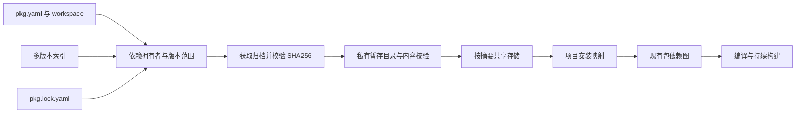
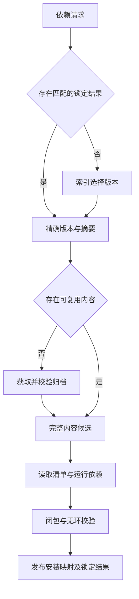

# 外部包安装实施计划

## Intent：最终目标

接通 `zxc pkg install`：从已配置索引解析外部包，校验并获取归档，复用内容寻址存储，锁定依赖闭包，让正常编译与 watch 按包拥有者消费精确版本。支持同一包多个版本并存和已有锁定结果的离线重放。

## Data：可用证据

- packages/pkgs 的 Release 已包含精确 version、archive 和 sha256；索引校验及范围选择已经提交。
- package/graph 目前只解析 workspace:，其他依赖明确报告未安装。package/project 将图转换为按包根目录划分的源码作用域；不应另建平行的编译导入解析器。
- 已有构建工具链支持 HTTP 获取、SHA256 及 tar 解包，但其来源是内嵌官方资源。包归档必须单独约束输出路径、条目种类、重复路径及资源量。
- 编译器 source.validate 要求物理路径与声明的包边界一致；安装后的共享目录需先规范化成物理包根，再构造作用域。
- 现有清单读写与工作区版本规则直接复用。发布文件范围仍待选择，不因此提前修改 pack 的清单 Schema。

## Edges：边界与限制

1. 初始安装源为索引中已有的 tar.gz 归档，包根含 pkg.yaml。索引来源字符串可为 HTTPS 地址或相对于索引文件的本地路径。安装不执行包脚本。
2. 归档原始 SHA256 先通过，再处理内容；名称和版本必须与选定索引记录一致。拒绝路径越界、绝对路径、符号链接、硬链接、设备节点与重复文件。包内声明不能靠归档路径绕过源码包边界。
3. 全局内容存储复用既有 ZXC_CACHE_DIR 位置约定，并划分 packages 子目录；只发布已准备完成的内容。失败保留既有可用安装，不把半成品标记为完成。
4. 锁定结果计划保存为 pkg.lock.yaml，记录格式版本、工作区请求及精确包版本、来源、摘要和依赖边。锁文件不包含开发机绝对缓存路径。构建不自动联网或安装。
5. 项目安装映射放在 .zxc 下，映射与锁文件必须对应；共享存储的内容身份取自摘要，不能只按包名/版本覆盖。workspace: 保持本地解析，不用索引补缺。
6. 本地项目的开发依赖可参与开发安装；已发布外部包只沿运行依赖获取闭包，不把发布者开发工具带入消费者。重复名称、版本不匹配与循环仍明确失败。
7. 使用已有回归和临时副本验证真实获取、恢复与消费，不新增测试用例、不调用浏览器。包名和源码不能针对演示硬编码。

## Answer：交付与成功标准

先完成可复用的归档验证、提取与共享存储，再接入锁文件、递归解析、CLI 和既有包作用域。实际验证：本地真实归档安装后编译运行；两种版本隔离；锁定重放不重新选择版本；离线读取已缓存内容；摘要或路径非法时拒绝并保持旧安装；源码修改、锁文件与安装映射变化进入 watch 观察集合。文档中的“安装完成”必须有实际构建消费证据。

## 自我复核

目录存在不证明归档完整，索引命中不证明安装成功，锁文件解析成功不证明其仍匹配当前清单。需要明确每一层拥有的数据、发布时点和恢复条件。实现不能把 pack 的待确认发布范围当作安装阻塞，也不能用整体 lib 导出替代保留依赖身份的安装。

## 归档输入约束与解析顺序

首版接受 gzip 包装的普通 tar 文件、目录和 GNU long-name 扩展，兼容本地 Zig tar.Writer 生成的长路径。明确拒绝链接、设备、稀疏文件、PAX/global PAX 等未支持条目，不默默忽略。允许常见的根级 ./ 前缀，规范化后仍拒绝中间的 .、..、空分量、反斜杠与驱动器/流名称分隔符。后续 pack 使用同一格式，不影响发布文件范围选择。

本地 Zig 0.16 tar.Iterator 会在返回条目前对不受限的 u64 大小做对齐运算；gzip 解码器只读取 CRC32/ISIZE，不替调用方校验。因此先验证原始摘要，再有界解压完整 tar，检查 CRC32、ISIZE 和压缩输入完整消费；原始 tar 预扫描确认大小、条目数、GNU 长名称与结束块后，才交给标准 Iterator 做正式解析和提取。默认归档上限 128 MiB、解压 tar 上限 512 MiB、条目上限 65536，超限明确失败。

提取只写调用方新建的私有暂存目录，文件独占创建；返回已提取文件的路径、内容摘要及执行权限信息，供共享存储完成标记与复核。任何失败由暂存目录拥有者清理，不发布半成品。

## 共享存储准备

存储以小写归档摘要为目录身份，布局为 packages/v1/archives/<sha>.tar.gz 与 packages/v1/contents/<sha>/{package,receipt.json}。receipt 记录格式版本、原始摘要和解包文件摘要/执行位；复用时核对文件集合、内容与执行位，不以目录存在或单个完成标记替代完整性检查。内容目录用私有暂存目录准备并通过目录 rename 发布（完成目录含 package 与 receipt，不会覆盖已有非空完成目录）；并发发布已有相同身份时复核赢家结果。

缓存损坏明确失败，不静默把错误内容当命中，也不在构建阶段联网修复。离线可复用完成内容，或从已校验的原始归档恢复缺失内容。首次获取限制 HTTP 正文大小，要求服务端按 identity 内容编码返回，并在写缓存前校验原始摘要。此层只存储有内容身份的归档；包名/版本与清单、依赖闭包仍由安装层校验。

## 已实施与实际验证

正式源码新增 package/archive.zig 及 gzip/header/path 三个内部模块；store.zig 及 download/receipt 两个模块。代码草稿、演示程序和 JSON 证据保存在外部包安装目录。尚未增加 install 命令、锁文件解析或改变 graph 的外部依赖行为，不能报告完整安装已完成。

复用现有原生构建示例创建 GNU tar.gz：5 个文件解包后逐字节一致，文件摘要与 Python SHA256 独立计算一致；重新编译并执行输入 {value:9,factor:2}，输出 {root:3,scaled:18}。错误原始摘要以及重算原始摘要后的错误 gzip CRC 均被拒绝，没有留下演示目标目录。

共享存储真实运行验证了首次准备、原始来源移走后的离线内容复用、删除已提取内容后从缓存归档离线恢复、文件篡改拒绝，以及两个同时启动进程返回同一摘要目录。HTTP 演示通过本机临时服务器提供同一真实归档，关闭服务器后仍能离线复用；记录到的请求仅一次，并使用 identity 内容编码。演示使用 DebugAllocator，没有泄漏或错误释放报告。

只读审查发现摘要目录、package 目录和 receipt 文件的入口也必须拒绝符号链接，不能仅依赖内部 walker。已使用不跟随链接的打开选项，并要求 receipt 是普通文件；将三个入口分别替换为指向外部相同内容的链接时均被拒绝，恢复原内容后重新可用。验证成本的条目上限同时计入目录；receipt 只记录文件集合，额外空目录不视为文件内容损坏，但不能无限增加验证工作量。

Windows 与 Linux x86_64 的共享存储演示均通过 -fno-emit-bin 编译检查；未实际运行这两个目标，不据此声称其并发发布已经验证。当前归档名称按宿主文件系统处理，设备保留名及名称规范化差异可能使部分包在其他系统失败，不宣称任意路径跨平台可用。

### 实施中的自我修正

首次共享存储准备失败于 macOS 的 renamePreserve：本地 Zig 对该平台使用硬链接再删除来模拟不覆盖重命名，不能用于目录。已改为 macOS 使用普通目录 rename、遇到已有非空目录则复核；Linux/Windows 使用支持的 renamePreserve，仅对明确的目标已存在错误复核，不吞掉权限或未知错误。修正后的本机离线与并发演示全部重新通过。

正文读取、解包和 receipt 读取均有界，但 receipt JSON 上限目前复用 512 MiB 的解包上限，极端大收据仍可能有较高解析内存占用；这不是恒定内存实现。后续安装闭环应继续核对资源限额、清单身份、锁定重放和项目发布，不把这些底层验证替代最终验收。
